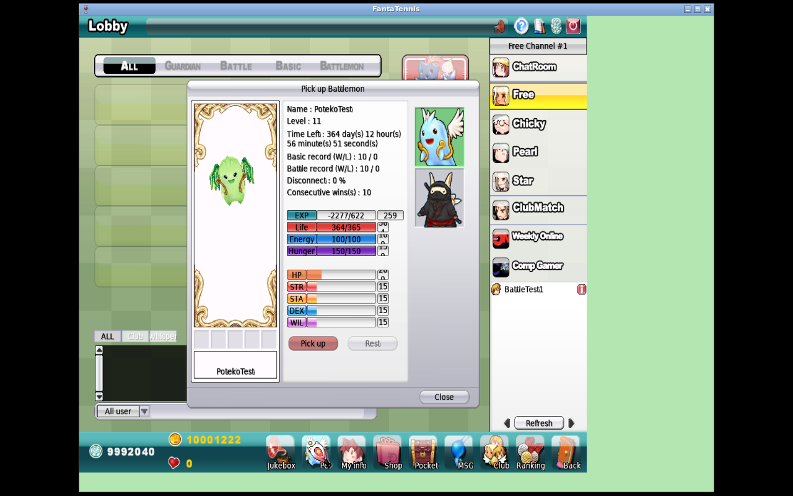

<div class="title-page">

# JFTSE — Native Battlemon AI level selection

<div class="subtitle">Proof that JFTSE supplies the level and the unmodified Fantasy Tennis client owns AI profile selection</div>

**Branch:** `feature/battlemon-complete`<br>
**Base:** `3a0163aa` (level persistence/serialization)<br>
**Validated HEAD:** `c3befbae`<br>
**FantaTennis.exe SHA-256:** `5477f0827acae66976403aecd2e9ebffeb4fa28da1fedae5f9541ec25e336c31`<br>
**Validation date:** 2026-08-13 UTC

</div>

<div class="page-break"></div>

# Executive summary

The validated native client, not JFTSE Java code, owns Battlemon tennis AI.
JFTSE persisted level 11 for `PotekoTest`, serialized `0B` in the native
`0x151B` pet-data response, and the unmodified client displayed `Level : 11`.
The original static analysis then appeared to connect that displayed level to
`TennisAIMgr`. A later constructor-level trace corrected that interpretation:
the twelve pet actor constructors around `0x534e00–0x535300` pass constant AI
profile level `1`. The displayed/persisted EXP level and native AI profile level
are independent inputs.

<div class="callout">

**Superseding finding:** a pet displayed at level 11 still initializes its
client-owned AI with profile level 1. `AI_PetA`…`AI_PetK` levels 1–13 are not
the 1–250 pet progression.

</div>

<div class="warning">

**Not claimed:** Java TennisAI, stat growth from level, visual evolution, or a
server-selected AI difficulty progression.

</div>

## Evidence classification

| Class | Finding |
|---|---|
| Observed native runtime | JFTSE emitted `0x151B` with `PotekoTest` level `0B`; the unmodified client displayed level 11. |
| Static client reverse engineering | Exact-level lookup, model vector selection, 88-byte profile copy, Basic and Double call sites, and missing-level failure path. |
| JFTSE source baseline | `Pet.level` is an independent unsigned byte and is serialized separately from `type` and STR/STA/DEX/WIL. |
| Corrected compatibility interpretation | AI profile levels 1–13 are separate from displayed/persisted levels 1–250; no progression cap is warranted. |
| Current implementation | Reproducible binary/wire evidence, full 1–250 progression, and client-owned AI. No Java AI. |

# First-principles proof

```text
Pet.level = 11
  → JFTSE S2C 0x151B contains 0B after PotekoTest\0
  → native client displays Level : 11

pet actor construction
  → supplies AI profile level 1 independently
  → TennisAIMgr(model, 1) selects [Level1]
```

The controlled fixture kept pet type and STR/STA/DEX/WIL unchanged. This
separates level-driven profile selection from item-grown statistics.

# Native binary contract

At VA `0x004F9BD0`, the validated executable receives requested level at
`[ebp+0x08]`, destination AI object at `[ebp+0x0c]`, and `nPetModel` at
`[ebp+0x10]`. It computes the model vector, copies each candidate record to a
temporary 88-byte buffer, and compares its first dword with the requested
level. On equality it copies the record's behavior flags, probabilities,
timings, and movement values into the destination and returns true.

The Basic caller at `0x004F4289` and Double caller at `0x004F4CDC` pass an
initializer argument to this lookup. The missing-record branch logs:

```text
AI Level(%d) requested not found for nPetModel(%d)
```

There is no instruction clamping the persisted pet level because that value is
not the constructor's AI-profile argument. Runtime memory extraction found 13
records for every owned-pet model 0–10, keyed 1–13; these remain available
client AI profiles rather than pet-progression rows.

# Controlled native observation

The database changed only pet ID 2's `level` from 3 to 11. JFTSE emitted:

```text
... 50 00 6F 00 74 00 65 00 6B 00 6F 00 54 00 65 00 73 00 74 00 00 00
0B 03 01 00 00 C8 00 00 00 0F 0F 0F 0F ...
^^ requested level 11; next bytes retain EXP/type/alive/HP/stats
```



# Reproduction

Run the verifier against the immutable executable and captured packet log:

```bash
python3 scripts/verify_native_pet_ai_level.py /path/to/FantaTennis.exe \
  --packet-log /path/to/game-server.log \
  --pet-name PotekoTest --expected-level 11
```

For an additional in-match debugger capture, attach
[`trace-owned-pet-ai-level.gdb`](../../scripts/gdb/trace-owned-pet-ai-level.gdb)
before match start. Its breakpoint is conditioned to ignore model `-1`; a hit
prints requested level, matched level, owned-pet model, record address, and all
22 dwords of the selected profile before detaching.

# Evidence inventory

| Artifact | Claim supported |
|---|---|
| [Client hash](evidence/client-sha256.txt) | Exact executable provenance |
| [DB before](evidence/level11-db-before.txt) | Controlled baseline |
| [DB after](evidence/level11-db-after.txt) | Only level changed to 11 |
| [Decoded packet](evidence/level11-packet.txt) | JFTSE sent level byte `0B` |
| [Native screenshot](evidence/level11-native-ui.png) | Client accepted/rendered level 11 |
| [Native profile table](evidence/native-profile-table.txt) | Owned models contain distinct level 1–13 records |
| [Verifier output](evidence/verifier-output.txt) | Binary and wire checks pass |
| [Checksums](evidence/SHA256SUMS) | Curated evidence integrity |

# Boundary and non-claims

The executable's AI resources contain profile records 1–13 while JFTSE's pet
progression supports 1–250. Constructor tracing resolves the apparent gap: the
actor supplies AI profile level 1 independently. A displayed level above 13
does not request a missing AI profile. The earlier two-client level-14 runtime
experiment left both clients unhealthy and could not isolate level 14 as the
cause; it must not be used as evidence for a server cap.

# Conclusion

No Java decision tree is warranted. The server persists and serializes the
independent pet `type`, displayed level, and stats. It permits the complete
1–250 progression. The validated client independently selects its AI profile
and executes `TennisAIMgr` behavior itself.
