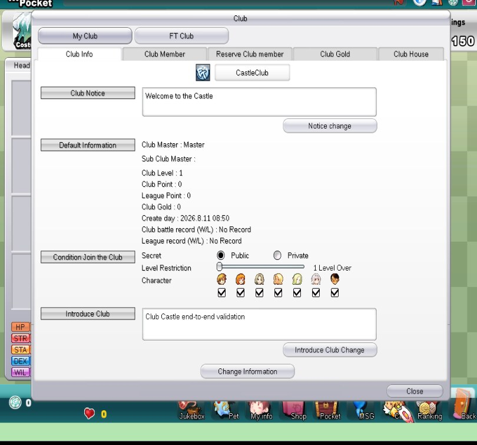
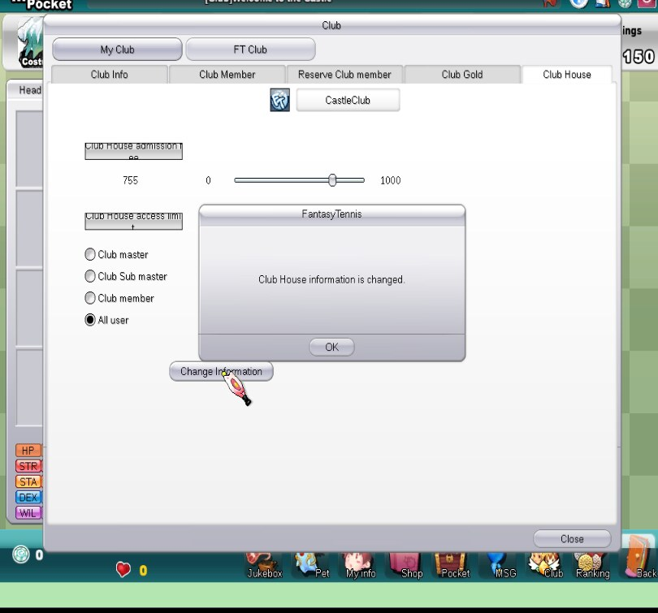
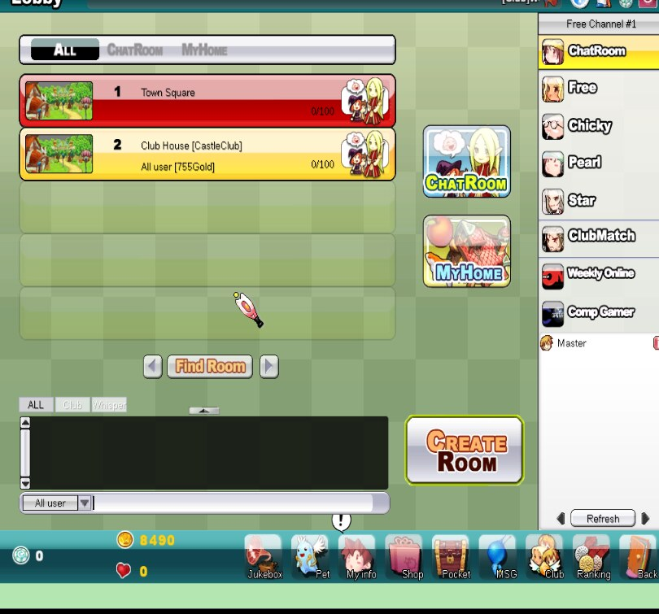
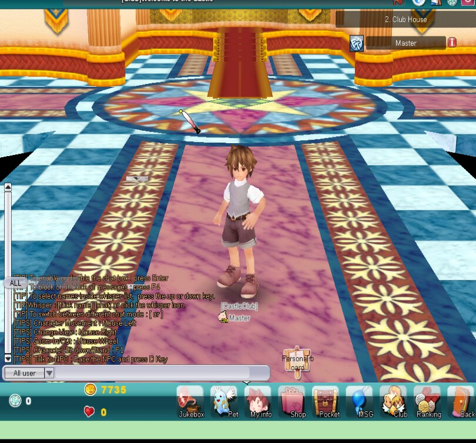
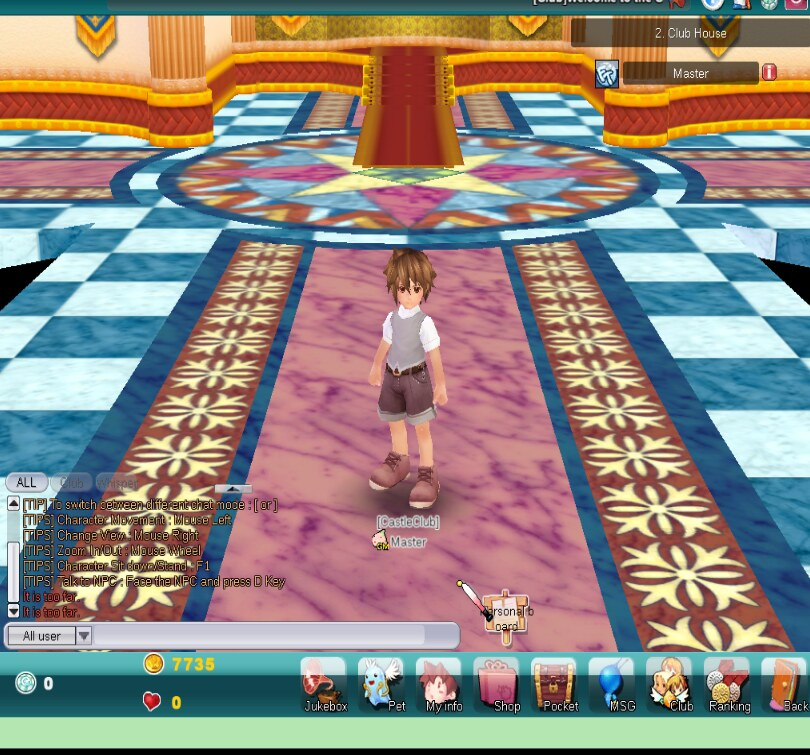
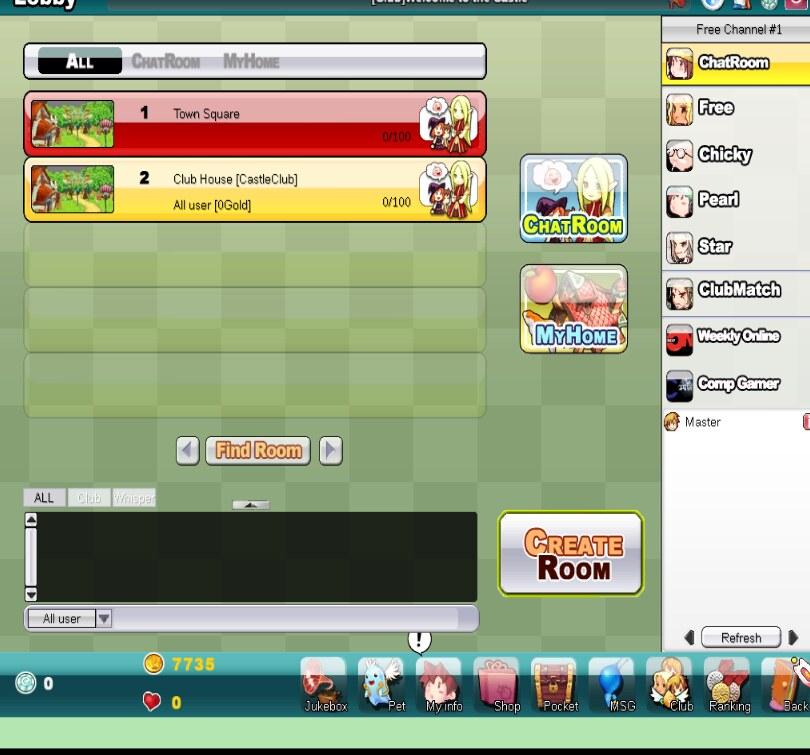
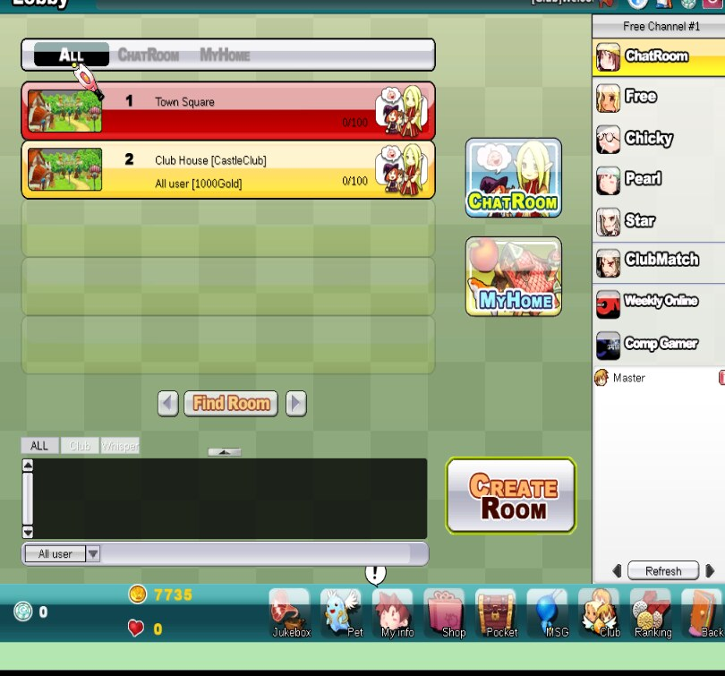
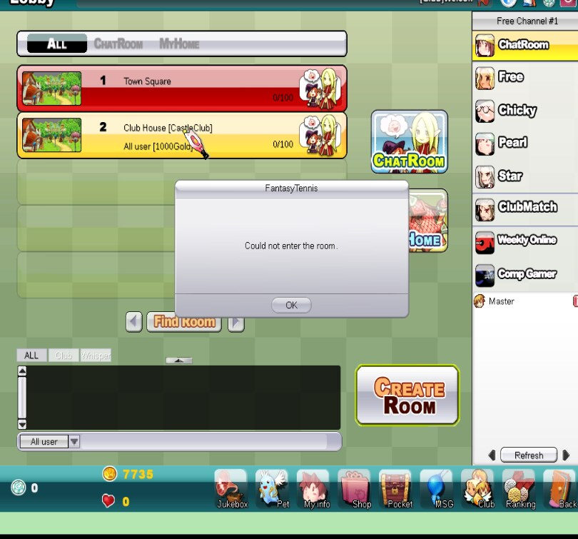

<div class="title-page">

# JFTSE Club Castle / Club House

<div class="subtitle">End-to-end client reverse engineering, server implementation, and runtime validation</div>

<div class="metadata">

**Repository:** `sstokic-tgm/JFTSE`<br>
**Branch:** `feature/club-castle`<br>
**Development integrated through:** `65c3665170edc2d912a3187244de89251a809712`<br>
**Faulty commit neutralized by:** `e7db684` (exact revert of `fcdeb89a94bb17337f8b8f499b79c5892370004e`)<br>
**Implementation commit:** `c8a36ef`<br>
**Validation date:** 11 August 2026 (UTC)

</div>

**Evidence basis:** JFTSE wiki documentation, static analysis of the distributed client, decoded client resources, packet capture, decoded server packet logs, MariaDB before/after snapshots, automated red/green tests, and visual execution of the real Windows client under Wine.

</div>

<div class="page-break"></div>

# Executive summary

This work unlocks the client-facing **Club Castle / Club House** flow in the JFTSE server. A Castle-owning Club now has one permanent server-owned Club House room. The real client can display and change Castle access and admission settings, discover the room, pay admission atomically, render the correct Castle interior, move inside it, and leave without deleting the permanent room.

The implementation was developed from protocol and runtime evidence rather than from UI labels alone. The strongest end-to-end evidence is:

1. the unmodified client sent Castle packets `0x2044` and `0x2046`;
2. the server returned the exact payload shapes accepted by the client for `0x2045` and `0x2047`;
3. a mode-3 social room with the reverse-engineered variable-length extension appeared as `Club House [CastleClub]`;
4. joining returned `roomType=1`, `mode=3`, and `mapId=5` and rendered the FantaCastle interior;
5. a paid join moved exactly 755 gold from the Player to the Guild;
6. a 1000-gold join by a 500-gold Player was rejected and changed neither balance;
7. client movement generated `CMSGChatHouseMove (0x18A5)`, the server broadcast `SMSGChatHouseMove (0x18A6)`, and fixed-geometry screenshots show the avatar moving;
8. leaving generated `CMSGRoomLeave (0x1771)` / `SMSGRoomLeave (0x1772)` and returned the client to the room list;
9. all 17 focused tests and the complete 11-module Maven reactor passed after the final development merge.

<div class="callout">

**Supported scope:** Castle information/settings, access restrictions, admission fee transfer, permanent Club House discovery and lifecycle, FantaCastle map spawn, movement, and leave.

</div>

<div class="warning">

**Not claimed:** Club Siege, Club Match, Castle acquisition/award logic, competitive Club gameplay, or any broader Club system not explicitly listed above.

</div>

## Evidence classification

The report deliberately separates four kinds of statements:

| Class | Meaning | Examples in this work |
|---|---|---|
| **Observed runtime behavior** | Seen in the real client/server execution or packet capture | Castle requests, settings success, room listing, paid/rejected joins, map rendering, movement, leave |
| **Static reverse engineering** | Recovered from client executable/resource analysis | Castle map index, resource path, exit tiles, packet-handler result branches |
| **Compatibility interpretation** | A server behavior selected where client semantics were incomplete | default access value `2`, fee credited to Guild gold, opaque fields emitted as zero |
| **Implementation** | New emulator behavior and integrity controls | transactional service, locks, room lifecycle, mutation guards, migration |

# Scope and provenance

## Branch and development baseline

The work is on `feature/club-castle`. The branch started from the then-current `development` head and later merged the newer `origin/development` head `65c3665`, so the final branch contains all current development changes.

The requested faulty commit, `fcdeb89a94bb17337f8b8f499b79c5892370004e`, is part of shared development history. Its code effects were removed without rewriting that shared history by the explicit revert commit `e7db684`. During the final merge, the later BattleMon follow-up conflicted in the same two files. Both conflicts were resolved to retain the reverted, pre-`fcdeb89` behavior. Across all eight files originally changed by `fcdeb89`, the final tree matches the parent of the faulty commit except for an end-of-file newline normalization in one Java file.

This is intentional: the branch carries an auditable revert rather than deleting a published commit from repository history.

## Included and excluded behavior

| Area | Status |
|---|---|
| Castle information request/answer | Implemented and runtime-observed |
| Castle settings update/result | Implemented and runtime-observed |
| Access modes 0–3 | Implemented; focused tests cover every rank and “all users” |
| Admission fees 0–1000 | Implemented; paid, free, and insufficient-funds paths validated |
| Club House room-list extension | Implemented and accepted by real client |
| Permanent server-owned room | Implemented; lifecycle tested |
| Castle interior map and spawn | Implemented and visually validated |
| Movement and leave | Implemented and runtime-observed |
| Club House client mutation attempts | Rejected; automated coverage for all known room mutations |
| Club Siege / Club Match | Out of scope; not implemented or claimed |

# Methodology

## Documentation baseline

The following wiki pages were treated as protocol and project documentation and were consulted on 11 August 2026:

- [JFTSE Roadmap](https://wiki.jftse.com/index.php/JFTSE_Roadmap)
- [All Pages](https://wiki.jftse.com/index.php/Special:AllPages)
- [Packet Structure](https://wiki.jftse.com/index.php/Packet_Structure)
- [Packet Schema (.packet) Format](https://wiki.jftse.com/index.php/Packet_Schema_(.packet)_Format)
- [Database Schema & Cheatsheet](https://wiki.jftse.com/index.php/Database_Schema_%26_Cheatsheet)

The wiki documents an 8-byte packet header followed by a variable-length payload and explains how `.packet` definitions generate typed packet classes. Those contracts were used as the baseline, but client acceptance and captured traffic remained the deciding evidence for undocumented Castle fields.

## Reverse-engineering loop

```text
Wiki and existing server packet IDs
        ↓
Client executable/resources and UI behavior
        ↓
Hypothesized packet and room contracts
        ↓
Failing packet-level tests (red)
        ↓
Small server implementation
        ↓
Focused tests and full reactor (green)
        ↓
MariaDB + RabbitMQ + four servers + real Wine client
        ↓
Packet capture, decoded logs, DB snapshots, screenshots
```

Static discoveries were not silently promoted to runtime facts. For example, resource decryption established the Castle map identity and likely exit geometry; rendering and movement with the real client established that the selected map and spawn actually work.

## Runtime environment

| Component | Validated runtime |
|---|---|
| MariaDB | 10.11.18, active |
| RabbitMQ | active |
| Auth server | TCP 5894 |
| Game server | TCP 5895 |
| Relay server | TCP 5896 |
| Chat server | TCP 5897 |
| Client | unmodified `FantaTennis.exe`, Wine 8.0, 32-bit prefix, Xvfb |
| Capture | loopback pcap on all four server ports |

The game-server database seed previously advertised chat on port 5900 even though the chat server listens on 5897. The seed was corrected to 5897; this was necessary for the client to complete the game-to-chat transition.

# Static client reverse engineering

## Client provenance

The client came from `https://www.jftse.com/client/FantaTennis.7z`.

| Artifact | SHA-256 |
|---|---|
| `FantaTennis.7z` | `c19ca21b8e2ab091953b2f631e48853b6477400f4d7000682ac7440f9994f12e` |
| `FantaTennis.exe` | `5477f0827acae66976403aecd2e9ebffeb4fa28da1fedae5f9541ec25e336c31` |

Hashes are retained in `evidence/client-provenance.txt` so subsequent analysis can verify it is using the same client build.

## Castle resource recovery

The client MapSet files use a one-byte prefix followed by AES-128-ECB encrypted data. Decrypting with key bytes `TIMOTEI_ZION\0\0\0\0` exposed the house map table.

`MapHouseRes.set` contains:

```ini
[Add_MapHouse]
House_Index = 5
House_ID    = "Castle"
House_Path  = "Res/MapRes/DecoRes/Mesh01/Castle_Inside00.dat"
```

This is **static reverse-engineering evidence** for map ID `5`. It became runtime evidence only after the client successfully rendered that interior from an `SMSGRoomJoin` response carrying `mapId=5`.

## Exit tiles and spawn derivation

The decrypted FantaCastle interior script has transitions at:

| X | Y | Destination |
|---:|---:|---|
| 15 | 36 | `FantaCastleOutSide` |
| 16 | 36 | `FantaCastleOutSide` |
| 17 | 36 | `FantaCastleOutSide` |

The implementation spawns at `(16,32)`: centered on the three exit tiles and four tiles inside the doorway. The first attempted generic social-room coordinates produced a black/invalid view, while the derived coordinates rendered the interior correctly. The chosen spawn is therefore a **compatibility derivation confirmed by runtime rendering**, not a claimed exact original-server coordinate.

# Reverse-engineered protocol

## Castle packet family

| ID | Direction | Payload | Evidence |
|---|---|---|---|
| `0x2044` | C2S | empty | pcap and client UI action |
| `0x2045` | S2C | success: `i8 result`, `i32 opaque0`, `i32 opaque1`, `u8 access`, `i32 fee`; failure: result byte only | pcap, client acceptance, packet tests |
| `0x2046` | C2S | `i32 opaque0`, `i32 opaque1`, `u8 access`, `i32 fee` | decoded runtime log and pcap |
| `0x2047` | S2C | signed result byte only | client acceptance, pcap, red/green test |

Captured successful settings request:

```text
CMSGGuildCastleChangeInformation {
  id: 0x2046, len: 13,
  unk0: 0, unk1: 0, accessLimit: 3, admissionFee: 755
}
SMSGGuildCastleChangeInformation {
  id: 0x2047, len: 1, result: 0
}
```

Static inspection of the real client's `0x2047` result handling identified:

| Signed result | Client behavior |
|---:|---|
| `0` | success |
| `-1` | “You don't have a Club House” |
| `-2` | generic information-change failure |
| `-10` | general network/database fallback |

The implementation returns `0`, `-1`, or `-2` for its validated cases. The two 32-bit request/answer fields remain named `opaque0`/`opaque1`; their semantics were not established, and the observed client sends them as zero.

## Room-list extension

For an entry with `roomType=1` and `mode=3`, the real client expects extra data after the ordinary room fields and before the final player-count/status bytes:

```text
UTF-16LE NUL-terminated guild name (variable length)
u8 accessLimit
i32 admissionFee
```

The variable-length guild name is significant. Treating the extension as fixed length or omitting it misaligns all following entries. Automated coverage builds mixed ordinary/Castle lists and proves that each subsequent room remains byte-aligned.

Only server-owned Club Houses are serialized with this extension. A mode-3 social room missing Castle identity is rejected rather than emitting a malformed list. Ordinary room output remains byte-compatible.

## Join, movement, and leave

| Flow | C2S | S2C | Runtime observation |
|---|---|---|---|
| Join | `0x138B CMSGRoomJoin` | `0x138C SMSGRoomJoin` | success carries type 1, mode 3, map 5; failures carry signed `-10` |
| Enable movement | — | `0x2617 S2CEnableTownSquareMovement` | sent after successful Club House join |
| Move | `0x18A5 CMSGChatHouseMove` | `0x18A6 SMSGChatHouseMove` | coordinates and animation echoed with player position |
| Leave | `0x1771 CMSGRoomLeave` | `0x1772 SMSGRoomLeave` | result 0, followed by refreshed room list |

The movement schemas validated at runtime are:

```text
CMSGChatHouseMove 0x18A5
  u8 unk0, u8 unk1, i16 x, i16 y, u8 animationType, u8 unk2

SMSGChatHouseMove 0x18A6
  i16 playerPosition, u8 unk0, u8 unk1,
  i16 x, i16 y, u8 animationType, u8 unk2
```

# Server implementation

## Persistence and service boundary

`Guild` now persists:

```java
private Byte castleAccessLimit = 2;
private Integer castleAdmissionFee = 0;
```

`GuildCastleService` owns Castle lookup, settings authorization, access evaluation, and fee transfer. Packet handlers do not directly mutate balances or trust room-cache values for admission.

## Access policy

The implemented access ordering follows the values sent by the client:

| Value | Allowed users |
|---:|---|
| `0` | Club master only (`memberRank=3`) |
| `1` | submaster and master (`memberRank>=2`) |
| `2` | accepted owning-Club member or above (`memberRank>=1`) |
| `3` | all users |

Pending applicants are not treated as members. The real client's “All user” selection was observed sending `3`; the implementation does not reverse that value.

Only an accepted Castle-owning Club master may change settings. Access outside `0..3` and fees outside `0..1000` return `-2`. A missing membership or non-Castle Club returns `-1`.

## Admission transaction and integrity

Admission performs one transaction with pessimistic locks in a consistent order:

```text
Guild → GuildMember (if any) → Player
```

After obtaining locks, the service revalidates Castle ownership, current access policy, current membership/approval, configured fee, Player funds, and Guild-gold overflow. A successful nonzero fee deducts Player gold and credits Guild gold in the same transaction. A zero fee still validates access and funds state but avoids balance writes.

This closes time-of-check/time-of-use gaps between a room listing and a join. Room metadata is presentation state; database state is authoritative at charge time.

## Permanent server-owned room

At chat-server startup and on room-list/settings refresh, `GameManager` creates exactly one Club House for every `Guild.castleOwner=true` row. Its authoritative fields are:

```text
roomType = 1
mode = 3
map = 5
capacity = 100
roomName = "Club House"
castleGuildId, castleGuildName, accessLimit, admissionFee
```

The room survives its final occupant leaving. Castle metadata refresh and admission synchronize on the same room monitor, preventing a stale join from overwriting newer settings. If Castle ownership disappears, an empty permanent room is removed; an occupied room is retained until safe, while database revalidation rejects new admission.

Client-created arbitrary mode-3 social rooms are rejected on both chat and game servers. Client room-mutation handlers also reject changes to a server-owned Club House for:

- BattleMon setting;
- private/password state;
- level range;
- map;
- room name;
- quick-slot setting;
- skill-free setting;
- kick requests; and
- game mode.

# Database migration

`scripts/sql/clubcastle.sql` is idempotent and safe whether or not Hibernate Envers created `Guild_AUD`.

It:

1. conditionally adds `Guild.castleAccessLimit`;
2. backfills nulls to `2`;
3. enforces `TINYINT NOT NULL DEFAULT 2`;
4. conditionally adds `Guild.castleAdmissionFee`;
5. backfills nulls to `0`;
6. enforces `INT NOT NULL DEFAULT 0`; and
7. conditionally adds nullable audit columns only when `Guild_AUD` exists.

The migration ran twice against the runtime schema and twice against a temporary schema with no audit table. Both idempotence paths passed.

<div class="warning">

The full repository SQL importer later fails in the pre-existing `guardian2maps.sql` seed because referenced Guardian seed data is absent. The importer had already completed `clubcastle.sql`; the unrelated foreign-key failure is recorded rather than hidden.

</div>

# Red/green testing

## Red evidence

The initial focused contract run intentionally failed before implementation:

```text
Tests run: 4, Failures: 2

GuildCastlePacketContractTest.castleChangeResultIsOneSignedByte
  expected payload length: 1
  pre-fix payload length: 4

ClubHouseRoomListPacketTest.clubHouseEntryAddsGuildAccessAndFeeBeforeListStatusFields
  expected first extension byte: 65
  pre-fix ordinary-room byte: 38

BUILD FAILURE
```

Those failures captured two client-breaking facts: `0x2047` had incorrectly been modeled as a 32-bit result, and the room list had no Castle extension.

## Focused green evidence

After implementation and concurrency/lifecycle hardening:

| Test class | Tests | What it proves |
|---|---:|---|
| `GuildCastleServiceImplTest` | 7 | settings authorization/bounds, rank ordering, pending rejection, paid/free/insufficient admission |
| `GuildCastlePacketContractTest` | 3 | one-byte `0x2047`, success and failure `0x2045` shapes |
| `ClubHouseRoomListPacketTest` | 4 | extension placement, ordinary compatibility, malformed rejection, multi-entry alignment |
| `ClubHouseWorldContractTest` | 1 | map and derived spawn contract |
| `ClubHouseLifecycleTest` | 1 | last occupant cannot delete permanent room |
| `ClubHouseMutationGuardTest` | 1 | all guarded room mutations preserve Castle state |
| **Total** | **17** | **0 failures, 0 errors, 0 skipped** |

## Final release gates

After merging the latest `origin/development` and preserving the faulty-commit revert:

```text
mvn test
  all 11 reactor modules: SUCCESS
  focused Club Castle tests: 17/17 passed
  BUILD SUCCESS at 2026-08-11T14:30:17Z

mvn package -DskipTests
  all 11 reactor modules: SUCCESS
  BUILD SUCCESS at 2026-08-11T14:31:30Z
```

<div class="page-break"></div>

# Runtime walkthrough and visual evidence

The screenshots below come from the real distributed client under Wine, not a mock UI. They are cropped from the fixed Xvfb desktop geometry without altering the client content.

## 1. Castle owner information is populated

The Club information page identifies `CastleClub`, the master, Castle ownership, and the Castle settings controls. This proves the client reached the Castle UI with server-backed Club state.



<div class="page-break"></div>

## 2. Settings change succeeds through the real packet path

The master selected “All user” and set a fee of 755. The client sent `0x2046` with `accessLimit=3`, `admissionFee=755`; the server returned the one-byte `0x2047 result=0`; the client displayed “Club House information is changed.” MariaDB then held access `3` and fee `755`.



<div class="page-break"></div>

## 3. Room-list extension is accepted

The room list shows `Club House [CastleClub]`, `All user [755Gold]`, and `0/100`. That text is client rendering of the variable-length mode-3 extension, not server-rendered text.



<div class="page-break"></div>

## 4. Paid join enters the FantaCastle interior

Joining room 1 produced:

```text
CMSGRoomJoin 0x138B: roomId=1
SMSGRoomJoin 0x138C: result=0, roomType=1, mode=3, mapId=5
SMSGSetMoney 0x1B61: gold=7735
```

Database conservation check:

| Entity | Before | After | Delta |
|---|---:|---:|---:|
| Player `Master` gold | 8490 | 7735 | -755 |
| Guild `CastleClub` gold | 1510 | 2265 | +755 |



<div class="page-break"></div>

## 5. Movement works inside the Castle

The client was clicked at a nearby destination. The packet logger and pcap recorded `CMSGChatHouseMove 0x18A5` with `(x=17,y=27)` and the corresponding `SMSGChatHouseMove 0x18A6`. The next three fixed-camera screenshots show the avatar before, during, and after movement.



<div class="page-break"></div>


<div class="page-break"></div>


<div class="page-break"></div>

## 6. Leave returns to the lobby without deleting the room

The client emitted `CMSGRoomLeave 0x1771`; the server returned `SMSGRoomLeave 0x1772 result=0`; the client requested a fresh room list. The Club House remained listed at `0/100`, matching the permanent-room lifecycle test. With fee zero, Player and Guild balances remained unchanged.



<div class="page-break"></div>

## 7. Insufficient funds are rejected without mutation

For the negative flow, the master first changed the admission fee to 1000 successfully. The Player balance was then deliberately set to 500. The refreshed room list advertised 1000 gold.



<div class="page-break"></div>

The join generated `CMSGRoomJoin 0x138B`, but the server returned signed result `-10` in `0x138C`. The client displayed “Could not enter the room.” Database snapshots before and after were identical.

| Entity | Before | After |
|---|---:|---:|
| Player gold | 500 | 500 |
| Guild gold | 2265 | 2265 |
| Configured fee | 1000 | 1000 |



The filenames of the source screenshots include “negative settings” because the settings change prepared this negative admission case. The settings update itself succeeded; the **join** is the rejected operation.

# Packet and database evidence

## Packet capture

`evidence/runtime-client-server.pcap` is a 338,824-byte capture with 3,655 packets spanning auth, game, relay, and chat ports. Its SHA-256 is:

```text
8627a774be257b28f854431ce1cedad185252a1a84c29910b071f9b749ade45f
```

The capture contains exact binary examples for Castle info/settings, successful and rejected joins, movement, and leave. `evidence/pcap-summary.txt` records representative packet hex and decoding. Decoded server excerpts are retained separately so packet names and fields can be reviewed without a custom Wireshark dissector.

## Evidence inventory

| Evidence file | Purpose |
|---|---|
| `runtime-client-server.pcap` | primary binary client/server traffic |
| `pcap-summary.txt` | capture metadata, hash, representative hex |
| `runtime-castle-change-packets.log` | decoded `0x2046/0x2047` settings flow |
| `runtime-paid-join-packets.log` | decoded successful join and money update |
| `runtime-insufficient-funds-packets.log` | decoded rejected join |
| `runtime-movement-packets.log` | decoded movement requests/broadcasts |
| `runtime-leave-packets.log` | decoded leave/result/room-list refresh |
| `database-validation.txt` | before/after positive and negative balance snapshots |
| `migration-validation.txt` | idempotence and optional-audit-table checks |
| `static-fantacastle-map-and-spawn.txt` | decrypted map and exit-tile findings |
| `validation-summary.txt` | red/focused green/reactor/package summaries |
| `client-provenance.txt` | client hashes and resource-decryption procedure |

# Compatibility assumptions and unresolved questions

## Explicit compatibility assumptions

1. **Default access value `2`.** The client-access ordering is validated, but the original production server's default for newly acquired Castles was not observed. `2` was selected as the member-access default.
2. **Admission fees credit Guild gold.** Runtime proves the implemented transfer is atomic and conserved. The client exposes an admission fee, but independent original-server evidence that its destination was specifically the Guild gold column was not recovered.
3. **Opaque Castle integers are zero.** The client sends and accepts zero for the two 32-bit fields. Their semantic names remain unknown, so they are preserved rather than assigned speculative meaning.
4. **Spawn `(16,32)`.** It is derived from static exit geometry and runtime-validated, but is not claimed to be the original server's exact spawn coordinate.

## Unresolved protocol/product questions

- semantic names and nonzero behavior of the two `0x2045/0x2046` 32-bit fields;
- the complete original result-code space beyond the branches identified in this client;
- Castle award/acquisition/expiration lifecycle;
- relationship between Club Castle, Club Siege, and Club Match systems;
- whether the original server taxed, split, or logged admission revenue elsewhere;
- any interior interactions beyond movement and leave.

No speculative implementation was added for those unknowns.

# Reproduction guide

## 1. Check out and verify branch history

```bash
git fetch origin development
git switch feature/club-castle
git merge-base --is-ancestor origin/development HEAD
git merge-base --is-ancestor e7db684 HEAD
```

Both ancestry checks should exit zero. `e7db684` is the explicit revert of the faulty `fcdeb89` commit.

## 2. Apply the schema migration

With the repository's normal MariaDB environment configured:

```bash
mysql fantasytennis < scripts/sql/clubcastle.sql
mysql fantasytennis < scripts/sql/clubcastle.sql  # idempotence check
```

Verify:

```sql
SHOW COLUMNS FROM Guild WHERE Field IN
  ('castleOwner', 'castleAccessLimit', 'castleAdmissionFee');
```

Expected Castle settings columns are non-null with defaults `2` and `0`.

## 3. Build and test

```bash
mvn test
mvn package -DskipTests
```

The validated environment used Temurin OpenJDK 21.0.12. Both commands must report all 11 reactor modules as `SUCCESS`.

## 4. Configure a Castle fixture

Use an existing Guild and an accepted master membership. The minimal Castle fields are:

```sql
UPDATE Guild
SET castleOwner = b'1',
    castleAccessLimit = 3,
    castleAdmissionFee = 0
WHERE id = :guild_id;
```

Confirm that the master has `memberRank=3` and `waitingForApproval=0`. For paid testing, give both Player and Guild known starting balances before setting the fee.

## 5. Start infrastructure and servers

Start MariaDB and RabbitMQ, then auth, game, chat, and relay servers using the repository's normal configuration. Verify listeners:

```bash
ss -ltnp | grep -E ':(5894|5895|5896|5897)\b'
```

The `GameServer` row for chat type must advertise port `5897`; the repository seed now contains that value.

## 6. Run the real client

Download the client from the URL in `evidence/client-provenance.txt`, verify its hash, and run `FantaTennis.exe` from its client directory. The validated Linux setup used:

```bash
DISPLAY=:99 WINEARCH=win32 \
WINEPREFIX=/path/to/wine-client \
WINEDEBUG=-all wine FantaTennis.exe
```

Log in, connect through game to chat, open Club information, change Castle settings, return to the room list, and enter `Club House [<guild>]`.

## 7. Capture traffic and balances

```bash
tcpdump -i lo -s 0 -U -w runtime-client-server.pcap \
  'tcp port 5894 or tcp port 5895 or tcp port 5896 or tcp port 5897'
```

Take Player/Guild snapshots immediately before and after each paid or rejected join. For a fee `F`, a successful paid join must satisfy:

```text
player_after = player_before - F
guild_after  = guild_before  + F
```

For rejection, both balances must remain equal to their before values.

# Final conclusion

The Club Castle / Club House vertical slice is implemented and validated through the actual JFTSE client. The result is not merely a packet stub: it includes persistent settings, authorization, transactional admission, a permanent room lifecycle, correct Castle world selection and spawn, movement, leave, client mutation protection, migration safety, and red/green coverage.

The evidence supports the narrowly stated feature set in this report. It does **not** support a claim that Club Siege, Club Match, or the wider original Castle metagame has been reconstructed. Those remain separate reverse-engineering tasks.
