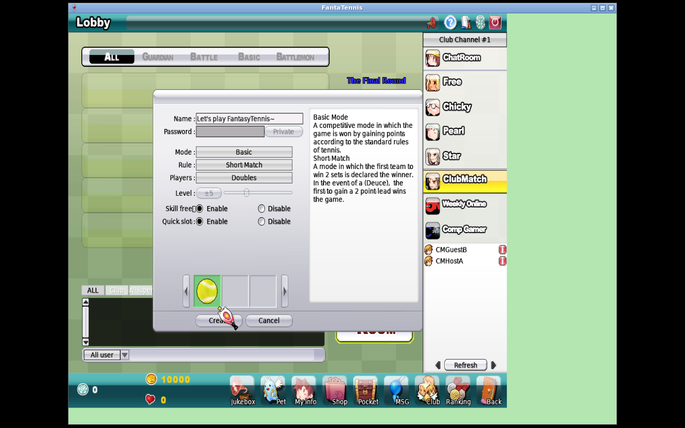
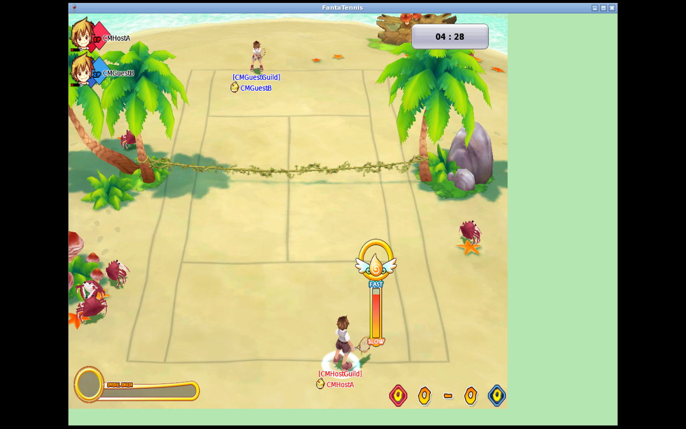
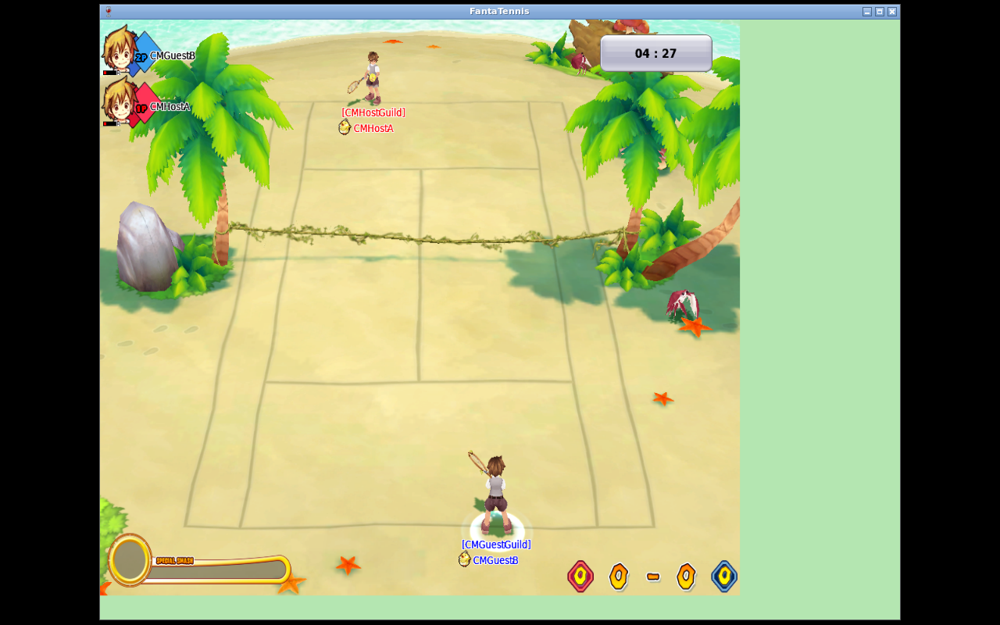
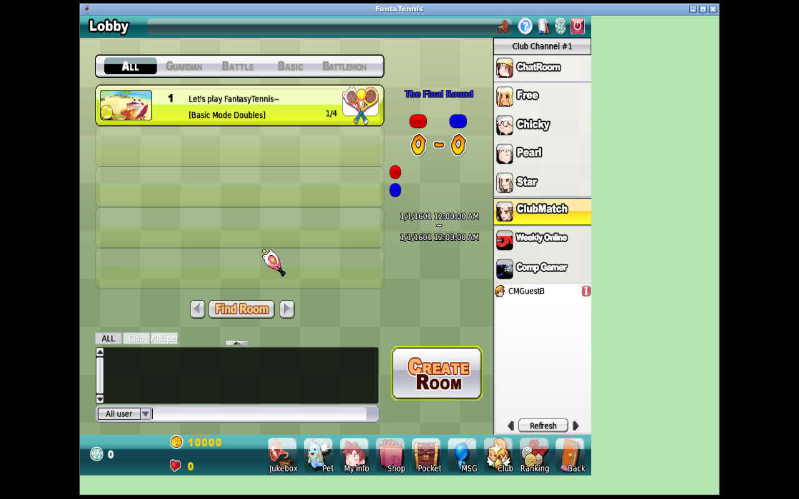

<div class="title-page">

# JFTSE — Club Match Native Validation

<div class="subtitle">Official-client protocol and lifecycle evidence for the supported Warfare Basic compatibility slice</div>

<div class="metadata">

**Server repository:** `ThewindMom/JFTSE`<br>
**Branch:** `feature/club-match-mode`<br>
**Validated source:** `5a29788bd46f97cdc69306b0cffdf84a49ad96d6`<br>
**Implementation sequence:** `186962ad` → `7abe015d` → `a7d1dcea` → `b8613d36` → `5a29788b`<br>
**FantaTennis.exe SHA-256:** `5477f0827acae66976403aecd2e9ebffeb4fa28da1fedae5f9541ec25e336c31`<br>
**Native environment:** Wine 8.0.2; two independent Win32 prefixes and `1280×800×24` displays<br>
**Validation date:** 2026-08-13 UTC

</div>

</div>

# Executive summary

Two isolated, unmodified copies of the official Fantasy Tennis client completed the main Club Match Warfare Basic lifecycle against JFTSE commit `5a29788bd46f97cdc69306b0cffdf84a49ad96d6`. Native runtime and decoded service evidence establish Warfare initialization, type-6 Basic room creation and listing, an opposing-guild join and roster, the Club-specific ready/countdown/designated-start exchange, both relay registrations, sustained `0x0414` gameplay relay traffic, point progression, deadline expiry, and clean return to the waiting room.

For **non-tied** matches, JFTSE sent exactly one `0x26FC 00` to each material client after genuine `0x26FB` expiry reports. The guest rendered `LOSER` and a Defeat result; the host was captured leading at `00:01`, but the alleged host-result image was audited and is only gameplay. No host `WINNER` or Victory panel is claimed.

For the fresh **1–1 tied** deadline, both clients emitted genuine `0x26FB`. JFTSE deliberately sent no `0x26FC`, displayed no result panel on either client, and returned both clients cleanly to the room. This is the branch's current compatibility behavior while retail tie-break semantics remain unknown; it is **not evidence that retail Fantasy Tennis behaved this way**.

Guest disconnect during countdown also cancelled the countdown with `0x26F8 01 00`, preserved a stable host `MASTER`, and allowed the room to relist, the guest to reconnect, and a later native rejoin to succeed.

<div class="callout">

**Proven scope:** official-client Warfare Basic (`roomType=6`, wire `mode=0`) through initialization, create/join, ready/countdown/start, relay gameplay, expiry, non-tied guest result, tied no-result compatibility handling, room return, and countdown-disconnect relist/rejoin.

</div>

<div class="warning">

**This is not a “fully complete” Club Match claim.** Result UI is incomplete on the winning host, several failure and room-deletion paths remain without native proof, retail tie semantics are unknown, Warfare Pet is unsupported, and no rewards, rankings, guild points, Castle effects, schedules, or seasons are implemented or claimed.

</div>

# Missing / not proven / non-claims

This section is intentionally prominent. “Implemented” or “server-tested” is not treated as native-client or retail proof.

| Missing or uncertain item | Accurate publication boundary |
|---|---|
| Host winner UI | **Not captured.** There is no host `WINNER`/Victory panel. The prior alleged host-result screenshot was audited as gameplay at `00:01`. |
| Result byte `00` | Consistent with red-side victory and the guest's visible Defeat. The host winner panel remains absent, so full two-sided UI interpretation is not proven. |
| Duplicate/non-designated start | The native UI did not emit duplicate or non-designated `0x26F9` attempts. Server coordinator tests are not native proof. |
| Duplicate/native expiry boundary | Native clients emitted expiry after server deadline in the non-tied runs, but the UI did not provide a controlled duplicate/early-expiry experiment. Server idempotence tests are not native proof of every client boundary. |
| Gameplay-time relay disconnect rollback | **Not completed** after the final fixes. |
| Withheld-relay failure | **Not completed** after the final fixes. |
| Final-occupant room deletion | **Not completed.** |
| Retail tied result | No retail result byte or tie-break rule was recovered. No draw byte was invented. The current no-result tie behavior is a JFTSE compatibility choice, not a retail claim. |
| Warfare Pet | **Not implemented or native-validated.** Room type 7/mode 1 remains outside this slice. |
| Rewards and metagame | No rewards, rankings, player statistics, guild points, Castle ownership/effects, retail schedules, or season behavior are claimed. |
| Original retail semantics generally | Packet/UI observations are from this official client against current JFTSE. Branch behavior is identified separately from unknown original-server policy. |

## Evidence classification

| Class | Findings in this work |
|---|---|
| **Observed native runtime** | Genuine `0x2700`→`0x2701` initialization; `0x1389` create; `0x138B` join; opposing roster; `0x26F7`/`0x26F8`/designated `0x26F9`; both relay joins; sustained `0x0414`; points; `0x26FA`; genuine `0x26FB`; non-tied `0x26FC 00`; guest Defeat; tie without result; room return; countdown disconnect/relist/rejoin. |
| **Static client reverse engineering** | Room types 6/7 select Club Match paths; Warfare/Warfare Pet identity findings informed the server mapping. Static findings are not promoted where native evidence is absent. |
| **JFTSE source/tests baseline** | Packet declarations, handlers, room coordinator/launcher/session behavior, relay decoder, focused regressions, 62-test full reactor, and package success. |
| **Compatibility interpretation** | Native create `(roomType=0, mode=0)` maps to stored/S2C Warfare `(6,0)` on server type 7; tied 1–1 expiry sends no result until retail semantics are known; ordinary Basic reward/stat mutations are suppressed. |
| **Implementation in this branch** | Dedicated type-7 Club service, Warfare initialization, balanced opposing-guild admission, master-ready exemption, guarded countdown/start, relay/deadline lifecycle, idempotent non-tied settlement, and native relay serial alignment. |

# Exact supported lifecycle

| Stage | Native/protocol observation | Verdict and limit |
|---|---|---|
| Warfare entry | Genuine C2S `0x2700` produced S2C `0x2701`; returned guild identity with state `3` | **Observed native runtime.** This identifies the supported Warfare state; it does not prove retail scheduling policy. |
| Create | Host selected Basic; native C2S `0x1389` had `roomType=0`, `mode=0`; type-7 JFTSE returned/listed/info'd `roomType=6`, `mode=0` | **Observed.** Create response/list/info identity is type 6. |
| Join/roster | Guest emitted genuine `0x138B`; `0x138C` returned `result=0, roomType=6, mode=0`; opposing guilds rendered on red/blue sides | **Observed with both clients.** |
| Ready/countdown | Guest emitted `0x26F7 ready=true`; both received full `0x26F8` countdown; host remained `MASTER` without Ready | **Observed.** Master exemption works through asynchronous launch recheck. |
| Start | Designated native participant emitted `0x26F9` | **Observed designated path.** Duplicate/non-designated native attempts not emitted. |
| Relay/game start | Both received relay settings, joined the same relay session, and received successful game start plus `0x26FA 2c 01 00 00` (300 seconds) | **Observed.** Final serial fix accepted by native gameplay. |
| Gameplay | Sustained decoded C2S `0x0414` relay frames, visible movement, and native `0x183F` point progression | **Observed.** No separately proven strike/serve key is claimed. |
| Non-tied deadline | Native point/score progression; both emitted `0x26FB`; JFTSE sent exactly one `0x26FC 00` per client; guest rendered Defeat; both returned to room | **Observed twice.** Byte 0 is consistent with red victory, but host Victory UI is absent. |
| Tied deadline | Authoritative state tied 1–1; both emitted `0x26FB`; no `0x26FC`; no result panel; clean return to same room | **Observed JFTSE compatibility behavior, not retail tie semantics.** |
| Countdown disconnect | Genuine guest TCP disconnect; `0x26F8 01 00` cancellation; host stable as `MASTER`; room relisted 1/4; guest reauthenticated and later rejoined | **Observed.** Gameplay-time relay rollback remains unproven. |

# Provenance and implementation history

## Client and source identity

| Artifact | Exact identity |
|---|---|
| Official client archive | `https://www.jftse.com/client/FantaTennis.7z`; known archive SHA-256 `c19ca21b8e2ab091953b2f631e48853b6477400f4d7000682ac7440f9994f12e` |
| `FantaTennis.exe` | `5477f0827acae66976403aecd2e9ebffeb4fa28da1fedae5f9541ec25e336c31` in immutable, host, and guest copies |
| Validated branch source | `5a29788bd46f97cdc69306b0cffdf84a49ad96d6` |
| Fresh validation game jar | `4800704cc38f4d0bc788b1f0b7c10cab7d1c91c706deae37af7b32c991261319` |
| Fresh validation relay jar | `82178bebda55b968bb7b98332ae8d639d7f04bdb5baf46c92d509cac2de5a723` |
| Final safe evidence archive | `jftse-club-match-final-validation-20260813-safe-evidence.tar.gz`; 4,036,544 bytes; SHA-256 `3606bf09de966a29e03fdaafe917e7c36146dcc056ac4b1d50f008ef209e2577` |
| Safe archive inventory | 28 evidence files and 10 audited screenshots, plus directories/index/manifest/report entries |

The fresh lab used Wine 8.0.2 with two independent Win32 prefixes, task-owned runtime directories, `1280×800×24` X displays, identities in different disposable guilds, and ordinary mouse/keyboard UI input. No synthetic game-packet injection, memory patch, or direct handler call is counted as native proof.

## Final commit sequence

| Commit | Purpose and evidence consequence |
|---|---|
| `186962ad1fb2c0d478a7ebed6c2e3be45f847679` | Implemented Warfare initialization (`0x2700`→`0x2701`) and packet contract. |
| `7abe015d2333a82907f20730e1308824707315e1` | Allowed balanced opposing teams below room capacity, enabling the native two-player 1-v-1 slice in a 4-slot room. |
| `a7d1dcea863ea0b3a315e32eaffe0c20a0fdc377` | Exempted Club Match `MASTER` from the ready prerequisite in countdown coordination. |
| `b8613d3667983288aff0f2d2f9ec7610be3f21b8` | Applied the same master exemption in the asynchronous relay-wait launch recheck; focused 15-test, full reactor, and package gates passed. |
| `5a29788bd46f97cdc69306b0cffdf84a49ad96d6` | Advanced the relay decoder serial after native registration; captured-frame regression, full reactor, package, and subsequent native relay gameplay passed. |

## Build and package gates

The final source was built with JDK 21. The captured final gates report:

- relay serial focused regression: **1 test, 0 failures, 0 errors, 0 skipped**;
- full 11-module reactor: **62 tests, 0 failures, 0 errors, 0 skipped; BUILD SUCCESS**;
- `mvn package -DskipTests`: **all 11 modules BUILD SUCCESS**.

The exact logs are included in the [evidence inventory](#evidence-inventory). One earlier package attempt affected by a concurrent build is not counted; the isolated rerun above is the claimed package gate.

# Protocol and state model

```text
guild/player DB S0
  + native Club action / C2S packet
  + type-7 room, countdown, and session guards
  → S2C response/broadcast and relay session
  → native gameplay/result/room UI
  → DB S1 with ordinary rewards/statistics intentionally unchanged
```

| Packet | Direction | Role in validated slice | Evidence boundary |
|---|---|---|---|
| `0x2700` / `0x2701` | C2S / S2C | Warfare initialization and guild state 3 | Native request/response observed; payload contract tested. |
| `0x1389` / `0x138A` | C2S / S2C | Basic room create and type-6 answer | Native create observed. |
| `0x138B` / `0x138C` | C2S / S2C | Join and type-6 room identity | Native join observed. |
| `0x26F7` | C2S | Guest readiness | Native `ready=true` observed. |
| `0x26F8` | S2C | Countdown state/timestamps or `01 00` cancellation | Full countdown and disconnect cancellation observed. |
| `0x26F9` | C2S | Designated participant starts after countdown | One designated native path observed. |
| `0x03ED` / relay settings | C2S / S2C | Relay session registration | Both native registrations observed. |
| `0x0414` | C2S relay envelope | Sustained native gameplay relay | Final deployment decoded sustained traffic after the serial fix. |
| `0x26FA` | S2C | Four-byte game duration | `2c 01 00 00` = 300 seconds observed on both. |
| `0x183F` | C2S | Point progression | Genuine point events observed and reflected in scores. |
| `0x26FB` | C2S | Client timer expiry report | Genuine reports from both clients in non-tied and tied runs. |
| `0x26FC` | S2C | One-byte winning side in non-tied matches | Exactly one `00` per client; omitted by compatibility design for tied 1–1. |

The dedicated Club service is server type 7. Server type, room type, and wire mode remain separate concepts: this slice maps native create `(0,0)` to Warfare room identity `(6,0)`. Warfare Pet `(7,1)` is not silently treated as equivalent.

# Native visual walkthrough

## Basic room and opposing-guild join




## Final-deployment gameplay





The relay evidence records both `0x03ED` registrations and sustained native `0x0414` frames after commit `5a29788b`. Genuine `0x183F` traffic progressed the authoritative score. These images prove UI state; decoded packet and server evidence prove the protocol path.

## Tied deadline compatibility behavior


The server recorded tied sets `1-1`, both clients emitted genuine `0x26FB`, no `0x26FC` was sent, and neither client displayed a result. The +15-second captures confirm the stable no-panel room state; they do not establish retail tie behavior.

## Countdown disconnect, relist, and reconnect




Decoded evidence records the guest TCP disconnect and S2C `0x26F8 01 00` cancellation. The same guest account reauthenticated and a later clean native rejoin succeeded. Crash/black frames from failed later Wine attempts were excluded and are not counted as evidence.

# Database, non-mutation, and cleanup

The validation used disposable fixture identities only. For tied expiry, JFTSE logged that ordinary Basic rewards, rankings, player statistics, and guild records were not changed. This validates the branch's intentional non-mutation boundary; it does not establish future retail reward policy.

Before teardown, task fixture state was explicitly reset. The final DB postcheck shows both accounts status 0 with null server fields, both players offline, and zero nonempty fixture rows. The final resource postcheck records:

```text
task_containers=0
task_networks=0
task_volumes=0
task_processes=0
listeners=0
displays=0
bulky_client_dirs=0
unsafe_pcaps=0
```

The shared `jftse-elemental-defense-native-net` remained present and was intentionally preserved. No native lab resources were restarted for publication.

# Evidence security and curation

The external safe archive was hash-verified before curation. This report tracks decisive screenshots, decoded packet excerpts, exact provenance, test/package logs, DB postchecks, and cleanup proof. It intentionally does **not** track the tarball itself.

Excluded from Git publication:

- credential-bearing raw authentication PCAP and unsafe multi-port captures;
- login/authentication logs, credentials, tokens, and replayable session material;
- official client executables, client trees, Wine prefixes, and database volumes;
- deployed jars and other giant runtime artifacts;
- black/crash frames, calibration noise, and redundant screenshots.

The ten tracked PNGs were audited as valid `1280×800` RGB screenshots: no credential UI, black/crash frames, or malformed images were present. Text evidence was scanned for password/secret/token/key patterns. Matches were limited to empty packet `password` fields, disposable fixture names, and task-lab IP addresses; no fixture secret or credential value was published.

## Evidence inventory

| File | Purpose | Claim supported |
|---|---|---|
| [Curated evidence README](native-evidence/README.md) | Safety scope and directory navigation | Publication boundary |
| [Curated evidence SHA-256 manifest](native-evidence/SHA256SUMS) | Hashes of every tracked evidence artifact | Evidence integrity |
| [Initial provenance](native-evidence/provenance/initial.txt) | Source/client/jar hashes and client start time | Exact runtime identity |
| [Final head and jar hashes](native-evidence/provenance/final-head.txt) | Final source and deployed artifacts | Final deployment provenance |
| [Full Club matrix excerpt](native-evidence/protocol/final-club-matrix.txt) | Create/join/ready/start/points/tie/rejoin decoded events | Main lifecycle and tied expiry |
| [Final relay matrix](native-evidence/protocol/final-relay-matrix.txt) | Both relay joins and sustained native relay frames | Post-fix relay gameplay |
| [Tie deadline packet excerpt](native-evidence/protocol/tie-deadline-packets.txt) | Tied state, both `0x26FB`, no result | Current tie compatibility behavior |
| [Countdown disconnect packets](native-evidence/protocol/countdown-disconnect-packets.txt) | TCP disconnect and `0x26F8 01 00` | Cancellation path |
| [Server readiness](native-evidence/protocol/server-readiness.txt) | Service readiness and handler context | Observable lab startup |
| [Focused relay regression](native-evidence/tests/relay-serial-regression-green.txt) | Captured-frame decoder contract | 1-test focused green |
| [Full reactor test log](native-evidence/tests/relay-serial-full-project-tests.txt) | JDK 21 11-module test gate | 62-test green |
| [Full package log](native-evidence/tests/relay-serial-full-project-package.txt) | JDK 21 release package gate | 11-module package success |
| [Initial fixture](native-evidence/db/initial-fixture.txt) | Disposable state and lab routing | Fixture provenance |
| [Final fixture reset](native-evidence/db/final-fixture-empty-postcheck.txt) | Accounts/players/rows restored | DB cleanup |
| [Final resource postcheck](native-evidence/cleanup/final-empty-postcheck.txt) | Containers, volumes, listeners, displays, unsafe PCAP count | Lab cleanup |
| [Host room creation](native-evidence/screenshots/tie-host-room-created.png) | Native Basic selection | Create UI |
| [Guest joined](native-evidence/screenshots/tie-guest-joined-single.png) | Guest room presence | Join/roster UI |
| [Host initial gameplay](native-evidence/screenshots/tie-host-gameplay-initial.png) | Host court at 0–0 | Native gameplay |
| [Guest initial gameplay](native-evidence/screenshots/tie-guest-gameplay-initial.png) | Guest court at 0–0 | Two-client gameplay |
| [Host tied expiry, immediate](native-evidence/screenshots/tie-host-deadline-immediate.png) | Host no-result room return | Tie compatibility UI |
| [Guest tied expiry, immediate](native-evidence/screenshots/tie-guest-deadline-immediate.png) | Guest no-result room return | Tie compatibility UI |
| [Host tied expiry, +15 s](native-evidence/screenshots/tie-host-deadline-plus15.png) | Stable host waiting room | No delayed result panel |
| [Guest tied expiry, +15 s](native-evidence/screenshots/tie-guest-deadline-plus15.png) | Stable guest waiting room | No delayed result panel |
| [Host after countdown disconnect](native-evidence/screenshots/countdown-disconnect-host.png) | Stable sole `MASTER` | Countdown cancellation |
| [Post-disconnect relist](native-evidence/screenshots/post-countdown-disconnect-relist.png) | Room at 1/4 occupancy | Persistence/reconnect path |

# Final conclusion

The main Warfare Basic path is now genuinely native-green for this exact official client and JFTSE source: initialization, type-6 create/list/info, opposing-guild join, ready/countdown/designated start, relay registration and sustained gameplay, points, duration, expiry, a non-tied guest Defeat result, and room return all occurred through unmodified clients. A tied 1–1 deadline and a countdown disconnect also reached clean, explicit compatibility outcomes.

The evidence does not justify “Club Match complete.” The winning host panel, controlled native duplicate/non-designated attempts, gameplay relay rollback, withheld-relay rollback, final-occupant room deletion, retail tie semantics, Warfare Pet, rewards, rankings, guild points, Castle behavior, schedules, and seasons remain absent or unproven. Those boundaries are part of the result, not footnotes to it.
