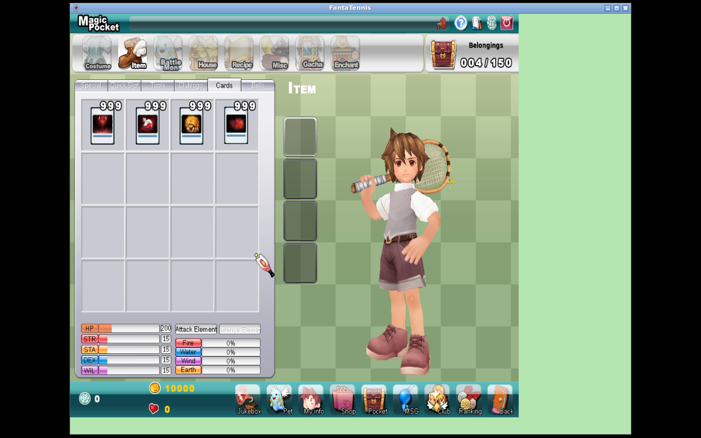
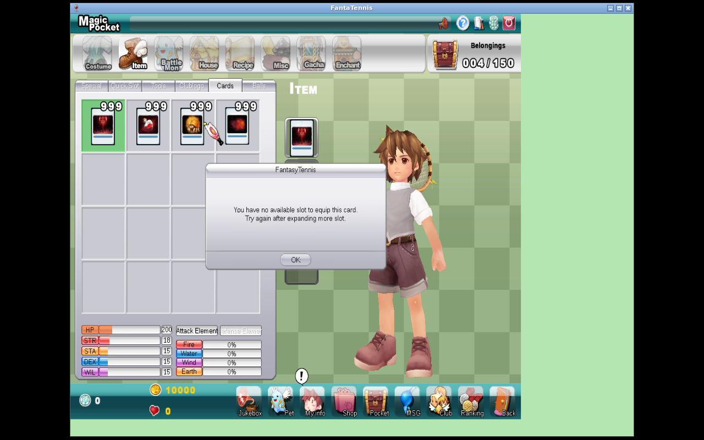
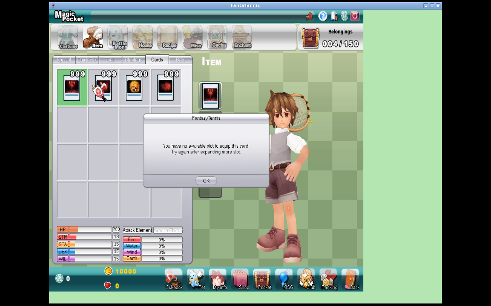
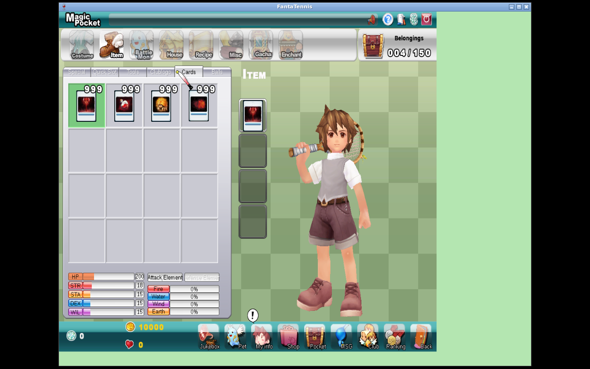
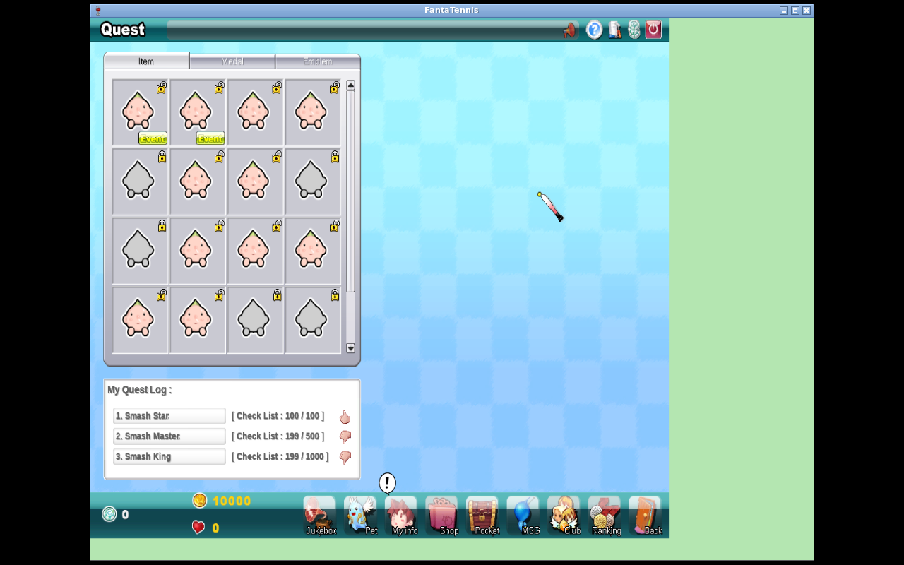
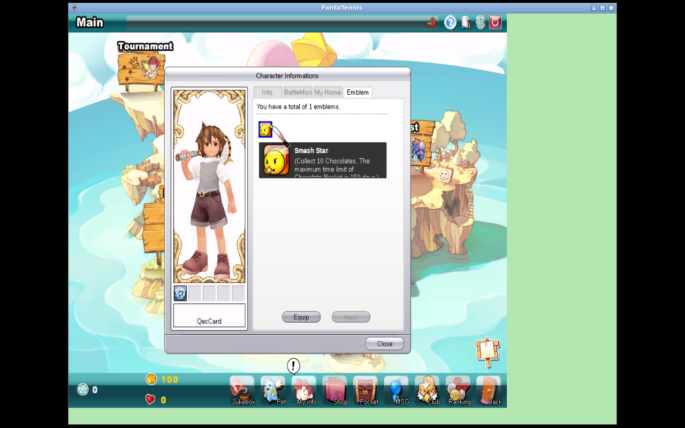
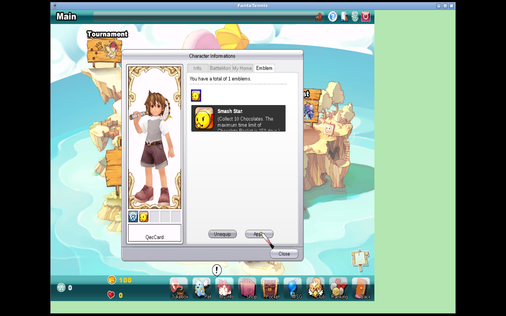
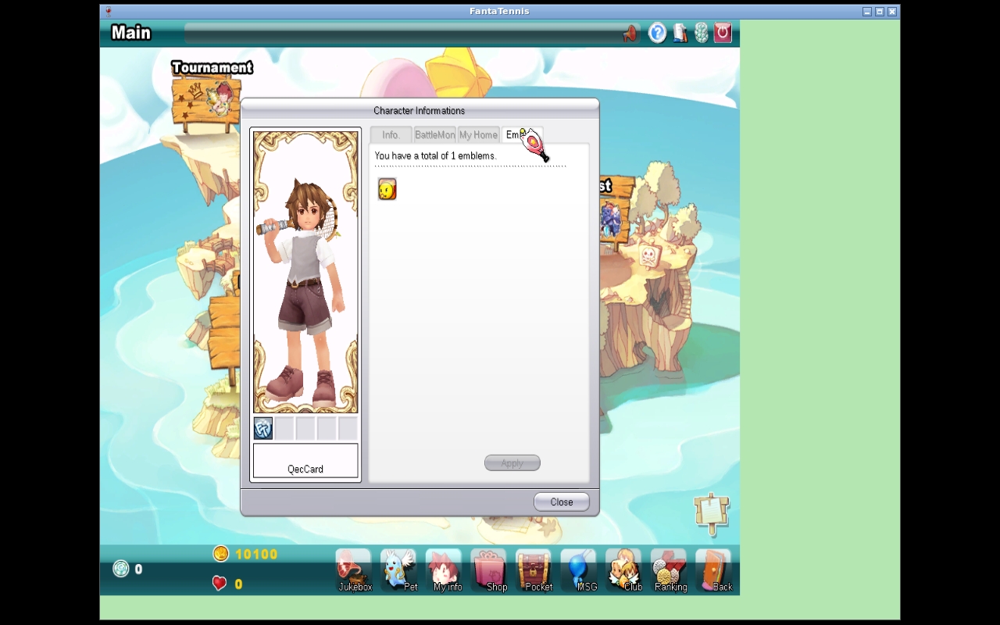

<div class="title-page">

# JFTSE — Quest, Emblem, and Card Systems

<div class="subtitle">Native Fantasy Tennis client reverse engineering, Java server implementation, persistence, and end-to-end validation</div>

<div class="metadata">

**Server repository:** `sstokic-tgm/JFTSE`<br>
**Branch:** `feature/quest-emblem-card-systems`<br>
**Development base:** `65c3665170edc2d912a3187244de89251a809712`<br>
**Faulty commit revert:** `2269ab8361b40b8668fadc4c5c86352ad659a166`<br>
**Implementation:** `1133311c813d1812dd870dce14e4a46e35406bf9`<br>
**Client archive SHA-256:** `c19ca21b8e2ab091953b2f631e48853b6477400f4d7000682ac7440f9994f12e`<br>
**FantaTennis.exe SHA-256:** `5477f0827acae66976403aecd2e9ebffeb4fa28da1fedae5f9541ec25e336c31`<br>
**Native runtime:** Wine 8.0, isolated prefix, Xvfb 1280×800×24<br>
**Validation date:** 12 August 2026 UTC

</div>

</div>

<div class="page-break"></div>

# Executive summary

This branch implements a coherent Quest/Emblem/Card vertical slice against the unmodified native Fantasy Tennis client. It starts from `origin/development`, preserves a dedicated revert of faulty commit `fcdeb89a94bb17337f8b8f499b79c5892370004e`, imports the client's card and emblem-quest definitions, adds externally manageable database state, implements the client/server packet contracts, validates mutations transactionally, and restores equipment after reconnect.

The strongest end-to-end proof is one continuous finalized native capture and its synchronized UI/DB checkpoints:

* a native card submission sent `0x1C21 [1,0,0,0]`; the server acknowledged authoritative state with `0x1C22` and persisted it; the native client rejected an over-capacity attempt without a DB mutation, and slot 1 was restored after reconnect;
* lifetime statistic packet `0x2292` delivered `TotalSmash=199`; list packet `0x226B` exposed the persisted baseline for Smash Star; the native UI rendered `100/100`;
* native completion sent `0x227C questIndex=1000`; response `0x227D` returned level 2, absolute gold 10100, and absolute EXP 100; the DB atomically moved the quest to `COMPLETED` and updated the player;
* native equipment sent `0x2295 [1000,0,0,0]`; the DB persisted it; a fresh reconnect received authoritative `0x2297 [1000,0,0,0]`, and the native UI restored the equipped emblem.

<div class="callout">

**Proven scope:** four-slot card transport and ownership validation; card stat aggregation/serialization; manual quest lifecycle services and packets; automatic emblem tracking; list, completion, unlock, equip, authoritative reconnect restoration; DB-backed definitions, rewards, player progress/equipment, audit tables, and an idempotent migration.

</div>

<div class="warning">

**Not claimed:** retail-perfect semantics for every bundled definition; legacy Challenge/MapQuest or `Quest.res`; item consumption on completion; native-runtime proof for manual accept/abandon, non-empty item rewards, or card bonuses during a played match; `WorldQuest`, `Furniture`, or `Transmutes` progression; Tournament; or unrelated client features.

</div>

## Evidence classification

| Class | Findings in this work |
|---|---|
| Observed native runtime | Card preview/submit/rejection/reconnect; `0x2292`; quest list and completion; emblem unlock/equip/reconnect; synchronized DB transitions. |
| Static client reverse engineering | `0x2297` is four consecutive LE `uint16` values; quest/emblem IDs and layouts were correlated with dispatch/parser behavior and client resources. |
| JFTSE wiki/source baseline | Fixed 8-byte LE header; `.packet` generator rules; database-operability goals; Roadmap explicitly lists Quest, Emblem, and Card as planned reverse-engineering work. |
| Compatibility interpretations | Client combines lifetime statistics with transmitted quest baselines; IDs 1000–1999 are automatic emblem quests; four unused element bytes per direction remain reserved/zero. |
| Implementation in this branch | Entities, repositories, services, handlers, packets, data import, match/housing hooks, migration, tests, and report evidence. |

# Scope, provenance, and branch history

## Repository, development base, and branch

The branch was created from `origin/development` at `65c3665170edc2d912a3187244de89251a809712`. The history intentionally has separate commits for the requested revert and the feature implementation:

```text
65c36651  origin/development base
2269ab83  Revert faulty pet/room packet commit fcdeb89a...
1133311c  Implement quest, emblem, and card systems
```

No force push, shared-branch rewrite, or removal of unrelated history was performed. “Remove this commit” is therefore implemented as a normal revert, preserving auditable history.

## Client provenance

The native archive came from `https://www.jftse.com/client/FantaTennis.7z`. Archive and executable hashes are fixed in the title metadata and [artifact hash inventory](evidence/quest-emblem-card/artifact-hashes.txt). The raw client, Wine prefix, disassembly, and PCAP are deliberately excluded from Git; only sanitized excerpts and screenshots are committed.

A known-good Wine prefix remains unchanged outside Git. Its original 138,016,303-byte archive and 90 MiB/41.6 MiB split chunks all have verified SHA-256 values in the hash inventory.

## Documentation consulted

The wiki was treated as project documentation, not proof of an unknown wire field:

* [JFTSE Roadmap](https://wiki.jftse.com/index.php/JFTSE_Roadmap), accessed 12 August 2026: defines reverse engineering as client/server behavior plus trial-and-error around packet structures, and explicitly lists Emblems, Quests, Cards, and incomplete packets.
* [Special:AllPages](https://wiki.jftse.com/index.php/Special:AllPages), accessed 12 August 2026: documentation index.
* [Packet Structure](https://wiki.jftse.com/index.php/Packet_Structure), accessed 12 August 2026: fixed 8-byte header and little-endian payload contract.
* [Packet Schema (.packet) Format](https://wiki.jftse.com/index.php/Packet_Schema_(.packet)_Format), accessed 12 August 2026: generator ownership, field ordering, fixed/repeated lengths, and CMSG/SMSG behavior.
* [Database Schema & Cheatsheet](https://wiki.jftse.com/index.php/Database_Schema_%26_Cheatsheet), accessed 12 August 2026: database-first server operability and relationship patterns.

The Roadmap's importer note says database and XML need correct synchronization and that authority must be decided. This implementation makes that decision explicit for emblem quests: XML seeds missing IDs, while existing DB definitions and rewards remain authoritative for external tooling.

# First-principles model

The client owns presentation and bundled labels; the server owns authorization, mutable progress, rewards, and reconnect truth.

```text
┌────────────────────┐      C2S       ┌────────────────────┐
│ Native client + XML│ ─────────────▶ │ Handler + service  │
└─────────┬──────────┘                └─────────┬──────────┘
          │                                     │ lock / validate
          │                                     ▼
          │                           ┌────────────────────┐
          │            S2C snapshot   │ Persistent DB state│
          └───────────────────────────│ + audit history     │
                                      └────────────────────┘
```

## Invariants

1. **Authorization:** a requested card ID must be a positive-count `CARD` row in that player's own pocket and must resolve to supported metadata. An emblem ID must correspond to that player's completed quest.
2. **No duplication:** nonzero card/emblem IDs cannot repeat within one four-slot request.
3. **Server truth:** rejection never echoes untrusted requested state; card responses contain the persisted authoritative slots. Successful emblem equip returns `0x2297`; all emblem equip attempts are followed by a refreshed list.
4. **Atomic completion:** player, quest, rewards, level/status points, EXP, and gold mutate in one transaction. Failure to grant a configured reward throws and rolls back rather than recording partial completion.
5. **Lifecycle:** manual quests can be accepted/abandoned under enabled/level/prerequisite/three-active/repeat constraints. Automatic IDs are created and tracked without manual accept/abandon.
6. **Reconnect:** card and emblem equipment are loaded from DB and sent during player-data initialization.
7. **External management:** re-running the bundled emblem XML import never overwrites an existing quest definition or its reward rows.

## Hypotheses and selected experiments

| Question | Competing hypotheses | Falsifier / experiment | Result |
|---|---|---|---|
| What does `0x2292` carry? | Flat values, deltas, or selector/value assignments | Change one lifetime stat and inspect combined initialization segment | `uint16 count`, then 5-byte selector + signed LE `int32` assignments. |
| What does `0x226B` progress mean? | Current progress or lifetime baseline | Persist baseline 99 and total 199, restart client, inspect UI | Client rendered 100/100 only when list carried baseline 99 and `0x2292` carried total 199. |
| Does completion return deltas? | Reward delta versus new absolute player totals | Native completion with known 100 gold/EXP reward | Client required absolute 10100 gold and 100 EXP; delta-only response was corrected. |
| What is `0x2297`? | Counted list, bytes, or fixed slots | Static parser tracing plus reconnect capture | Exactly four consecutive LE `uint16` emblem IDs. |
| Who is authoritative after XML import? | Bundled XML or DB | Modify existing definition/reward, rerun import | Required operator edit to survive; importer now skips existing IDs entirely. |

# Static Fantasy Tennis client reverse engineering

## Resource findings

`EmblemQuest.xml` contains 102 definitions: 37 manual quest IDs below 1000 and 65 automatic emblem IDs from 1000 through 1064. Its `Quest`, `QuestDetail`, and six character-specific reward tables are normalized into DB definitions and reward records. Presence in XML is descriptive, not proof that server tracking exists.

`Item_Stat_Cards_Ini3.xml` contains 39 card definitions. Each maps an item index to a type, grade, and power. Supported implemented types are HP, STR, STA, DEX, WIL, four attack elements, and four defense elements.

The client-side resource names and descriptions can be surprising. For example, the native tooltip shown for Smash Star mentions chocolates even though the server fixture tracks a TotalSmash definition. That mismatch is why the report distinguishes observed wire/UI behavior from claims about retail content semantics.

## Executable and parser findings

Instruction-level parser tracing around the emblem equipment dispatch established that `0x2297` consumes four adjacent 16-bit values with no count prefix. This finding was promoted to a byte-exact packet test, then validated in native reconnect frame 4978.

The same methodology—packet-ID cross references, nearby parser reads, resource IDs, controlled DB changes, and native UI response—was used instead of guessing from names. Generated `.packet` schemas are used only where their field order matches the observed client parser; server packets with conditional layouts are written explicitly.

## Static findings not runtime-proven

Manual request IDs `0x2274` and `0x2278` and their two-byte quest index layouts are statically grounded and covered by generated-parser/service tests, but the final native walkthrough exercises automatic emblem completion rather than manual accept/abandon. Reward records are byte-exact against the standard 28-byte inventory representation, but the final native completion intentionally has reward count zero.

# Reverse-engineered protocol

## Framing and listener ownership

Every packet uses the wiki-documented 8-byte header:

```text
offset  size  field
0x00    2     serial
0x02    2     checksum
0x04    2     packet ID, little-endian
0x06    2     payload length, little-endian
0x08    n     payload
```

| Listener | Port | Feature role in this work |
|---|---:|---|
| auth | 5894 | Login/player creation; creates associated equipment rows. |
| game | 5895 | All Quest, Emblem, Card packets and the final PCAP evidence. |
| relay | 5896 | Started for normal JFTSE topology; no feature packet in this slice. |
| chat | 5897 | Receives card-derived player serialization changes for parity. |

## Packet table

| ID | Direction | Exact payload | Evidence | Confidence |
|---|---|---|---|---|
| `0x1C21` | C2S | Four LE `int32` PlayerPocket IDs | Native frames 253/479; existing client packet schema | High |
| `0x1C22` | S2C | Authoritative four LE `int32` IDs | Native frames 255/402/5001 and reconnect UI | High |
| `0x226A` | C2S | Empty list request | Native frames 2557/5077 | High |
| `0x226B` | S2C | `int16 status`, `uint16 count`, then 17-byte records | Native list responses and byte-exact tests | High |
| `0x2274` | C2S | `uint16 questIndex` | Static/generated schema and service tests | Medium |
| `0x2278` | C2S | `uint16 questIndex` | Static/generated schema and service tests | Medium |
| `0x227C` | C2S | `uint16 questIndex` | Native frames 2871/3364 | High |
| `0x227D` | S2C | `uint8 status`; on success: level, absolute gold, absolute EXP, reward count/records | Native frames 2873/3366 and byte-exact tests | High |
| `0x2292` | S2C | `uint16 count`; repeated `uint8 selector + int32 value` | Native combined segment frame 2406 | High |
| `0x2295` | C2S | Four LE `uint16` emblem quest IDs | Native frame 4201 | High |
| `0x2297` | S2C | Authoritative four LE `uint16` emblem quest IDs | Static parser + native frame 4978 | High |

### `0x226B` quest record

After the 4-byte response prefix, each record is exactly 17 bytes:

```text
uint16 questIndex
uint8  active
uint16 completionCount
repeat 4 times:
    uint8 conditionPresent
    int16 transmittedBaseline
```

For failure/special states, the implementation emits only a signed 16-bit sentinel, matching the client-side conditional shape rather than appending a count.

### `0x227D` completion

Success payload order is:

```text
uint8  status = 0
uint8  newLevel
int32  absoluteGold
int32  absoluteExp
uint16 rewardCount
repeat rewardCount: 28-byte inventory reward record
```

The reward record is pocket ID, category, item index, use type, count, Windows FILETIME, and six enchant bytes. Failure is a one-byte status only.

### Card stat block

The complete player-card block is 24 bytes: HP `int32`; STR/STA/DEX/WIL as saturated bytes; eight attack-element bytes; eight defense-element bytes. The client resources currently establish Earth/Wind/Water/Fire; the upper four positions in each eight-value direction remain zero/reserved. Existing match reward data carries only the 8-byte HP + four status subset, which is preserved.

Representative raw bytes, frame timestamps, and decoded values are in [protocol excerpts](evidence/quest-emblem-card/protocol-excerpts.txt).

# Java server implementation

## Boundaries

* `entities`: normalized definitions, player state, audit-enabled equipment/progress entities, and locking repositories.
* `server-core`: transactional Quest/Emblem/Card services, card arithmetic, packet operation IDs, generated CMSG schemas, and explicit S2C packet writers.
* `auth-server`: first-player associated-row creation plus card/emblem resource import.
* `game-server`: request handlers, initialization snapshots, match/housing tracking hooks, and card stat propagation into player/match packets.
* `chat-server`: equivalent card-derived player serialization where the same shared player structures are emitted.

## Quest and emblem lifecycle

Definitions below 1000 use the manual lifecycle. Acceptance validates enabled state, level restriction, prerequisites, repeat policy, duplicate state, and a maximum of three active manual quests. Abandon marks an active manual row `ABANDONED`. Definitions 1000–1999 are automatic: list creation initializes their baseline from authoritative player statistics, and manual accept/abandon is rejected.

Progress is separated into a persisted baseline and server progress. Total conditions are validated against current authoritative `PlayerStatistic` values at completion. Incremental conditions are updated from Basic/Battle/Guardian match totals and successful fishing/fruit collection hooks where implemented. Basic/Battle mode restrictions are honored.

Completion locks player and quest state, validates requirements, grants configured character-specific reward products, increments completion count, applies EXP/gold and level/status points, and returns the persisted absolute values expected by the native client.

## Emblem equipment

The four requested IDs are interpreted as unsigned 16-bit values. Nonzero IDs must be unique and must be owned through completed quest state. A successful transaction saves `PlayerEmblemEquipment`, reloads the in-memory player view, sends authoritative `0x2297`, and refreshes `0x226B`. Player initialization sends `0x2297` even when all four slots are zero.

## Cards

The existing `CardSlotEquipment` table remains the slot owner. `ItemCard` provides server-side meaning for the client's card item indices. `tryUpdateCardSlots` locks the equipment row and requested pocket rows, rejects malformed lists, foreign/non-card/empty items, duplicate IDs, or unknown card definitions, and changes all four slots together. Both success and rejection answer with persisted `0x1C22` state.

Derived `CardStats` are loaded into game/chat player and room views. The implementation replaces previously hard-coded zero card blocks in lobby, room, status, unknown-player, match-end, and level-up packet paths without changing unrelated field order. Integer/byte saturation prevents overflow on wire.

## Concurrency and rejection

Mutating service methods are transactional. Player, quest, equipment, and inventory rows use repository `FOR UPDATE` paths at authorization boundaries. Malformed or unauthorized card/emblem state is rejected before mutation. Completion cannot leave granted rewards with an incomplete quest or vice versa because a reward grant failure aborts the transaction.

# Persistence, migration, and external tooling

## Schema

The standalone [`quest_emblem_card_systems.sql`](../scripts/sql/quest_emblem_card_systems.sql) migration creates:

| Object | Purpose |
|---|---|
| `ItemCard` | Card item index → stat/element metadata. |
| `EmblemQuestDefinition` | Externally editable lifecycle, condition, requirement, and currency reward definition. |
| `EmblemQuestReward` | Character-specific ordered item rewards. |
| `PlayerEmblemQuest` | Per-player status, baselines, progress, completion count. |
| `PlayerEmblemQuest_AUD` | Envers history. |
| `PlayerEmblemEquipment` | Four persistent emblem IDs per player. |
| `PlayerEmblemEquipment_AUD` | Envers history. |
| three statistic columns + audit columns | perfect games, fish caught, fruit collected. |

The migration was executed twice against a fresh disposable MariaDB datadir. Both passes succeeded; all seven feature tables existed once, all six added statistic columns existed once, and six feature foreign keys were present. See [migration proof](evidence/quest-emblem-card/migration-proof.txt).

## Import authority

`auth-server -import` loads 39 card records and seeds 102 quest definitions plus character reward rows. Card metadata is refreshed by item index. Quest definitions behave differently by design: if `questIndex` exists, the entire definition and all reward rows are left untouched. This lets an external administration/event system edit enablement, conditions, rewards, and lifecycle data without the next bundled import undoing it.

The importer regression test modifies an existing DB definition/reward, reruns `loadEmblemQuest`, and proves both survive. XML remains the bootstrap source for missing IDs, not an ongoing authority over operator state.

# Red/green testing

## Native completion contract

The red test encoded the native behavior found during completion investigation. Before the fix, 23 focused tests produced three failures, including the response's byte layout and delta-versus-absolute EXP semantics. After the implementation changed `0x227D` and the service result to persisted totals:

```text
EmblemCompletePacketHandlerTest  1 passed
EmblemPacketContractTest         5 passed
EmblemQuestServiceTest          17 passed
Total                           23 passed, 0 failures/errors
BUILD SUCCESS
```

## Equipment restoration

The next red test was added before `S2CEmblemEquipmentPacket` existed and failed compilation on that missing class. The green implementation added the exact four-`uint16` packet, handler acknowledgement, initialization send, and tests:

```text
EmblemEquipPacketHandlerTest  2 passed
EmblemPacketContractTest      6 passed
Total                         8 passed, 0 failures/errors
BUILD SUCCESS
```

## Card release audit

Card service/handler tests cover ownership, category, count, duplicate IDs, metadata, authoritative rejection responses, arithmetic, and byte order. Packet tests cover full 24-byte and existing 8-byte subset contracts. One audit iteration incorrectly expected a full 24-byte tail from the subset packet; that 24-versus-21 failure was corrected as a test error rather than misrepresented as a product red. Final focused result: 9 passed.

## Full gates

```text
mvn test
auth-server: 1 passed
game-server: 44 passed
total: 45 passed, 0 failures, 0 errors
11/11 reactor modules SUCCESS

mvn package -DskipTests
11/11 reactor modules SUCCESS
BUILD SUCCESS
```

Commands and decisive outputs are summarized in [verification evidence](evidence/quest-emblem-card/verification.txt). Final JAR hashes are in the [artifact hash inventory](evidence/quest-emblem-card/artifact-hashes.txt).

<div class="page-break"></div>

# Native runtime laboratory

## Topology and method

The native client ran in an isolated Wine 8.0 prefix on an Xvfb 1280×800×24 display. Auth, game, chat, relay, MariaDB, and RabbitMQ were supervised in the orb. `ServerInfo.ini` targeted auth port 5894; DB-advertised routing connected the native client to game port 5895.

One finalized loopback PCAP contains 5,101 packets and has SHA-256 `7a41145cbe21a0b5d18f1b4d63254918c6a5ba62fc12dc12df1a6759037ca748`. The capture was stopped and not replaced after the reconnect proof. Raw capture is excluded from Git because the committed excerpts are enough to audit feature claims without shipping unrelated session traffic.

Every important action used a barrier:

```text
DB S0 → native click → expected C2S → expected S2C → DB S1 → screenshot
disconnect → online=0 → fresh process/login → init S2C → DB unchanged → screenshot
```

The deterministic Smash Star fixture changed `TotalSmash` from 99 to 199 while the client was offline. This was an operator mutation for protocol validation, not simulated evidence of a played match.

# Native walkthrough and visual evidence

## 1. Card baseline

The card tab initially shows four owned card stacks and no equipped card. Native stats are HP 200 and STR/STA/DEX/WIL 15; attack elements are zero.



## 2. Positive preview and capacity boundary

Selecting the first card previews it in the single level-one available card slot and raises native STR from 15 to 18, matching card index 1 (`STR +3`). Additional selection reaches the client's capacity boundary and opens its native “You have no available slot” modal. This screenshot therefore contains both the successful stat preview and the first negative capacity feedback.



After leaving the pocket, the client sent frame 253 `0x1C21` with `[1,0,0,0]`; frame 255 acknowledged the same authoritative four IDs. The DB moved from `[0,0,0,0]` to `[1,0,0,0]`.

## 3. Negative card attempt and no mutation

The pocket was reopened and a second source card selected while slot 1 remained occupied. The native client again displayed the no-slot modal. The synchronized DB snapshot remained `[1,0,0,0]`; no unauthorized second slot appeared.



## 4. Card reconnect persistence

After disconnect and a fresh known-good-prefix login, initialization sent `0x1C22 [1,0,0,0]`. The native card page restored the first card in the top equipment slot; the remaining three are empty.



## 5. Lifetime baseline and completable quest

Initialization packet `0x2292` delivered ten selector/value assignments, including selector `0x0A = 199` for TotalSmash. The quest list response carried count 65 and baseline 99 for quest 1000. The fresh client combined those values and rendered Smash Star at 100/100, while Smash Master and Smash King remained 199/500 and 199/1000.



## 6. Completion and atomic DB transition

The native client sent `0x227C e8 03`. Corrected `0x227D` returned `00 02 74 27 00 00 64 00 00 00 00 00`: success, level 2, gold 10100, EXP 100, no item rewards. The refreshed list removed Smash Star from active “My Quest Log”; Smash Master, Smash King, and Slice Star shifted up.


At the same checkpoint, the DB changed player level 1→2, EXP 0→100, gold 10000→10100, status points 5→6, quest status `ACTIVE→COMPLETED`, and completion count 0→1. Full before/after rows are in [database transitions](evidence/quest-emblem-card/database-transitions.txt).

## 7. Emblem unlocked

The native Character Information → Emblem tab reports one emblem and exposes the Smash Star tile for equipment. The tile is selected; the character slot has not yet been changed.



## 8. Emblem equipped

Applying the tile produced C2S `0x2295 [1000,0,0,0]`. The server validated that quest 1000 was completed and persisted slot 1. The native character panel immediately displays the emblem in its equipment strip.



## 9. Fresh reconnect restoration

The client was terminated, the server observed offline state, and a fresh native process logged in. At 22:27:17.058 UTC, frame 4978 sent the exact 16-byte full packet `57 38 83 07 97 22 08 00 e8 03 00 00 00 00 00 00`. The payload is four emblem IDs `[1000,0,0,0]`. The DB remained completed/equipped, and the native UI restored both unlocked inventory and the equipped strip.



## Multi-client scope

These are per-player inventory/progression systems, and the target mutation does not require a second-client synchronization barrier. No multiplayer card-stat gameplay claim is made. The relevant lifecycle boundary is fresh-process reconnect, which was exercised for both card and emblem equipment.

# Packet, database, and artifact evidence

## Evidence inventory

| File | Source | Purpose | Claim supported |
|---|---|---|---|
| [01-card-before.png](evidence/quest-emblem-card/01-card-before.png) | Native client | Empty card baseline | STR 15 and empty slots. |
| [02-card-preview-and-capacity-rejection.png](evidence/quest-emblem-card/02-card-preview-and-capacity-rejection.png) | Native client | Positive preview + boundary | One card, STR 18, no-slot modal. |
| [03-card-negative-no-slot.png](evidence/quest-emblem-card/03-card-negative-no-slot.png) | Native client | Negative repeated attempt | Native rejection with slot occupied. |
| [04-card-reconnect.png](evidence/quest-emblem-card/04-card-reconnect.png) | Native client | Fresh reconnect | Card equipment persistence. |
| [05-quest-completable.png](evidence/quest-emblem-card/05-quest-completable.png) | Native client | Pre-completion | Smash Star 100/100. |
| [06-quest-completed.png](evidence/quest-emblem-card/06-quest-completed.png) | Native client | Post-completion | Completed quest removed from active list. |
| [07-emblem-unlocked.png](evidence/quest-emblem-card/07-emblem-unlocked.png) | Native client | Completed inventory | One available emblem. |
| [08-emblem-equipped.png](evidence/quest-emblem-card/08-emblem-equipped.png) | Native client | Equip action | Emblem displayed in character strip. |
| [09-emblem-reconnect.png](evidence/quest-emblem-card/09-emblem-reconnect.png) | Native client | Fresh reconnect | Unlock/equipment restored. |
| [protocol-excerpts.txt](evidence/quest-emblem-card/protocol-excerpts.txt) | Final PCAP | Sanitized frame bytes/times | Exact C2S/S2C contracts. |
| [database-transitions.txt](evidence/quest-emblem-card/database-transitions.txt) | MariaDB snapshots | Before/after/no-mutation | Persistence and atomic transitions. |
| [migration-proof.txt](evidence/quest-emblem-card/migration-proof.txt) | Disposable MariaDB | Two migration passes | Idempotence and schema objects. |
| [verification.txt](evidence/quest-emblem-card/verification.txt) | Maven/source checks | Red/green and release gates | 45 tests and package success. |
| [artifact-hashes.txt](evidence/quest-emblem-card/artifact-hashes.txt) | SHA-256 inventory | Provenance/integrity | Client, resources, PCAP, JARs, images, prefix. |

# Compatibility interpretations

1. **Lifetime minus baseline drives total-condition presentation.** Native `0x2292 TotalSmash=199` plus `0x226B baseline=99` rendered 100/100. Sending current progress in both places did not. A retail capture with independently known values could replace this interpretation; blast radius is `wireProgress` and total-condition initialization, not DB lifecycle.
2. **IDs 1000–1999 are automatic emblem quests.** Bundled IDs 1000–1064, native list behavior, and inability/needlessness of manual acceptance support this range. A resource/capture containing a manual ID inside that range would require changing the range predicate.
3. **Required items are presence gates, not consumed.** Current implementation locks and verifies quantities but does not remove them because no native evidence established consumption. A before/after retail inventory capture is the smallest replacement evidence.
4. **The complete card element block reserves eight positions per direction.** Existing partial player packets and client parser shape establish eight; XML establishes four named elements. The upper four remain zero. A card/resource using another selector plus native stat change would define them.
5. **Completion currency/EXP fields are absolute.** This is stronger than compatibility-only because the native correction, packet bytes, UI flow, and DB totals agree. It would only be revisited if another completion mode demonstrably expects deltas.

# Failures and corrected procedure

* An early connected client retained stale in-memory lifetime state after an operator DB change and rendered 0/100. The procedure was corrected to require a fresh process after fixture changes.
* A signed-delta probe temporarily sent `-100` to discriminate client arithmetic. It was a controlled probe, not final behavior. The final capture uses authoritative lifetime values and persisted baselines.
* The first completion implementation returned reward deltas. Native behavior and red tests showed the client expects absolute post-transaction gold/EXP; packet/service code was corrected and retested.
* Emblem equip initially persisted but lacked an initialization snapshot. Static parser work identified `0x2297`; a red compile contract preceded the packet implementation; fresh reconnect then proved restoration.
* One card release test asked a subset packet for 24 bytes. Its failure was correctly classified as a test mistake; the final tests distinguish the full and subset card layouts.
* The normal DB user could not create a disposable schema for migration verification. A task-local MariaDB datadir was started, migration ran twice, and the service/datadir/socket/PID were removed afterward.
* One native reconnect stalled in the client initializer. The task-owned process was stopped and the preserved known-good Wine prefix was used for the final fresh login; the original prefix archive and its chunks were not modified.

# Unresolved questions

| Unknown | Smallest decisive experiment |
|---|---|
| `WorldQuest`, `Furniture`, and `Transmutes` conditions | Trigger one known client action with before/after DB and capture; map the authoritative event source before adding a hook. |
| Required-item consumption | Complete a retail-equivalent quest with exact pocket snapshots before and after. |
| Nonzero completion rewards in native UI | Configure one safe reward, capture `0x227D` with one 28-byte record, and verify inventory/UI/reconnect. |
| Manual `0x2274` accept and `0x2278` abandon UI | Use an enabled sub-1000 definition, capture both actions, and compare list sentinel/state behavior. |
| Card bonus effect in a completed native match | Run a controlled match with/without one card, capture full player and match-end blocks, and compare gameplay/result stats. |
| Upper four attack/defense element bytes | Locate a resource/card that sets a nonstandard element or trace every client read site. |
| Perfect-game generation rule | Establish the exact native condition from match outcomes before incrementing `perfectGames`. |

# Reproduction guide

## 1. Checkout and verify history

```bash
git fetch origin development
git checkout feature/quest-emblem-card-systems
git log --oneline origin/development..HEAD
sha256sum /path/to/FantaTennis.7z /path/to/FantaTennis.exe
```

The log must contain the revert before the implementation. Do not reapply `fcdeb89a`.

## 2. Build and migrate

Use the repository-required JDK 21 and Maven ≥3.6.3:

```bash
export JAVA_HOME=/path/to/jdk-21
export PATH="$JAVA_HOME/bin:$PATH"
mvn test
mvn package -DskipTests
mysql <connection-options> <database> < scripts/sql/quest_emblem_card_systems.sql
```

The migration may safely be run again; verify the same objects remain singular.

## 3. Import seed resources

After configuring the normal JFTSE database properties:

```bash
java -jar auth-server/target/auth-server.jar -import
```

On an existing environment, back up the DB first. Existing emblem quest IDs and reward rows must remain unchanged; missing IDs should be inserted. The migration creates structure; the import seeds definitions.

## 4. Start dependencies and servers

Follow the repository Docker/readme configuration for MySQL and RabbitMQ, then start at least auth, game, chat, and relay server JARs. Verify listeners 5894–5897 and DB-advertised game routing before launching the client. Never use default RabbitMQ credentials in production.

## 5. Prepare a disposable fixture

Create a test account/player through normal JFTSE flow. Give the player known card products, preserve one available level-one card slot, and choose one automatic emblem definition with a condition source already implemented. For deterministic Smash Star validation, record `TotalSmash`, baseline, level, EXP, gold, status points, quest row, and both equipment rows before the client connects.

## 6. Start packet capture

```bash
tcpdump -i lo -s 0 -w qec-native.pcap \
  '(tcp port 5894 or tcp port 5895 or tcp port 5896 or tcp port 5897)'
```

Record UTC action markers separately. Stop capture cleanly before hashing it.

## 7. Launch the native client

Use an isolated Wine prefix and fixed display geometry:

```bash
export WINEPREFIX=/path/to/disposable-prefix
export DISPLAY=:99
wine /path/to/FantaTennis.exe
```

Configure `ServerInfo.ini` for auth port 5894. Never commit the prefix, client, login details, or raw PCAP.

## 8. Card barriers

1. Screenshot empty card slots and baseline stats.
2. Equip one known card and confirm the native stat preview.
3. Leave/close the pocket so `0x1C21` is submitted.
4. Verify `0x1C22` and DB slots.
5. Attempt over-capacity/unauthorized state; verify rejection and no DB change.
6. Disconnect, restart, and verify initialization `0x1C22` plus restored UI.

## 9. Quest/emblem barriers

1. Confirm initialization `0x2292` and request/response `0x226A/0x226B`.
2. Screenshot the exact progress row.
3. Snapshot player, quest, inventory, and equipment rows.
4. Complete natively and verify `0x227C/0x227D` absolute values.
5. Verify refreshed list and atomic DB result.
6. Open Emblem inventory, equip, and verify `0x2295` plus DB.
7. Disconnect and fresh-login; verify `0x2297`, unchanged DB, and restored UI.

## 10. Rebuild and validate this report

```bash
bash /path/to/reverse-engineering-jftse/scripts/build-report.sh \
  docs/quest-emblem-card-reverse-engineering.md \
  docs/quest-emblem-card-reverse-engineering.pdf \
  docs/jftse-report.css

python3 /path/to/reverse-engineering-jftse/scripts/validate-report.py \
  docs/quest-emblem-card-reverse-engineering.md \
  docs/quest-emblem-card-reverse-engineering.pdf
```

Then render every PDF page to images, inspect every page for clipping/blank content, and rerun `pdftotext` to verify headings, hashes, packet IDs, and limitations are searchable.

# Final conclusion

The branch now gives the native Fantasy Tennis client a DB-authoritative, reconnect-safe Quest/Emblem/Card vertical slice. Card ownership and stat metadata are validated server-side; the native card UI previews the correct STR increase, rejects excess capacity, submits exact four-slot state, and restores it. Automatic emblem progress is synchronized through the recovered lifetime/list contract; completion is transactional and returns the absolute values the client consumes; completed emblems can be equipped and restored with the recovered four-`uint16` packet.

The result is deliberately bounded. It does not relabel partial coverage as “fully retail complete.” Unsupported conditions, nonzero native reward presentation, manual UI lifecycle, and played-match card effects have concrete next experiments above. Within the proven scope, native UI, packet bytes, DB transitions, reconnect behavior, migration idempotence, red/green tests, the full 45-test reactor, and final 11-module package all agree.
