<div class="title-page">

# JFTSE — Remaining Special Items

<div class="subtitle">Fantasy Tennis client reverse engineering, Java server implementation, red/green tests, native-client validation, and an explicit unresolved-work register</div>

<div class="metadata">

**Server repository:** `ThewindMom/JFTSE`<br>
**Development source:** `origin/development` / `65c3665170edc2d912a3187244de89251a809712`<br>
**Clean reconstructed base:** `b737fc59cf9ad5811318d28eacda2629a6658243`<br>
**Work branch:** `reverse-engineering/unknown-special-items`<br>
**Implementation commits:** `ba919b4493e8e1702d88f932baadc2a99d6d462c`, `3a2ad3d5cdb765b6f129edb4813eacd74117a49d`<br>
**Faulty commit excluded from ancestry:** `fcdeb89a94bb17337f8b8f499b79c5892370004e`<br>
**Client archive SHA-256:** `c19ca21b8e2ab091953b2f631e48853b6477400f4d7000682ac7440f9994f12e`<br>
**FantaTennis.exe SHA-256:** `5477f0827acae66976403aecd2e9ebffeb4fa28da1fedae5f9541ec25e336c31`<br>
**Runtime:** Wine 8.0, Win32 prefix, unmodified native client<br>
**Final validation date:** 2026-08-13 UTC

</div>

</div>

<div class="page-break"></div>

# Executive summary

This branch implements only behavior established from repository contracts,
decrypted client resources, packet traces, database transitions, and native
client observation. It retains the earlier special-item work and adds three
new native-validated items:

| Index | Client item | Implemented behavior | Native result |
|---:|---|---|---|
| 7 | Contract with Guardian / “Zero Book” | Reset the basic, battle, and guardian win/loss records; consume one item atomically. | `0x1BDA`, row ID 13; six counters reset; RP/streak/disconnect/shot data preserved; item removed. |
| 18 | Club Member License | Club master at club level ≥10 increases member capacity by 10, capped at 80; consume on success only. | Capacity 25→35 with removal; capacity 80 rejection retained item and state. |
| 19 | Personal Board | Consume one board per message, publish/replace the pink overhead board in the current room, restore active boards to joiners, clear on leave/kick/disconnect. | Native `0x22CD`; visible initial and replacement boards; depletion and leave/rejoin clearing observed. |

The earlier implementation covers nickname cooldown, proposal cards,
necklaces, earrings, special-slot validation and consumption, promotional
aliases, and exact duplicate-stack behavior. The complete reactor and package
gates pass.

<div class="callout">

**Final automated proof:** 28 focused tests for items 7/18 and 17 focused
tests for item 19 passed. The full reactor passed with game-server 93 tests,
chat-server 17 tests, auth-server 1 test, no failures/errors, and all 11 modules
successful. `mvn package -DskipTests` also passed.

</div>

<div class="callout">

**Final native proof:** the unmodified client exercised the positive item 7,
positive and max-capacity item 18, and item 19 creation, replacement,
depletion, leave, and rejoin flows. Each functionality claim below is paired
with packet, database, test, or visual evidence.

</div>

<div class="warning">

**Still unresolved and deliberately not implemented:** indices 5, 8, 20, and
22. No separate club-level-up item was found. Item 18 changes the maximum club
member count; it does not increase club level. Native second-client receipt of
the Personal Board join-list packet `0x22CF` is also still missing.

</div>

# Scope, provenance, and clean history

## Documentation basis

The JFTSE wiki was treated as game documentation, including:

- [All wiki pages](https://wiki.jftse.com/index.php/Special:AllPages)
- [JFTSE Roadmap](https://wiki.jftse.com/index.php/JFTSE_Roadmap)
- [Packet Structure](https://wiki.jftse.com/index.php/Packet_Structure)
- [Database Schema & Cheatsheet](https://wiki.jftse.com/index.php/Database_Schema_%26_Cheatsheet)
- [Items](https://wiki.jftse.com/index.php/Items)
- [Stats](https://wiki.jftse.com/index.php/Stats)
- [Packet Schema format](https://wiki.jftse.com/index.php/Packet_Schema_(.packet)_Format)

Wiki and static client text identify intended concepts, but neither is treated
as proof of a request packet or server state transition. Native packet and DB
evidence takes precedence where available.

## Removing the faulty commit

The requested faulty commit was already embedded in the merge history of
`origin/development`. A simple revert would leave it as an ancestor, so the
final branch was reconstructed instead. The source tree produced by the prior
explicit revert was committed on the clean parent `6f3f60d`, then the special
item commits were replayed.

```text
3a2ad3d  Implement native special item behavior
ba919b4  Implement remaining special item behavior
b737fc5  Reconstruct development without faulty pet packet change
6f3f60d  Clean parent (does not descend from fcdeb89)
```

`git merge-base --is-ancestor fcdeb89... HEAD` returns exit status 1. The
reconstructed pre-documentation tree was byte-for-byte equal to the tree that
previously contained the explicit revert, so this history operation changed
ancestry without reintroducing the faulty pet packet behavior.

## Complete implemented item matrix

| Indices | Implemented behavior | Evidence level |
|---|---|---|
| 4 | Next nickname change is six calendar months after the last change. | Static client + unit test |
| 7 | Reset six basic/battle/guardian win/loss counters; preserve other statistics; atomic item use. | Native packet/UI/DB + 12 tests |
| 18 | Club master, level ≥10, capacity +10, maximum 80; no consumption on rejection. | Native positive/negative + 16 tests |
| 19 | Room-scoped Personal Board creation/replacement, item use, join snapshot, and cleanup. | Native packet/UI/DB + 17 tests |
| 23–25 | Proposal-only category/index validation and exact-stack transactional consumption. | Source + handler/service tests |
| 27–29 | +50/+100/+200 HP for Battle/Guardian-family modes, excluded from generic/basic packets. | Static client + tests |
| 30–37 | STR/STA/DEX/WIL +3/+5 and one use per successful supported settlement. | Static client + tests |
| 39–41 | Promotional aliases of canonical EXP/Gold/Wiseman rings with exact-row behavior. | Static client + 9 tests |
| 42–46 | Promotional +50 HP / +3 STR/STA/DEX/WIL aliases. | Static client + parameterized tests |

Unknown entries were not assigned speculative behavior.

# First-principles model and invariants

```text
DB S0
  + authenticated native action / decoded C2S packet
  + handler authorization and room context
  + locked transactional mutation
  → authoritative S2C state/inventory packet
  → DB S1
  → visible native-client result
```

The implementation enforces these additional item-use invariants:

1. A requested `PlayerPocket.id` must exist, belong to the active player's
   pocket, match the exact category/index/use type, and have a positive count.
2. Item mutation and its functional state mutation share one transaction.
3. A final unit deletes the row and decrements `Pocket.belongings`; a stack
   decrements and sends an updated count.
4. Pessimistic locks prevent a replay/concurrent use from applying twice.
5. Item 7 changes only the six persisted record counters. `totalGames` is a
   Hibernate formula derived from four of those counters and is refreshed to
   zero in the immediate S2C view; it is not a seventh persisted reset.
6. Item 18 locks the inventory row, membership, guild, and pocket. Only an
   approved rank-3 club master can change capacity; invalid level/capacity
   leaves the item untouched.
7. Personal Board text is accepted only from an authenticated player currently
   represented in a room. Length is 2–80 characters and the existing profanity
   service is applied before consumption.
8. Board state is keyed by player ID within one `Room`, broadcast only to that
   room, translated to current room positions for join snapshots, and removed
   as part of room cleanup.

The earlier four-slot ownership, one-settlement, proposal-transaction, and
exact-ring-row invariants remain unchanged.

# Reverse-engineered packet contracts

No packet ID was invented.

| ID | Direction | Payload / role | Proven use |
|---|---|---|---|
| `0x1BDA` | C2S game | `int32 PlayerPocket.id` (`quickSlotId` in current schema) | Native item 7 and 18 confirmation requests used row 13. |
| `0x1B6F` | S2C game | current play-record fields | Item 7 immediately refreshes the client record display. |
| `0x1B74` | S2C game/chat | removed `PlayerPocket.id` | Native final-unit removal for items 7/18/19. |
| `0x22CD` | C2S chat | `int32 PlayerPocket.id`, null-terminated UTF-16 message | Native Personal Board request. |
| `0x22CE` | S2C chat | null-terminated player name and message | Room broadcast that renders the pink board. |
| `0x22CF` | S2C chat | `int16 count`, repeated (`int16 position`, null-terminated message) | Server join snapshot; serialization/lifecycle tested, not observed by a second native client. |
| `0x1B70` | C2S game/chat | four special pocket-row IDs | Earlier special-slot validation. |
| `0x251D` / `0x251E` | C2S/S2C game | proposal request / status | Earlier proposal-card implementation. |

The Personal Board server strings use the existing `Packet.write(String)`
null-terminated representation. An early fixed-width response rendered badly;
the final null-terminated `0x22CE` produced the native board correctly.

# Java implementation

## Item 7 — Contract with Guardian / Zero Book

`ContractWithGuardianServiceImpl` locks the requested item and statistic row,
validates ownership and identity, resets basic/battle/guardian wins and losses,
and consumes one unit. `ContractWithGuardian` refreshes the in-memory player
view, sends `S2CPlayerInfoPlayStatsPacket`, then sends count/removal state.

Native before/after SQL showed exactly these six transitions:

```text
basic win/loss      11/12 → 0/0
battle win/loss     21/22 → 0/0
guardian win/loss   31/32 → 0/0
PlayerPocket.id 13  present → deleted
Pocket.belongings   13 → 12
```

RP values 101/202/303, streak values 4/9, disconnects 7, and all shot counters
41–53 remained unchanged.

## Item 18 — Club Member License

`ClubMemberLicenseServiceImpl` validates approved club membership, exact master
rank, club level 10 or higher, and a complete +10 increase that cannot exceed
80. It locks membership and guild state before mutation. The adapter consumes
the inventory unit only after the capacity change succeeds.

The native positive database transition was capacity 25→35, item row deleted,
and belongings 13→12. At capacity 80, the client still sent `0x1BDA`; the
service emitted no inventory removal, and both guild capacity and the item row
were unchanged.

This is a **member-capacity** license. No catalog evidence, client action, or
packet was found for a separate item that increments the club's level.

## Item 19 — Personal Board

The new `CMSGPersonalBoard` handler delegates inventory mutation to
`PersonalBoardServiceImpl`, stores the accepted message in the current `Room`,
and broadcasts `0x22CE` only to room clients. `RoomJoinRequestPacketHandler`
and Town Square join send the current room's `0x22CF` snapshot. Central room
cleanup removes a leaving/kicked/disconnected player's message.

Native database evidence showed two boards becoming one after the first
message and the final row disappearing with belongings 13→12 after the
replacement. A subsequent no-item dialog produced no `0x22CD`, so no server
mutation occurred. Leaving Town Square and rejoining showed no stale board.

## Earlier special-item slice

`SpecialItemEffects` maps necklace/earring indices and aliases into isolated
equipment components. Successful supported match settlement consumes active
rows once under an idempotence guard. Proposal-card mutation locks and
revalidates the exact inventory row in one transaction. Promotional ring
reward and consumption use the exact equipped row rather than an arbitrary
stack sharing the same item index. Nickname cooldown uses six calendar months.

# Red/green and release validation

## Decisive red contracts

| Slice | Red result before implementation |
|---|---|
| Item 7 | Test compilation failed: `ContractWithGuardianServiceImpl` did not exist. |
| Item 18 | 14 tests ran; 13 failed. Factory returned null and all service scenarios returned `ITEM_NOT_FOUND`. |
| Item 19 | Packet test compilation failed because join-list state was the wrong `Map<Integer,String>` shape rather than position-keyed shorts. |
| Earlier slice | Missing effect class; promotional aliases unresolved; battle-only +200 HP leaked into a generic packet. |

## Focused green contracts

| Test class | Tests | Result |
|---|---:|---|
| `ContractWithGuardianTest` | 12 | pass |
| `ClubMemberLicenseTest` | 16 | pass |
| `PersonalBoardServiceTest` | 6 | pass |
| `PersonalBoardRoomLifecycleTest` | 3 | pass |
| `PersonalBoardPacketTest` | 2 | pass |
| `PersonalBoardRequestPacketHandlerTest` | 6 | pass |

Focused total: **45 tests, 0 failures, 0 errors**.

## Final gates

```text
mvn test
auth-server:  1 test,  0 failures, 0 errors
game-server: 93 tests, 0 failures, 0 errors
chat-server: 17 tests, 0 failures, 0 errors
all 11 reactor modules: SUCCESS
BUILD SUCCESS

mvn package -DskipTests
all 11 reactor modules: SUCCESS
BUILD SUCCESS
```

<div class="page-break"></div>

# Native validation — connection and prior slice

The screenshots below use the unmodified `FantaTennis.exe`. The disposable DB
fixture is disclosed; it is not client-created evidence.

## Login and release connectivity


<div class="page-break"></div>


<div class="page-break"></div>


<div class="page-break"></div>


<div class="page-break"></div>


The fifth figure remains a deliberate negative control: the client displayed a
necklace preview, but the DB slots stayed zero and no `0x1B70` arrived.

<div class="page-break"></div>

# Native validation — item 7

## Tooltip and identity

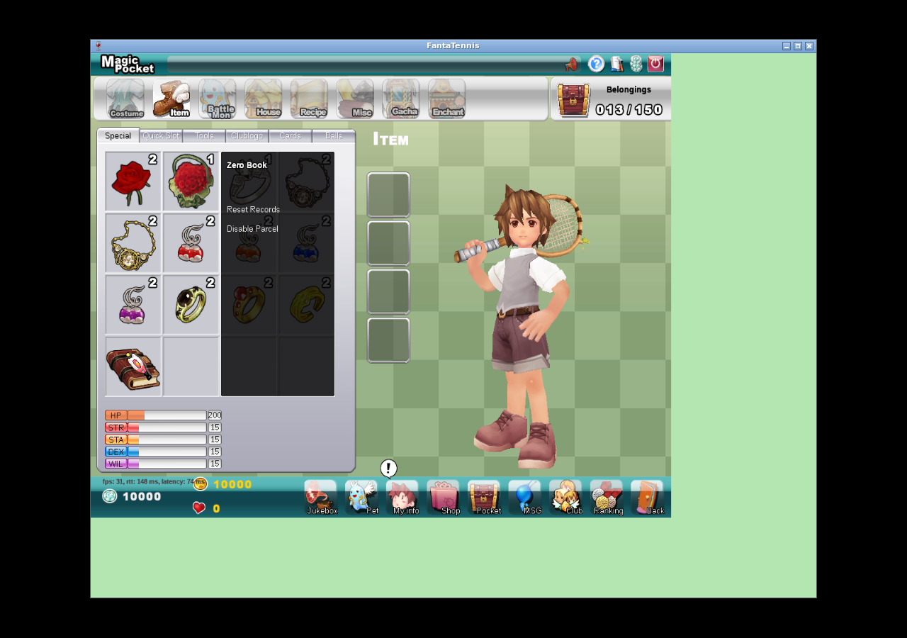

<div class="page-break"></div>

## One-use confirmation

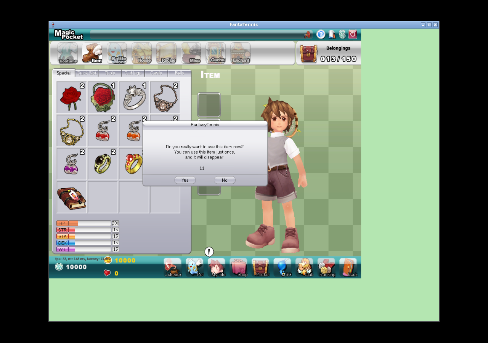

The confirmation emitted `CMSGUseQuickSlot (0x1BDA)` with row ID 13.

<div class="page-break"></div>

## Visible inventory result

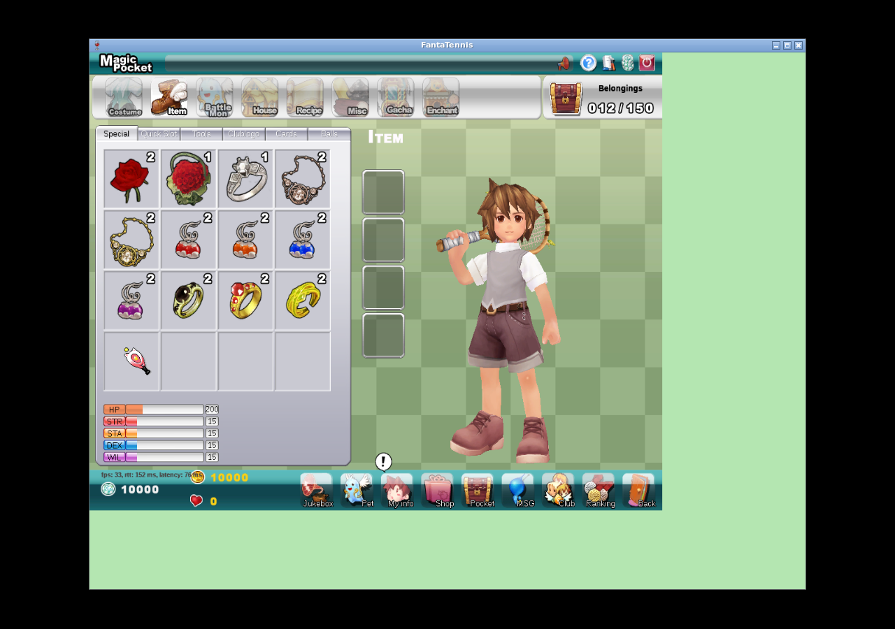

The screenshot is paired with the six-counter DB diff and S2C record/removal
packet trace in [native-special-items-evidence.txt](evidence/native-special-items-evidence.txt).

<div class="page-break"></div>

# Native validation — item 18

## Positive 25→35 capacity flow

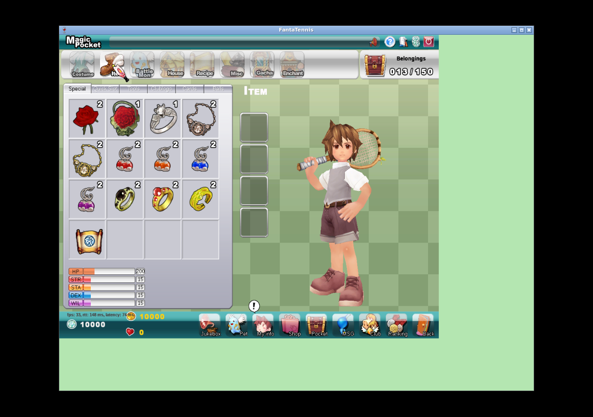

<div class="page-break"></div>


<div class="page-break"></div>


The native DB transition proves the capacity change; the screenshot proves the
matching inventory result.

<div class="page-break"></div>

## Maximum-80 negative flow


<div class="page-break"></div>

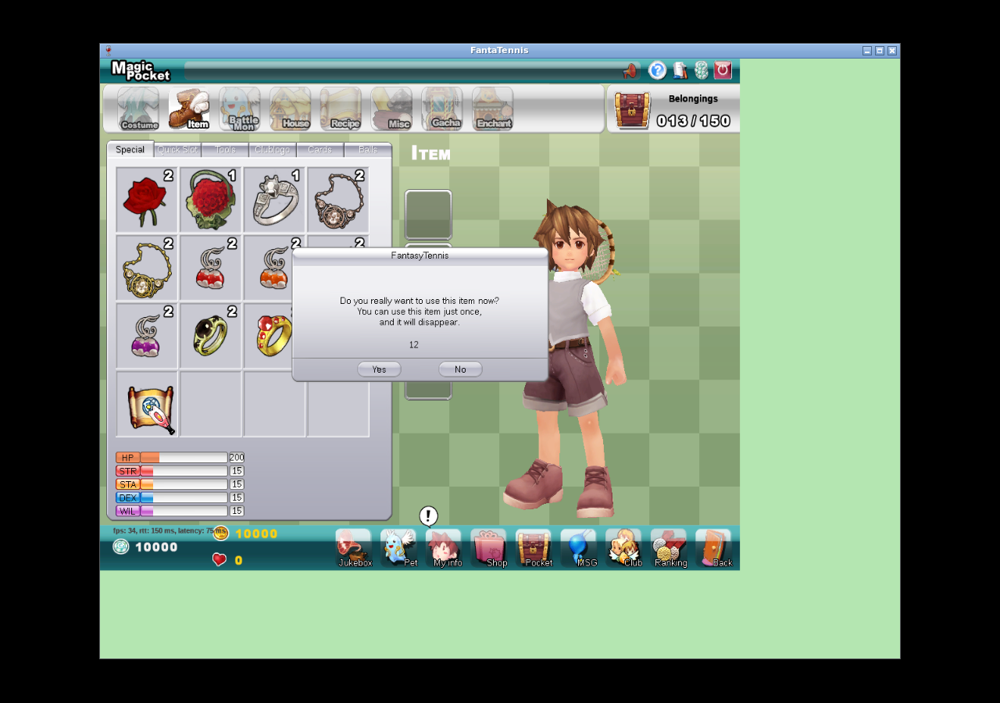

<div class="page-break"></div>


The client shows no explicit error modal. Rejection is proven by the item still
being present plus the before/after DB equality: capacity remained 80 and row
13 remained owned. This avoids claiming that the screenshot alone explains
why the request was rejected.

<div class="page-break"></div>

# Native validation — item 19

## Initial board

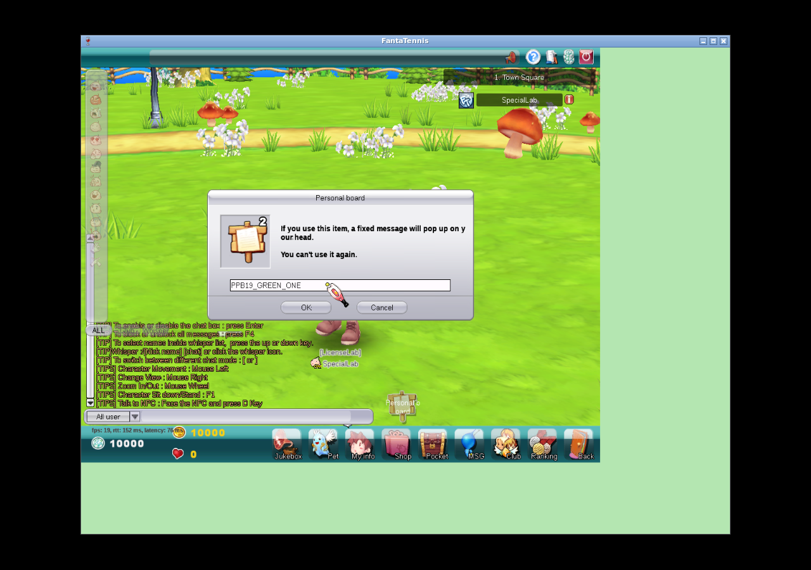

<div class="page-break"></div>

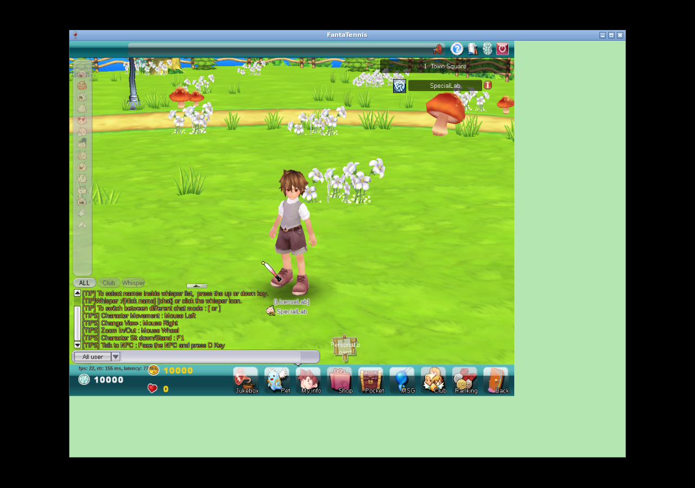

Packet `0x22CD` arrived with the item row and message; the item stack changed
2→1 and null-terminated `0x22CE` rendered correctly.

<div class="page-break"></div>

## Replacement and final-unit depletion

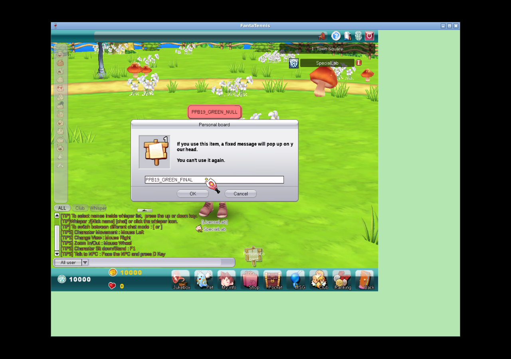

<div class="page-break"></div>


After this request, row 13 was deleted and belongings changed 13→12. Replacing
a visible board is therefore not a free edit.

<div class="page-break"></div>

## Leave/rejoin lifecycle

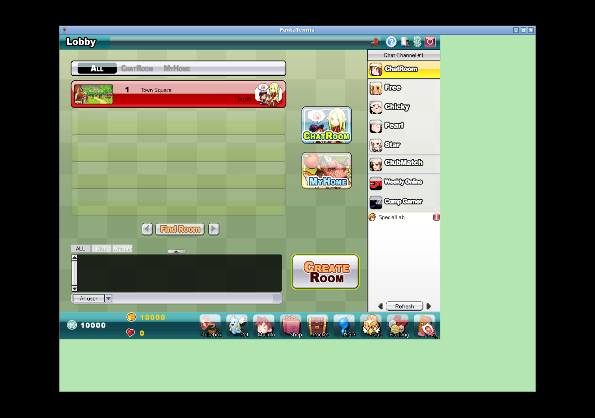

<div class="page-break"></div>

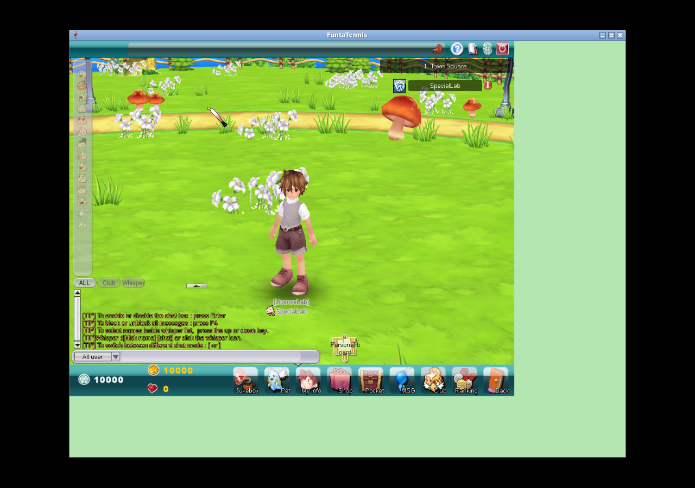

<div class="page-break"></div>

## Depleted-item behavior

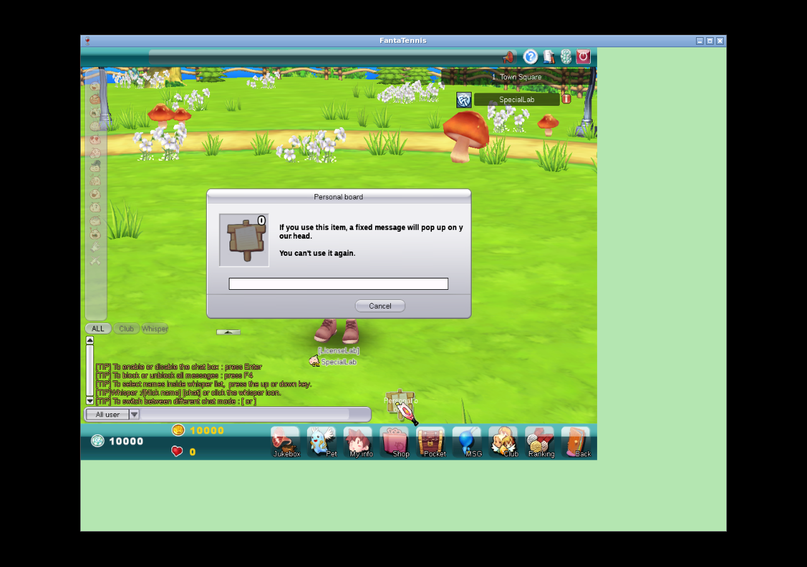

This final screenshot is not, by itself, a rejection signal. The decisive
evidence is the empty item state plus no new `0x22CD` in the packet-log interval
and no DB mutation.

<div class="page-break"></div>

# Evidence inventory

| Evidence | Claim supported |
|---|---|
| Figures 1–5 | Client/service connectivity, seeded inventory, and negative special-slot boundary. |
| Figures 6–8 | Item 7 identity, confirmation, consumption, visible belongings update. |
| Figures 9–14 | Item 18 positive use and max-80 no-consumption rejection. |
| Figures 15–21 | Item 19 creation, replacement, depletion, leave/rejoin cleanup, no-item behavior. |
| [native-special-items-evidence.txt](evidence/native-special-items-evidence.txt) | Sanitized packet/DB transitions for 7, 18, 19. |
| [red-green-excerpts.txt](evidence/red-green-excerpts.txt) | Decisive red failures and final green gates. |
| [packet-contracts.txt](evidence/packet-contracts.txt) | Earlier source packet declarations. |
| [static-client-findings.txt](evidence/static-client-findings.txt) | Earlier decrypted catalog semantics. |
| [native-db-state.txt](evidence/native-db-state.txt) | Earlier disposable fixture disclosure. |
| [artifact-sha256.txt](evidence/artifact-sha256.txt) | Integrity hashes for all committed screenshots. |

# What remains missing

This section is intentionally detailed so that future work does not confuse a
catalog name or tooltip with a completed server contract.

## Index 5 — RingB

Known static facts: it is durable, allows up to 9,999 uses, disables parceling,
and its resource description literally says `Unknown`.

Missing evidence:

- no user action or C2S trigger has been identified;
- no equipped/passive/instant lifecycle has been established;
- no target stat, reward multiplier, room effect, or social effect is known;
- no DB field transition or S2C synchronization packet is known;
- no expiry or consumption boundary is known.

Required next proof: observe the item in every plausible equip/use surface,
capture traffic and DB snapshots, then compare match, reward, room, and social
state with an A/B fixture. **No functionality claim is made in this branch.**

## Index 8 — Bag of Dwarf

Known static facts: `UseType=Time`, maximum duration 365, and the description
says the quick slots expand from two to five. Source analysis shows this means
the in-match crystal/spell queue, not persistent `QuickSlotEquipment`:
`RoomPlayer` currently has capacity two, a third crystal evicts the oldest, and
item 21 rotates the first two entries.

Still missing:

1. stable native login and match fixture with no item, valid future expiry,
   and expired item variants;
2. native HUD comparison proving two versus five visible/usable queue slots;
3. at least three, preferably five, distinct crystal acquisitions;
4. pickup/use/swap packet capture and exact queue ordering;
5. proof whether entitlement is passive ownership, current expiry, an
   activation packet, or another lifecycle;
6. reconnect/match-transition persistence and expiration behavior.

Only after those observations should the server queue capacity become
expiration-aware. The failed fixture experiment did not reach a stable match
and is not positive evidence. **Index 8 is not implemented.**

## Index 20 — Betting Coin

Known static facts: this is a count item and the client contains spectator
betting mode.

Still missing:

- wager request packet ID and payload;
- whether the stake is coin item count, gold, AP, another currency, or a
  combination;
- eligible match phases, player targets, limits, cancellation, and validation;
- when the item/currency is reserved or consumed;
- payout formula, settlement packet, winner/draw/abort handling;
- disconnect, spectator leave, room close, and server restart behavior;
- what observers, participants, and other bettors receive.

Required fixture: at least two match players plus a spectator, synchronized
packet capture, and before/after DB snapshots across win, loss, cancel, and
disconnect cases. **Index 20 is not implemented.**

## Index 22 — Thief's Mask

Known static fact: its description says it hides player information.

Still missing:

- which identity/stat/equipment/club/couple fields are hidden;
- whether masking affects lobby, room, Town Square, match, ranking, messenger,
  inspect dialogs, or only one surface;
- whether party, club, couple, friends, GMs, or self-view bypass the mask;
- equip/passive/activation and expiration behavior;
- whether existing packets use redacted values, sentinel values, omitted
  structures, or a separate flag;
- observer refresh when the item is equipped, expires, or is removed.

Required fixture: two native clients in controlled observer/subject roles,
with packet and screenshot A/B comparisons on every information surface.
**Index 22 is not implemented.**

## Club-level upgrade item

No separate club-level upgrade item was found in the inspected special-item
catalog, packets, or native flows. Index 18 was proven to modify
`Guild.maxMemberCount` only. A future club-level claim requires a distinct
catalog identity and a captured level-changing transaction; capacity evidence
must not be relabeled as club-level evidence.

## Personal Board multiplayer observation gap

The room-state implementation and exact `0x22CF` byte layout are covered by
tests. What is still missing is a native second client joining after another
player has an active board and visibly rendering the `0x22CF` snapshot. Future
validation should use two clients, capture the join interval, identify packet
`0x22CF`, verify room-position mapping, and show the board on the observer.
This gap does not invalidate the proven same-client creation/replacement and
server lifecycle behavior, but it limits the native multiplayer claim.

## Earlier-slice native gaps

- no native successful `0x1B70` special-slot persistence walkthrough;
- no native proposal-card `0x251D` transaction;
- no completed native match showing necklace/earring consumption;
- no complete native Battlemon effect lifecycle.

# Reproduction and cleanup

1. Check out `reverse-engineering/unknown-special-items` and verify
   implementation commits `ba919b4` and `3a2ad3d`.
2. Verify `fcdeb89...` is not an ancestor; the command must return 1.
3. Use JDK 21; run the two focused commands documented in the evidence file,
   then `mvn test` and `mvn package -DskipTests`.
4. Start MariaDB, RabbitMQ, and supervised auth/game/relay/chat services.
5. Use only a disposable account and record every inserted inventory/stat/guild
   fixture before the native action.
6. Use the unmodified client hash from the title page and the Win32 Wine
   prefix. Start packet capture before interaction.
7. Pair every client screenshot with packet and DB state; a visual alone is not
   proof of server mutation.
8. Stop clients and captures, remove experimental inventory/tutorial/guild
   rows, restore original statistics/password, mark account/player offline, and
   restore the advertised game port.
9. Regenerate the PDF with the committed stylesheet and visually inspect all
   pages for clipping, blank pages, stale metadata, and broken images.

The final cleanup was executed and verified: experimental rows 13/14,
tutorial progress, and `LicenseLab` were removed; the baseline 12 inventory
rows and 12/150 belongings were restored; all statistic fields are zero; the
original password/offline state and game port 5895 are restored; and all lab
services are stopped. The sanitized result is included in
[native-special-items-evidence.txt](evidence/native-special-items-evidence.txt).

<div class="keep">

# Final conclusion

The delivered branch now has proven server behavior for special items 7, 18,
and 19 in addition to the earlier implemented slice. Item use is authoritative,
transactional, exact-row based, and tested against replay and rejection paths.
Native screenshots, packets, and DB transitions show the end-to-end positive
flows and the important negative boundaries.

The branch also records exactly what is not known. RingB remains wholly
unknown; Bag of Dwarf lacks match entitlement/HUD proof; Betting Coin lacks the
wager and settlement protocol; Thief's Mask lacks observer masking semantics;
no club-level item was found; and Personal Board `0x22CF` still needs native
second-client observation. Those are future reverse-engineering tasks, not
functionality claimed by this release.

</div>
