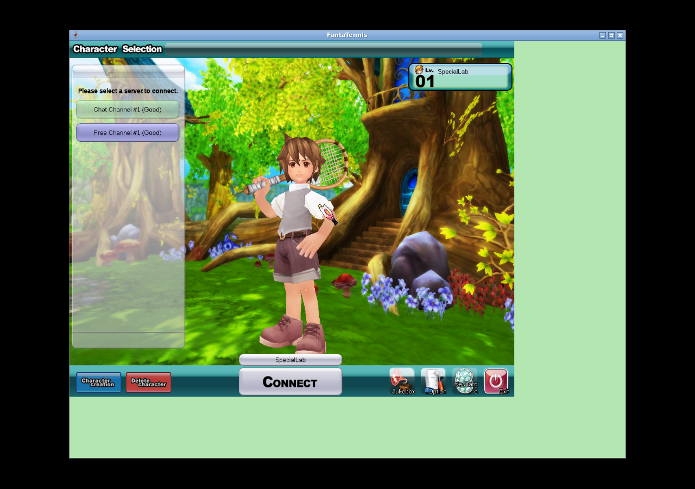
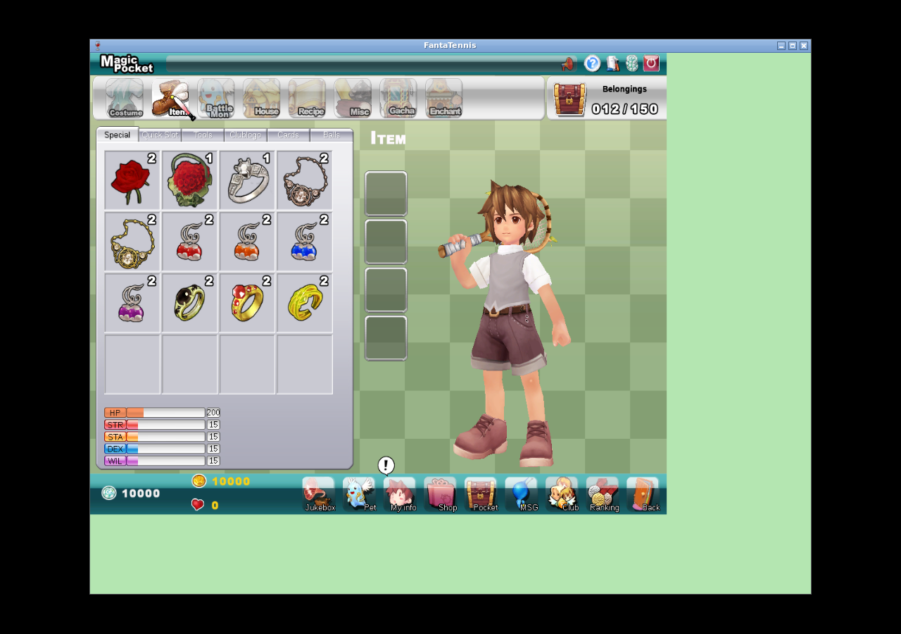

<div class="title-page">

# JFTSE — Remaining Special Items

<div class="subtitle">Fantasy Tennis client reverse engineering, Java server implementation, red/green tests, and native-client validation</div>

<div class="metadata">

**Server repository:** `sstokic-tgm/JFTSE`<br>
**Base branch/commit:** `origin/development` / `65c3665170edc2d912a3187244de89251a809712`<br>
**Work branch:** `reverse-engineering/remaining-special-items`<br>
**Faulty-change revert:** `af927924ea3fa2a4cf1259d35f1e153185018d7e`<br>
**Implementation:** `7079844c6d648aad89686dad5852540ffbb5e31a`<br>
**Client archive SHA-256:** `c19ca21b8e2ab091953b2f631e48853b6477400f4d7000682ac7440f9994f12e`<br>
**FantaTennis.exe SHA-256:** `5477f0827acae66976403aecd2e9ebffeb4fa28da1fedae5f9541ec25e336c31`<br>
**Runtime:** Wine 8.0, Win32 prefix, Xvfb `:108` at 1280×900×24<br>
**Validation date:** 2026-08-12 UTC

</div>

</div>

<div class="page-break"></div>

# Executive summary

This branch implements the currently understood functional subset of Fantasy
Tennis special items from first principles. The client catalog, JFTSE packet
schemas, existing entity/service boundaries, and native runtime were treated
as separate evidence classes rather than interchangeable proof.

The implementation adds match-stat effects for necklaces and earrings,
per-successful-match consumption, special-slot validation, proposal-card
consumption, promotional ring aliases, exact duplicate-stack handling, and a
six-calendar-month nickname cooldown. Match settlement is idempotent per game,
and proposal-card mutation is transactional with pessimistic row locks.

<div class="callout">

**Proven by executed tests:** item-value mapping, mode filtering, packet field
serialization, equipment normalization, one-use consumption, exact-row ring
behavior, proposal validation/transaction behavior, nickname cooldown, and
single settlement under concurrency. The final full reactor and package gates
passed.

</div>

<div class="callout">

**Observed with the unmodified native client:** the exact release JARs reached
User Login, authenticated the disposable fixture, displayed `SpecialLab` and
the channel list, and entered the Main lobby. A pre-final packaged run rendered
all 12 DB-seeded special-item stacks in Magic Pocket.

</div>

<div class="warning">

**Not claimed:** native proof of special-slot persistence, proposal UI,
match-item consumption, match settlement, Battlemon, Personal Board, or items
5/7/8/18/19/20/22. The character and inventory were DB seeded. A visible
necklace equip preview did not persist and is explicitly negative evidence.

</div>

## Evidence classification

| Class | Finding |
|---|---|
| Observed native runtime | Release client reached login → player/channel selection → Main lobby; earlier package rendered 12 seeded stacks. |
| Static client reverse engineering | Decrypted `Item_Special.set` defines values, aliases, mode text, one-use-per-game text, proposal cards, and six-month cooldown copy. |
| JFTSE source baseline | `.packet` files establish `0x1B70`, `0x251D`, and `0x251E`; entities/services define persistence ownership. |
| Compatibility interpretation | Promotional copies behave like canonical items; WIS catalog effects map to the server's WIL stat; successful settlement is the consumption boundary. |
| Branch implementation | Java behavior and tests in commit `7079844`. |

# Scope, provenance, and branch history

## Development base and non-destructive removal

The branch was created from `origin/development` at
`65c3665170edc2d912a3187244de89251a809712`. The faulty commit requested for
removal, `fcdeb89a94bb17337f8b8f499b79c5892370004e`, was already in published
development history. It was removed non-destructively by revert commit
`af927924ea3fa2a4cf1259d35f1e153185018d7e`; history was not rewritten.

```text
7079844  Implement remaining special item behavior
af92792  Revert "fix types in pet packets; ..."
65c3665  origin/development base
```

The faulty commit remains an ancestor as immutable history, but its patch is
counteracted by `af92792`. Nothing was pushed during this work.

## Client provenance

The client came from
[https://www.jftse.com/client/FantaTennis.7z](https://www.jftse.com/client/FantaTennis.7z).
The archive and executable matched the known JFTSE hashes on the title page.
`FantaTennis.exe` was unmodified. Runtime copies used a proven Win32 Wine
prefix; the immutable client copy was not altered.

## Implemented item matrix

| Indices | Implemented behavior | Evidence level |
|---|---|---|
| 4 | Next nickname change is six calendar months after the last change. | Static client + unit test |
| 23–25 | Proposal-only category/index validation; exact owned stack decremented/deleted atomically; `Pocket.belongings` updated on final unit. | Schema/source + handler/service tests |
| 27–29 | +50/+100/+200 HP; active for Battle/Guardian-family modes, excluded from generic/basic packets. | Static client + serialization/domain tests |
| 30–37 | STR/STA/DEX/WIL +3/+5; serialized in earring stat fields; consumed after successful supported settlement. | Static client + tests |
| 39–41 | Promotional aliases of canonical EXP/Gold/Wiseman rings; exact equipped `PlayerPocket` row drives reward and consumption. | Static client + 9 exact-row tests |
| 42–46 | Promotional +50 HP / +3 STR/STA/DEX/WIL aliases. | Static client + parameterized tests |

Items with an existing implementation outside this slice were not rewritten.
Unknown or unresolved catalog entries were not guessed.

# First-principles model and invariants

```text
DB S0
  + authenticated native action / decoded C2S
  + handler authorization
  + transactional service mutation
  → S2C response/inventory update
  → DB S1
  → client-visible state
```

The implementation enforces these invariants:

1. Special equipment is exactly four slots.
2. A nonzero slot must identify an owned `SPECIAL` `PlayerPocket` row.
3. The same pocket row cannot occupy multiple slots; malformed IDs normalize
   to zero in the authoritative response.
4. An equipped consumable is decremented once per successful supported match
   settlement, even if duplicate stale slots reference it.
5. Final-unit removal clears every slot referencing that row and decrements
   `Pocket.belongings` once.
6. A game can begin settlement once (`AtomicBoolean.compareAndSet`).
7. A proposal record and proposal-card decrement/delete share one transaction.
8. Proposal mutation rechecks category, index, count, and ownership after a
   pessimistic lock; rejection does not mutate inventory.
9. Ring reward lookup and ring consumption use the exact equipped pocket row,
   not the first stack with a matching catalog index.
10. Battle-only necklace HP cannot leak into generic/basic status packets.

# Documentation and static client basis

The following project documentation was reviewed on 2026-08-12:

- [All wiki pages](https://wiki.jftse.com/index.php/Special:AllPages)
- [JFTSE Roadmap](https://wiki.jftse.com/index.php/JFTSE_Roadmap)
- [Packet Structure](https://wiki.jftse.com/index.php/Packet_Structure)
- [Database Schema & Cheatsheet](https://wiki.jftse.com/index.php/Database_Schema_%26_Cheatsheet)
- [Items](https://wiki.jftse.com/index.php/Items)
- [Stats](https://wiki.jftse.com/index.php/Stats)
- [Packet Schema format](https://wiki.jftse.com/index.php/Packet_Schema_(.packet)_Format)

The wiki informed terminology and navigation but was not treated as runtime
proof. The detailed static findings are preserved in
[static-client-findings.txt](evidence/static-client-findings.txt).

## Important static findings

The decrypted client resource identifies proposal-card indices 23–25; necklace
values 27–29; earring values 30–37; aliases 39–46; per-game consumption text;
and a six-month nickname interval. Japanese necklace text is the strongest
static mode qualifier and explicitly names Battle, Battlemon Battle, and
Guardian Battle.

Conflicting localizations exist. For example, some necklace English/Thai text
uses imprecise material names, and Chinese nickname text says three months
while English, German, French, Italian, Japanese, Taiwanese, and Thai text say
six. This branch chooses six calendar months because it is the dominant client
resource contract and the requested compatibility behavior; that is not a
claim about an unavailable original retail backend.

# Reverse-engineered protocol

JFTSE packets use the documented eight-byte header followed by packet-specific
payload. No new packet IDs were invented.

| ID | Direction | Listener | Payload | Use in this branch | Native status |
|---|---|---:|---|---|---|
| `0x1B70` | C2S | game/chat | four repeated `int32` special pocket-row IDs | Validate, normalize, persist, echo authoritative slots | Not observed in the attempted native preview |
| `0x251D` | C2S | game | receiver string, pocket-row ID, catalog index, message | Proposal validation and atomic card use | Not observed natively |
| `0x251E` | S2C | game | signed status byte | Existing proposal success/error response | Not observed natively |

Exact source declarations are archived in
[packet-contracts.txt](evidence/packet-contracts.txt).

## Listener ownership

| Listener | Port | Role in this validation |
|---|---:|---|
| auth | 5894 | Login, character list, nickname change |
| game | 5895 | Lobby, inventory, proposal, room/match settlement |
| relay | 5896 | Started and listening; no special-item claim |
| chat | 5897 | Started and listening; mirrors equipment/stat serialization paths |
| AC | 3724 | Packaged but not used or claimed in this native run |

# Java implementation

## Match-stat effects and packet fields

`SpecialItemEffects` is the shared mapping for indices 27–37 and 42–46. It
writes isolated `specialAddHp`, `specialStrength`, `specialStamina`,
`specialDexterity`, and `specialWillpower` components into
`EquippedItemStats`. Keeping the components separate prevents a necklace from
silently becoming permanent base HP.

Game and chat `FTPlayer` load exact equipped special rows. Existing status,
cloth, room, and result packets now serialize earring fields. Generic/basic
packets write zero for special HP; battle result/stat paths use active necklace
HP. Battle and Guardian state construction adds the isolated special stats to
base/clothing/enchantment totals.

## Consumption and settlement

Basic, Battle, and Guardian settlement handlers call `MatchSpecialItemUse`
only after reaching successful player reward settlement. `MatchplayGame`
guards settlement with one compare-and-set operation. The service consumes
each distinct equipped active row once, sends updated count/removal packets,
and clears exhausted slots.

No native match was completed in this thread. This behavior is proven at the
service/settlement test boundary, not through client gameplay.

## Promotional rings and duplicate stacks

Indices 39/40/41 are routed to the existing EXP/Gold/Wiseman ring classes.
Both reward detection and consumption now iterate/receive exact equipped
`PlayerPocket.id` values. This fixes the case where two stacks share one item
index and a repository's arbitrary first row is not the equipped row.

## Proposal cards

The handler performs cheap request checks and relationship checks; the service
then locks the requested inventory row and revalidates category, index, count,
and pocket ownership in the mutation boundary. A final unit deletes the row,
locks/updates the pocket count, and creates the proposal in the same
transaction. Failures map to existing `SMSG_SendProposal` status values.

## Nickname cooldown

The former fixed 30-day calculation is replaced with `Calendar.MONTH + 6` in
UTC. A January 31 boundary test expects July 31, preserving calendar-month
semantics rather than approximating six months as a fixed number of days.

# Persistence and fixtures

No production schema migration or catalog seed was needed. New values are
derived at runtime from existing `PlayerPocket` and `SpecialSlotEquipment`
rows. Repository lock methods were added for proposal mutation.

The native account, character, pocket, equipment row, and 12 items were
directly seeded into the disposable lab database. They are not client-created
evidence. Full fixture and cleanup state is in
[native-db-state.txt](evidence/native-db-state.txt).

| Fixture group | Rows |
|---|---|
| Proposal cards | 23×2, 24×1, 25×1 |
| Necklaces/earrings | 27, 29, 30, 32, 34, 36; each durable count 2 |
| Promotional rings | 39, 40, 41; each durable count 2 |
| Pocket | 12/150 belongings |
| Authoritative special slots | 0, 0, 0, 0 |

# Red/green testing

The compact evidence transcript is
[red-green-excerpts.txt](evidence/red-green-excerpts.txt).

## Meaningful red contracts

The first focused red test failed because `SpecialItemEffects` did not exist.
A later correctness red run caught two substantive regressions:

```text
Promotional aliases: expected true but was false (3 cases)
Generic status HP: expected 220 but was 420
BUILD FAILURE
```

The second value proves the test discriminated between ordinary equipment HP
(20) and an incorrectly leaked battle-only necklace (+200).

## Green matrix

| Test class | Final count | Contract |
|---|---:|---|
| `SpecialItemEffectsTest` | 28 | Values, aliases, aggregation, mode activation |
| `SpecialSlotEquipmentServiceImplTest` | 5 | Four slots, ownership/category, duplicate rows, consumption/removal |
| `SpecialItemPacketSerializationTest` | 1 | Exact packet length/offsets and no generic necklace HP |
| `PromotionalRingAliasTest` | 9 | Alias type, reward detection, exact-row consumption |
| `ProposalServiceImplTest` | 6 | Transactional decrement/delete, ownership, locks |
| `SendProposalRequestHandlerTest` | 8 | Statuses, no-mutation rejection, success notifications |
| `MatchplayGameSettlementTest` | 1 | Exactly one concurrent settlement |
| `PlayerNameChangeHandlerTest` | 1 | Six-calendar-month boundary |

Post-commit focused rerun: **58 tests, 0 failures, 0 errors**.

## Release gates

```text
mvn test
game-server: 65 tests, 0 failures, 0 errors
auth-server: 1 test, 0 failures, 0 errors
all 11 reactor modules: SUCCESS
BUILD SUCCESS

mvn package -DskipTests
all 11 reactor modules: SUCCESS
BUILD SUCCESS
```

Release JAR hashes and runtime details are in
[release-runtime-summary.txt](evidence/release-runtime-summary.txt).

<div class="page-break"></div>

# Native runtime walkthrough

The final release smoke run used the exact packaged JAR hashes, the unmodified
client, Wine 8.0, a Win32 prefix, Xvfb `:108`, Openbox, loopback routing, and
supervised Amp services. Packet capture began before login and stopped after
the client.

## Step 1 — exact release JARs reach User Login


The ID field, password field, and LOG IN button are visible. No credentials are
shown. The initial green unused region is a Wine/window geometry artifact, not
server behavior.

<div class="page-break"></div>

## Step 2 — authenticate and list the seeded character



The native client authenticated against auth port 5894 and rendered the
DB-seeded `SpecialLab` character. `Free Channel #1 (Good)` was selected. This
proves final-JAR auth/client compatibility; it does not prove native character
creation.

<div class="page-break"></div>

## Step 3 — connect to the game listener


The client transitioned to game port 5895 and rendered the Main lobby. The raw
release capture contains one sustained game conversation (344 frames, 27 kB,
756.6 seconds). It is not committed because login traffic can contain plaintext
disposable credentials.

<div class="page-break"></div>

## Step 4 — render the DB-seeded special inventory



This screenshot predates the final exact-row ring backend correction. It shows
the same unmodified client and disposable DB fixture rendering 12/150 special
stacks: proposal cards, necklaces, earrings, and promotional rings. The final
smoke re-proved login/player-list/lobby compatibility after the tiny exact-row
change, but did not reopen the pocket successfully. Therefore this figure is
inventory-rendering evidence, not final-JAR functional evidence for effects.

<div class="page-break"></div>

## Step 5 — negative special-slot experiment


The UI shows the gold necklace in the first visual slot and HP 400. However,
the post-action database remained `0,0,0,0`, and the owning log had no received
`0x1B70`. This is a client-local preview/failed emission, not a positive equip
result. It is retained to prevent screenshot-only overclaiming.

## Native evidence result table

| Checkpoint | UI | Packet/listener | DB | Verdict |
|---|---|---|---|---|
| Release login | User Login | auth handshake on 5894 | Fixture available/offline before login | Proven |
| Release auth | SpecialLab/channel list | successful auth conversation | Disposable fixture | Proven |
| Release game transition | Main lobby | sustained game:5895 conversation | player active, later cleanly offline | Proven |
| Special inventory | 12 visible stacks | Earlier packaged run | 12 exact seeded rows | Proven only as rendering of seeded data |
| Special equip preview | Necklace shown, HP 400 | no received `0x1B70` | slots stayed all zero | Negative / not proven |
| Proposal | Not exercised | no native `0x251D` | no native mutation | Not proven natively |
| Match consumption | Not exercised | no completed native match | no native mutation | Not proven natively |

# Packet, DB, and artifact evidence

## Release capture boundary

The raw final capture SHA-256 is
`f3baa146e6be08785cfad4f72a6e2be11acbfbcd2333fe1dd9cc42acd9782b6e`.
It is omitted from Git because protocol payloads can expose credentials. The
committed runtime summary records endpoint roles, sizes, conversation totals,
JAR hashes, and the capture hash without publishing payloads.

<div class="page-break"></div>

## Evidence inventory

| File | Source | Purpose | Claim supported |
|---|---|---|---|
| [01-release-login-screen.png](evidence/01-release-login-screen.png) | Native final run | Login UI | Exact client and release stack reach login |
| [02-release-player-list.png](evidence/02-release-player-list.png) | Native final run | Character/channels | Successful auth and fixture rendering |
| [03-release-game-channel.png](evidence/03-release-game-channel.png) | Native final run | Main lobby | Auth-to-game transition |
| [04-special-items-pocket.png](evidence/04-special-items-pocket.png) | Native pre-final run | Seeded special inventory | Client renders all 12 fixture stacks |
| [05-special-slot-preview-negative.png](evidence/05-special-slot-preview-negative.png) | Native pre-final run | Failed equip experiment | UI preview must not be treated as persistence |
| [native-db-state.txt](evidence/native-db-state.txt) | MariaDB snapshots | Fixture and post-preview state | Seed disclosure and all-zero slots |
| [packet-contracts.txt](evidence/packet-contracts.txt) | Repository schemas | Exact payload declarations | `0x1B70`, `0x251D`, `0x251E` contracts |
| [static-client-findings.txt](evidence/static-client-findings.txt) | Decrypted client resource | Catalog semantics | Values, aliases, modes, consumption text |
| [red-green-excerpts.txt](evidence/red-green-excerpts.txt) | Maven runs | Red/green proof | Missing/wrong behavior then release green |
| [release-runtime-summary.txt](evidence/release-runtime-summary.txt) | Final native run | Runtime and capture metadata | Exact JAR/client provenance |
| [artifact-sha256.txt](evidence/artifact-sha256.txt) | Curated artifacts | Integrity | Screenshot hashes |

# Compatibility interpretations and limitations

1. **Promotional aliases.** Identical icons/descriptions make 39/40/41 and
   42–46 compatibility aliases of canonical rings/stat items. Retail server
   implementation history remains unknown.
2. **WIS → WIL.** The client resource says Wisdom/WIS while this server and UI
   use Willpower/WIL. The branch maps the catalog field to WIL.
3. **Consumption boundary.** “Per game” is implemented at successful supported
   result settlement, not room start or disconnect. This prevents charging a
   use for an uncompleted room.
4. **Battlemon.** Static text names Battlemon and the effect mapper recognizes
   that mode, but no native Battlemon lifecycle was validated here. No complete
   Battlemon support claim is made.
5. **Nickname date arithmetic.** Six calendar months follows dominant client
   text; it is not a fixed 180-day approximation.

## Explicit non-claims

- No native positive or negative proposal walkthrough.
- No native successful special-slot packet or reconnect persistence proof.
- No native completed Basic/Battle/Guardian match consumption proof.
- No multiplayer, relay synchronization, Battlemon, or Personal Board proof.
- No functionality claim for unresolved indices 5, 7, 8, 18, 19, 20, or 22.
- No claim that the original retail server used these exact transactions or
  error mappings.
- No claim that DB-seeded character/items were created by the client.

# Failures and corrected procedure

1. A clean final native launch first displayed only the JFTSE background; after
   waiting for Wine initialization, User Login appeared.
2. GUI input dropped/duplicated initial characters in two login attempts. The
   server correctly returned invalid-user status. Separating focus, clear,
   text, tab, and enter helper calls produced the exact username and a
   successful third attempt.
3. A final pocket navigation attempt opened Shop/My Info rather than Magic
   Pocket because custom-cursor and host-cursor coordinates diverged. It was
   not spliced into positive evidence; the earlier genuine pocket screenshot
   remains labeled pre-final.
4. A necklace looked equipped in the UI but never produced authoritative
   packet/DB state. The report classifies it as a failed experiment rather than
   treating appearance as proof.

<div class="page-break"></div>

# Reproduction guide

1. Check out `reverse-engineering/remaining-special-items` and verify commits
   `af92792` and `7079844`.
2. Use JDK 21 and run `mvn test`, then `mvn package -DskipTests`.
3. Verify release JAR hashes against
   [release-runtime-summary.txt](evidence/release-runtime-summary.txt).
4. Start MariaDB and RabbitMQ, then supervised auth/game/relay/chat services.
5. Verify listeners 5894/5895/5896/5897 and DB-advertised endpoint rows.
6. Seed a disposable account/character/pocket/items; record that this is a DB
   fixture. Reset login/online state before each run.
7. Point CRLF `ServerInfo.ini` to `127.0.0.1:5894`.
8. Start packet capture before interaction. Use a distinct Win32 Wine prefix,
   Xvfb display, Openbox service, and runtime copy per native client.
9. Drive `FantaTennis.exe` from its runtime working directory; verify each UI
   barrier and pair screenshots with packet and DB checks.
10. Stop client and capture cleanly; inspect PCAP for credentials before any
    publication. Recheck account offline state.
11. Build this report with the committed stylesheet and visually inspect every
    rendered page.

# Final conclusion

The branch now contains a coherent, tested server implementation for the
understood remaining special-item slice. All final tests and package gates are
green, exact release JARs interoperate with the unmodified client through the
Main lobby, and the report preserves both positive visual evidence and the
critical failed equip boundary.

The strongest functionality claims are test-backed server contracts. Native
runtime evidence is deliberately narrower: connectivity, character/channel
rendering, lobby transition, and seeded inventory rendering. Proposal,
successful equip persistence, consumption, and match/Battlemon flows remain
future native experiments rather than claims in this work.
