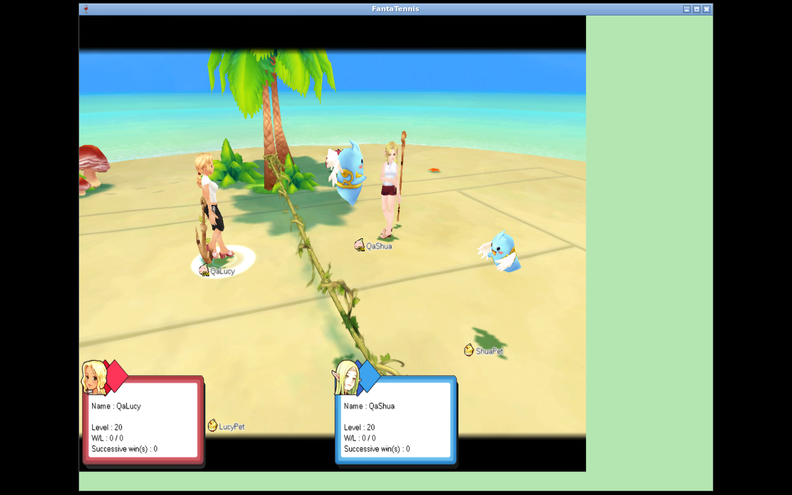
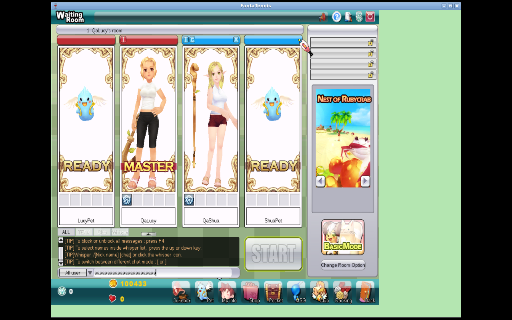
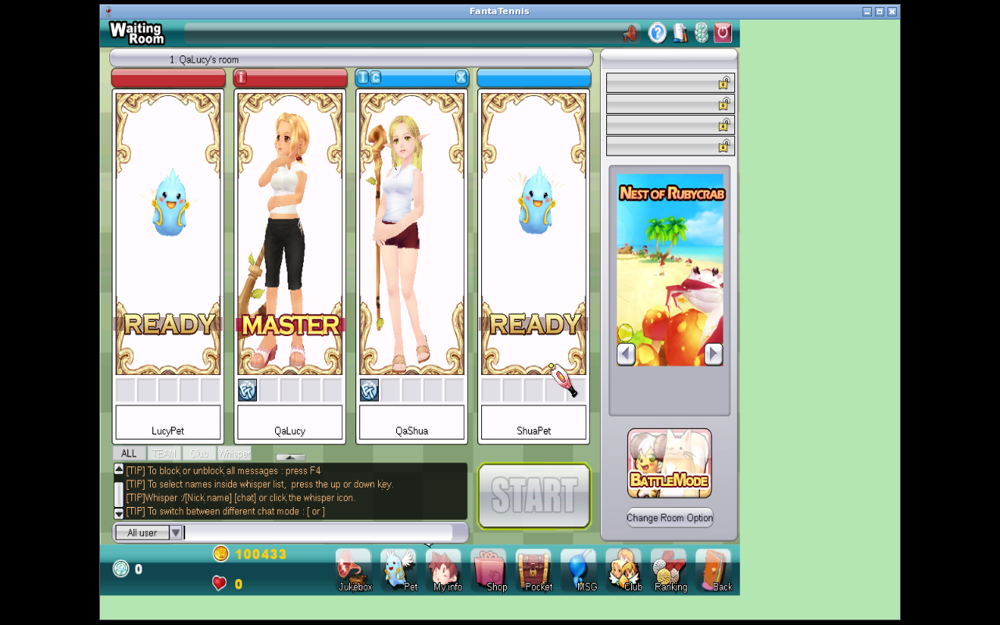
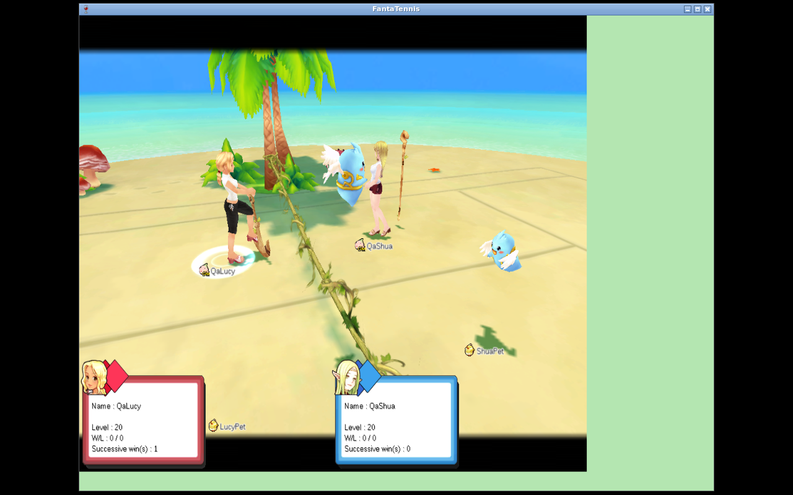
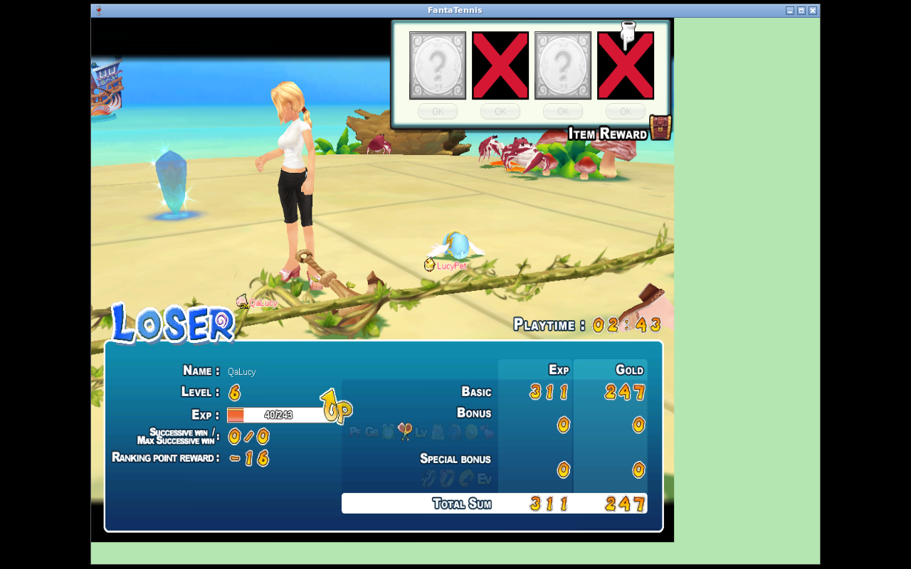
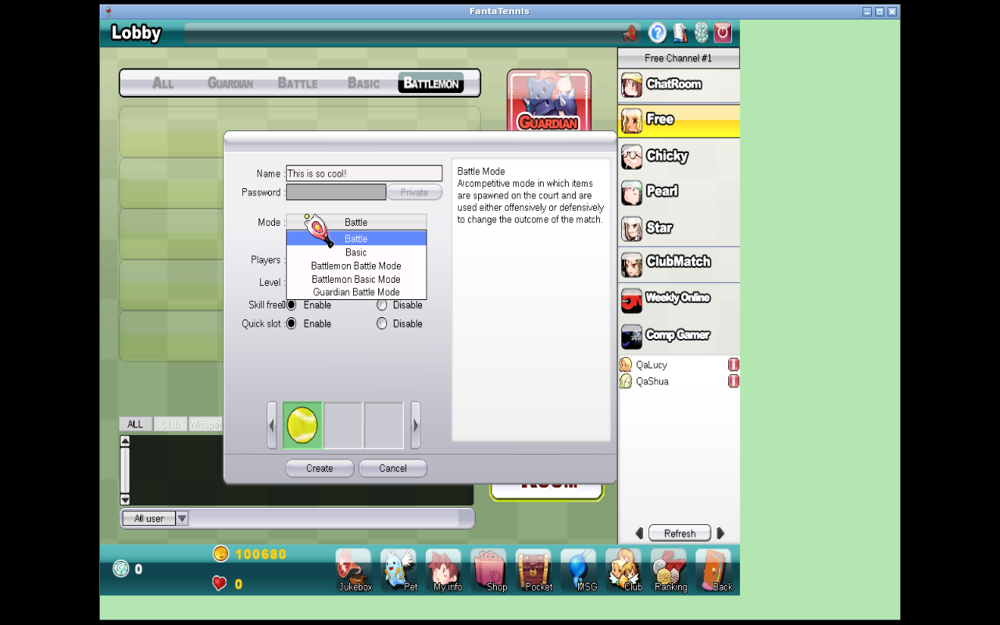
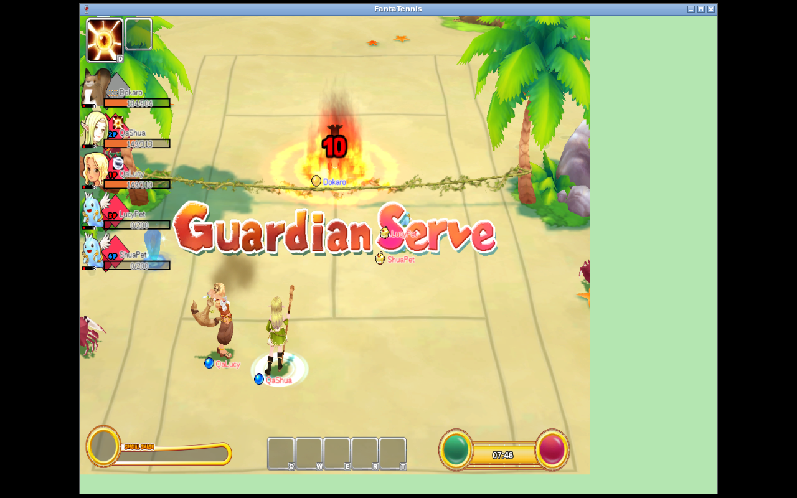
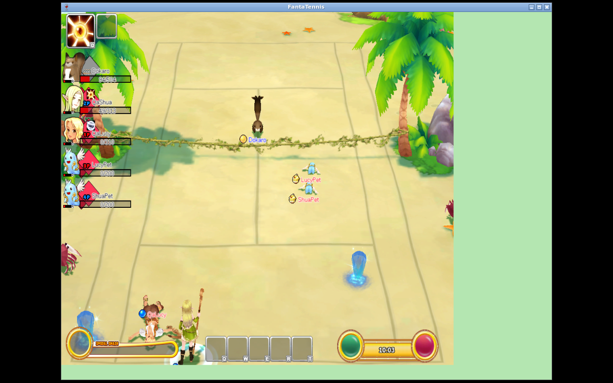
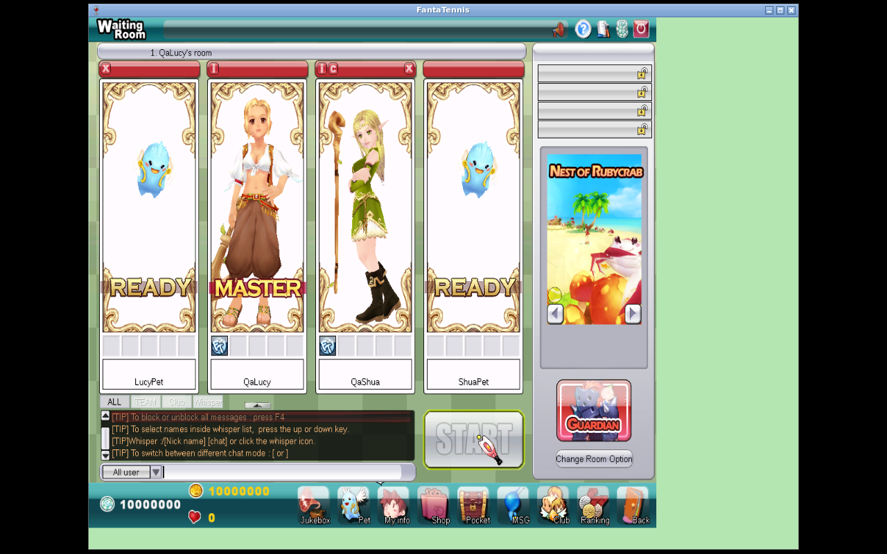

# Battlemon End-to-End Implementation and Real-Client Validation

**Result:** PASS within the controlled scope defined below<br>
**Validation date:** 2026-08-12<br>
**Base checkout:** `development` at `ea5ad9169be79e89b2a948a65695df70271f7c71`<br>
**Execution environment:** Current Amp orb, `/home/user/workspace/repo`<br>
**Native clients:** Two isolated Fanta Tennis Wine clients, `QaLucy` and `QaShua`

## Objective and related work

The objective was to finish the server-side Battlemon feature end to end and prove it with two native clients. Both Battlemon runtime modes had to support room creation, joining, pet admission, ready/start, a two-owner/four-actor topology, relay ownership, gameplay, natural completion, human-only rewards and statistics, return to the waiting room, and cleanup without a feature-attributable native crash. A final compatibility check also had to determine whether “Guardian mode” is part of Battlemon and prove that the completed work did not regress ordinary Guardian gameplay.

This report continues and consolidates the following Amp threads:

- [Battlemon objective and acceptance criteria](https://ampcode.com/threads/T-019fef68-c915-70c9-a2a5-8a914077b2c9)
- [Predecessor implementation and investigation](https://ampcode.com/threads/T-019fee48-1db8-7618-b921-94c5ed10dcf6)
- [Earlier Battlemon reverse-engineering baseline](https://ampcode.com/threads/T-019fecdd-2a73-777b-83e0-dd65acc9d8d2)
- [Applied implementation and final completion work](https://ampcode.com/threads/T-019ff016-0f54-7549-a2ce-c429c2a80586)
- [Native Battlemon null-pet crash diagnosis](https://ampcode.com/threads/T-019ff053-6cc2-74be-98e8-2dede35596b5)
- [Native Wine client operational procedure reproduced in the orb](https://ampcode.com/threads/T-019ff004-6ad7-736d-8561-148ac7ca9b5f)

## Executive answer

The controlled Battlemon implementation is operational in both Basic and Battle runtime modes. Guardian is **not** a third Battlemon runtime mode: the native menu represents `Battlemon Basic Mode`, `Battlemon Battle Mode`, and `Guardian Battle Mode` as separate choices, and selecting Guardian emits an ordinary match tuple of `roomType=0, mode=2`. The server independently rejects `roomType=BATTLEMON, mode=GUARDIAN` at creation, mode change, and start.

Two unmodified native clients created and joined Battlemon rooms, entered gameplay with the expected four actors, exercised human and pet actor paths, completed matches naturally, received results, persisted rewards only for the two human owners, and returned to the correct waiting room. No new native crash dump was created by either successful final run.

The same two native clients also completed a fresh Guardian run with **Allow Battlemon enabled and one attached pet per human**. They created and joined `roomType=0, mode=2`, displayed `LucyPet`, `QaLucy`, `QaShua`, and `ShuaPet` together before start, connected both human endpoints to relay, rendered both humans and both pets in live Rubycrab gameplay, completed naturally through the defeat/reward path, and returned to the Guardian waiting room with all four cards intact. Guardian's `0x3EA` network roster intentionally remained human-only (`[4,5,0,0]` and `[5,4,0,0]`); pet actors were authorized server-side to their owners rather than represented as extra network clients. The dump inventory remained unchanged.

The final actor layout was:

| Position | Actor | Owning endpoint |
|---:|---|---|
| 0 | `QaLucy` | owner 0 / QaLucy client |
| 1 | `QaShua` | owner 1 / QaShua client |
| 2 | `LucyPet` | owner 0 / QaLucy client |
| 3 | `ShuaPet` | owner 1 / QaShua client |

The implementation does **not** claim to reconstruct every historical retail Battlemon mechanic. The exact supported scope and the remaining reverse-engineering boundary are stated in the final section.

## 1. Implemented feature surface

### 1.1 Persistence, migration, and shop data

Battlemon slot equipment is represented in the entity, repository, service, chat/game transport, and SQL layers. The migration in `scripts/sql/battlemon-slot-equipment.sql` is repeat-safe and includes:

- a schema-scoped advisory lock;
- table creation;
- audit and backfill handling;
- index and foreign-key creation;
- temporary-table cleanup; and
- release of the advisory lock at end of file.

The auth shop data enables products `5015` through `5021`, covering `PET_ITEM` IDs `16` through `22`, plus pet-character products `5500` through `5504`.

### 1.2 Battlemon room admission and pet stability

Battlemon room creation and joining now require a canonical selected pet that:

- belongs to the player;
- is alive;
- has not expired; and
- is still the same active selection when the room slot is claimed.

The selected pet is attached to `RoomPlayer` before the successful room-player packet is serialized. Creation or joining is rejected before the success transition when the invariant cannot be established.

After admission, room-pet and active-pet requests cannot detach or replace the admitted pet. An idempotent pickup request for the already attached pet remains successful without mutation. Ordinary rooms retain their previous detach behavior.

Primary implementation paths:

- `GameManager.getValidatedActiveBattlemonPet(...)`
- `RoomJoinRequestPacketHandler`
- `RoomRequestPetPacketHandler`
- `PetPickupRequestPacketHandler`

### 1.3 Complete room packet pet tails

Both roster and individual join-player packets now express the same optional-pet contract:

1. write `petPresent=1` only when a real attached pet exists;
2. when present, write name, level, type, HP, four primary statistics, hunger, and energy; and
3. omit the entire optional tail when the pet is absent in an ordinary room.

This applies to the creator roster packet (`0x1394`) and the joining-player packet (`0x1396`). It resolves the malformed/incomplete join state and the Battlemon null-pet crash described later.

### 1.4 Two owners and four gameplay actors

`GameSession` now records pet actors separately from network clients. A Battlemon session accepts exactly two owning endpoints in positions 0 and 1 and materializes their pets at positions 2 and 3.

The session exposes explicit checks for:

- actor ownership;
- admitted gameplay endpoints;
- owner position for any human or pet actor; and
- the complete actor-position set.

Pet actors do not become fake `FTClient` instances. This keeps endpoint lifecycle, disconnect handling, acknowledgements, and persistence tied to real human connections while still allowing game logic to address all four actors.

### 1.5 Basic and Battle runtime integration

Battlemon Basic uses four-actor doubles geometry. Serve/receiver ownership is projected back to the two real endpoints, so point-back acknowledgement waits for two connections rather than four nonexistent clients.

Battlemon Battle creates combat state for all four actors from each human or pet's canonical statistics. Team-death evaluation includes pet HP, while ranking and reward positions include only the two human owners.

All start-abort paths notify clients and tear down partially initialized state. Regression coverage also preserves ordinary-room relay ordering and non-contiguous reward-position handling.

### 1.6 Relay authorization and lifecycle

Game-server authorization tells the relay which four actor positions exist and which owner endpoint controls each one. The relay rejects:

- an endpoint attempting to control the other owner's human or pet;
- unauthenticated or stale session endpoints;
- Battlemon pet spider-mine placement; and
- forged Battlemon spider-mine explosions.

The fixed five-minute relay read timeout was removed because it could disconnect a valid long-running match independently of application lifecycle. Session teardown and revocation remain explicit.

### 1.7 Native point and Battle damage reports

Native Battlemon clients do not always report points as if the sender owns the scoring actor. A point may identify the opponent or a pet scorer. Point reports are therefore accepted from an admitted gameplay endpoint and still rejected from non-endpoints.

Real actor actions remain owner-authorized. The only additional Battle exception is the exact native Guardian Serve sentinel:

```text
attackerPosition = 4
skillId          = 0
damageType       = 0
```

That sentinel must come from an admitted gameplay endpoint. Unsupported sentinel shapes, unsupported pet spell shapes, non-endpoints, and ordinary cross-owner actions remain rejected.

### 1.8 Human-only result persistence

Pet actors participate in geometry, scoring, and Battle HP evaluation, but not independent account progression. Match results project actor outcomes back to owners and persist only:

- the two player rows;
- the two player-statistic rows; and
- the applicable human ranking and win/loss changes.

No player, player-statistic, pet, or pet-statistic row is created for a pet actor.

## 2. Native crash diagnosis and resolution

The first Battlemon quick-create attempt admitted `QaLucy` with no attached active pet. The server truthfully serialized `petPresent=0` and omitted the optional pet tail. That packet is valid in ordinary rooms but is not a valid Battlemon scene invariant for this native client.

In Battlemon scene 2, the native client bypasses its ordinary absent-pet path, resolves the local pet object, and calls the pet-tail parser against it. The object was null. The dump faulted at `0x004566CF` while writing a UTF-16 terminator to `NULL+0x36`.

The fix was not padding or a dummy pet. Battlemon now refuses a create/join success transition without a validated selected pet and attaches that pet before `0x1394` or `0x1396` is built. This enforces the client-required invariant at the server ownership boundary.

The successful final Basic and Battle runs generated no new dump. The only dump files remaining in the isolated prefixes were older zero-byte controlled-exit placeholders that predated those runs.

## 3. Controlled two-client environment

Validation was performed in the current Amp orb rather than the separate local runner. The final source was copied into `/tmp/jftse-battlemon-orb-verify` for isolated builds and runtime work; the authoritative working checkout remained `/home/user/workspace/repo`.

The environment used:

- Java 21 for compilation and tests;
- MySQL and RabbitMQ matching the project runtime topology;
- auth, game, chat, relay, and anti-cheat servers built from the verification copy;
- two isolated Wine prefixes and native client directories;
- two seeded accounts, `QaLucy` and `QaShua`;
- one valid active pet per account, `LucyPet` and `ShuaPet`; and
- packet, database, screenshot, process, and crash-dump evidence captured around each run.

The procedure followed the proven operational sequence from the native-client thread: isolated displays and prefixes, local anti-cheat routing, deterministic login and character selection, explicit pet pickup, room lifecycle actions, packet-tail inspection, and database snapshots before and after each match.

## 4. Battlemon Basic real-client result

### 4.1 Room and startup

The creator sent `roomType=2` with the quick-create lobby sentinel `mode=-1`. The server selected runtime Basic mode `0`. The second client joined, both clients readied, and both entered gameplay.

The room showed both human owners and their attached pets before start.

<figure class="evidence-page">

<figcaption><strong>Figure 1 — Battlemon Basic room.</strong> Two real owners and their selected pets are present before ready/start.</figcaption>
</figure>

### 4.2 Four-actor gameplay

Startup materialized actor positions `0,1,2,3` with owner mapping `[owner0, owner1, owner0, owner1]`. Both native clients loaded the doubles/four-actor court and remained connected.

<figure class="evidence-page">

<figcaption><strong>Figure 2 — Basic startup.</strong> The native client has entered the four-actor Battlemon Basic match.</figcaption>
</figure>

<figure class="evidence-page">

<figcaption><strong>Figure 3 — Basic gameplay.</strong> Human and pet actors are active on the doubles court; pet-originated point reporting was accepted.</figcaption>
</figure>

### 4.3 Natural completion and persistence

The match completed through the normal point/game result path rather than forced process termination. Both clients returned to the waiting room.

<figure class="evidence-page">

<figcaption><strong>Figure 4 — Basic completion.</strong> The client returned to the room after the naturally completed match.</figcaption>
</figure>

Persistence delta:

| Player | EXP | Gold | Record | Ranking points |
|---|---:|---:|---|---:|
| QaLucy | +429 | +433 | Basic win | +16 Basic RP |
| QaShua | +294 | +303 | Basic loss | 0 |

Both pet-statistic rows were unchanged. Player, player-statistic, pet, and pet-statistic row counts all remained two.

Raw snapshots:

- `data/basic-db-before.txt`
- `data/basic-db-after.txt`

## 5. Battlemon Battle real-client result

### 5.1 Room and startup

The creator again sent `roomType=2` and quick-create mode `-1`; the create result selected runtime Battle mode `1`. The join result independently encoded `roomType=2, mode=1`. Creator and joining-player room packets contained full pet tails.

<figure class="evidence-page">

<figcaption><strong>Figure 5 — Battle room.</strong> Both owning clients and both attached pets are represented before start.</figcaption>
</figure>

<figure class="evidence-page">

<figcaption><strong>Figure 6 — Battle startup.</strong> The native client entered Battle mode with all four combat actors initialized.</figcaption>
</figure>

### 5.2 Four-actor Battle and native damage

The runtime used positions `0,1,2,3` with the same owner mapping as Basic. Native Guardian Serve sentinel reports produced real server damage packets. Positions 0 and 2 reached zero HP through server-issued damage, satisfying team-death evaluation across the human and pet state.

<figure class="evidence-page">

<figcaption><strong>Figure 7 — Battle gameplay.</strong> Four actors are active while the server processes native Battle damage reports.</figcaption>
</figure>

<figure class="evidence-page">

<figcaption><strong>Figure 8 — Battle damage progression.</strong> The match advanced through server-authoritative HP changes toward team defeat.</figcaption>
</figure>

### 5.3 Natural completion, room return, and persistence

The match terminated naturally. Both clients sent `CMSGClientBackInRoom`, received successful `SMSGClientBackInRoom` (`0x1774`), and returned to the Battle-mode waiting room.

<figure class="evidence-page">

<figcaption><strong>Figure 9 — Battle completion, client A.</strong> QaLucy is back in the Battle-mode room after the result flow.</figcaption>
</figure>

<figure class="evidence-page">

<figcaption><strong>Figure 10 — Battle completion, client B.</strong> QaShua independently completed the same return-to-room transition.</figcaption>
</figure>

Persistence delta:

| Player | EXP | Gold | Record | Ranking points |
|---|---:|---:|---|---:|
| QaLucy | +311 | +247 | Battle loss | 0 |
| QaShua | +385 | +346 | Battle win | +16 Battle RP |

Both pet-statistic rows were unchanged, no independent pet reward/statistic rows were created, and all relevant row counts remained stable.

Raw snapshots:

- `data/battle-db-before.txt`
- `data/battle-db-after.txt`

## 6. Guardian compatibility and native regression

### 6.1 Guardian is separate from Battlemon

The native create-room menu exposes five explicit choices. The two Battlemon entries are Basic and Battle; Guardian is a separate ordinary match choice.

<figure class="evidence-page">

<figcaption><strong>Figure 11 — Native mode contract.</strong> Guardian Battle Mode is a separate entry from Battlemon Basic Mode and Battlemon Battle Mode.</figcaption>
</figure>

Packet evidence removes any ambiguity caused by opening the create dialog while the lobby's Battlemon list filter was selected:

- selecting `Guardian Battle Mode` emitted `CMSGRoomCreate` with `roomType=0, mode=2`;
- the Guardian quick-create control emitted `CMSGRoomCreateQuick` with `roomType=0, mode=2`;
- the join result repeated `roomType=0, mode=2`; and
- Battlemon's native entries and quick-create path emit `roomType=2` with Basic/Battle runtime mode only.

The server enforces the same matrix. Manual creation, quick creation, in-room mode changes, and match start reject Guardian when `roomType=BATTLEMON`. This is intentional protocol validation, not missing Guardian support inside Battlemon.

### 6.2 Fresh Guardian end-to-end result with two Battlemons

QaLucy created an ordinary Guardian room on Nest of Rubycrab and enabled `Allow Battlemon`. QaLucy attached `LucyPet` in reserved actor slot 2; QaShua joined human position 1 and attached `ShuaPet` in reserved actor slot 3. The server requires a valid attached pet for **every active human** when this Guardian option is enabled. Starting with only one attached pet was rejected in focused coverage; the final native start used both.

<figure class="evidence-page">

<figcaption><strong>Figure 12 — Two-Battlemon Guardian pre-start.</strong> LucyPet and ShuaPet are both READY beside their human owners; QaLucy is master, QaShua is ready, and START is enabled.</figcaption>
</figure>

The final start sequence was captured at `08:04:12–08:04:16`:

- position 1 sent `CMSGRoomChangeReady (0x1775)` with `ready=true`;
- the master sent `CMSGStartGame (0x177B)`;
- Guardian `0x3EA` encoded human endpoint IDs `[4,5,0,0]` for QaLucy and `[5,4,0,0]` for QaShua;
- relay session `36129` accepted both non-spectator human endpoints with the same human-only arrays and returned result `0` to each;
- both game clients sent `CMSGConnectedToRelay (0x03F3)`;
- Guardian initialization packets `0x1D4F` and `0x1D50` were sent to both clients; and
- `SMSGStartGame (0x17DE)` returned result `0` to both.

The human-only `0x3EA` roster is intentional. Guardian remains an ordinary two-endpoint match; server-side actor authorization maps LucyPet to QaLucy and ShuaPet to QaShua without inventing pet network clients. Dedicated Battlemon rooms remain different and duplicate owner IDs in their four-actor relay arrays.

<figure class="evidence-page">

<figcaption><strong>Figure 13 — Successful Guardian start.</strong> Both owners and both attached pets entered the native Guardian scene after relay and start acknowledgements.</figcaption>
</figure>

<figure class="evidence-page">

<figcaption><strong>Figure 14 — Live two-Battlemon Guardian gameplay.</strong> The HUD independently tracks Dokaro plus both humans and both pets; all four friendly actors are rendered on the Rubycrab court.</figcaption>
</figure>

The pets were real combat actors rather than decorative room tails. During the match, the HUD reported separate HP for positions 2 and 3. Both eventually reached `0/200` while the humans remained active; Guardian Serve and the match continued with the surviving human actors.

<figure class="evidence-page">

<figcaption><strong>Figure 15 — Pet combat lifecycle.</strong> LucyPet and ShuaPet have independently reached zero HP; QaLucy and QaShua remain active against Dokaro.</figcaption>
</figure>

<figure class="evidence-page">

<figcaption><strong>Figure 16 — Human continuation.</strong> The native match remains operational after both pet actors are defeated; QaShua continues while QaLucy and both pets are down.</figcaption>
</figure>

The match completed naturally after approximately eleven minutes. The server issued item rewards to human positions 0 and 1. Both clients then sent `CMSGClientBackInRoom (0x1773)` and received successful `SMSGClientBackInRoom (0x1774)` responses for positions 0 and 1. Both returned to the same room, where both pet cards were still attached.

<figure class="evidence-page">

<figcaption><strong>Figure 17 — Natural completion and room return.</strong> Both humans and both pet cards are present after the successful back-in-room transition.</figcaption>
</figure>

The database before/after comparison recorded one Guardian loss for each human and no pet progression or pet-statistic mutation. The native dump inventory remained unchanged: no new dump was created.

Raw concise evidence: `data/guardian-native-evidence.txt`.

## 7. Automated verification

Focused verification was run under Java 21 against the isolated copy of the completed checkout.

| Verification | Result |
|---|---|
| Narrow Guardian Serve policy regression | PASS |
| Focused game/server/core Battlemon suite | 72 tests, 0 failures, 0 errors, 0 skipped |
| Chat regression | 1 test, 0 failures |
| Relay authorization and connection regressions | 13 tests, 0 failures |
| Fresh native two-Battlemon Guardian run | PASS: two humans, both pets, human-only relay roster, live combat, natural completion, room return |
| Battlemon/Guardian acceptance matrix | PASS: native packet trace plus create/change/start server guards |
| Guardian two-pet start regression | PASS: one missing pet rejected; both valid pets admitted as four gameplay actors |
| Fresh game-server package | BUILD SUCCESS |
| Final whole-reactor package with tests skipped | 11 modules, BUILD SUCCESS |
| CRLF-aware `git diff --check` | PASS |
| Merge-conflict path check | No conflicts |

The final whole-reactor package completed at `2026-08-12T09:07:55Z`.

Focused coverage includes:

- missing, foreign, dead, expired, and selection-raced pet rejection;
- creator and join-player full pet packet tails;
- admitted-pet detach/reselection blocking and ordinary-room compatibility;
- four-actor Basic geometry and two-endpoint acknowledgements;
- four-actor Battle HP and human-only ranking/rewards;
- actor ownership and non-endpoint rejection;
- native point-reporter behavior;
- exact Guardian Serve sentinel acceptance and malformed variants rejection;
- pet spider-mine restrictions;
- start abort, retry, disconnect cleanup, relay revocation, and relay lifecycle;
- ordinary-room relay ordering; and
- non-contiguous reward positions;
- Battlemon's Basic/Battle-only mode boundary; and
- Guardian `Allow Battlemon` slot reservation and lifecycle;
- Guardian start rejection when either active human lacks a pet; and
- Guardian two-owner/four-actor start with a human-only relay endpoint roster.

## 8. Compatibility and protected work

The change preserves the ordinary-room optional-pet contract: ordinary rooms may still represent a player without a pet and omit the pet tail. Dedicated Battlemon admission always requires a pet. Guardian only requires one pet per active human when its explicit `Allow Battlemon` option is enabled; otherwise its ordinary no-pet behavior is unchanged.

The unrelated untracked spectator implementation was treated as protected work and remained unchanged:

```text
game-server/src/main/java/com/jftse/emulator/server/core/handler/matchplay/LateSpectatorBootstrap.java
SHA-256 7d26282a89a67512c44092ca62fb2ef74958385d4a8d6cb0ffda9977348bbfe9
```

The protected file remained unchanged while the Battlemon implementation and report were committed separately from unrelated dirty work.

## 9. Final infrastructure state

After evidence collection, all task-owned runtime state was stopped and removed:

- no task-owned auth/game/chat/relay/anti-cheat listeners;
- no task-owned Fanta Tennis or Xvfb processes; and
- the packet-capture service stopped after its file was flushed.

The shared MySQL, RabbitMQ, and Docker services were left running because they belong to the orb environment rather than the two-client evidence run.

## 10. Supported controlled scope versus historical Battlemon completeness

### Supported and demonstrated

This implementation supports the controlled server scope exercised here:

- exactly two human Battlemon owners, each with one selected valid pet;
- four gameplay actors at positions 0 through 3;
- native room creation and joining for `roomType=2`;
- Basic and Battle as the two valid Battlemon runtime modes, with Guardian combinations rejected;
- quick-create sentinel conversion to Basic runtime mode 0 and Battle runtime mode 1;
- complete room pet serialization for creator and joiner;
- ready, start, relay authorization, actor ownership, and long-running relay lifecycle;
- Basic doubles geometry, scoring, natural finish, and room return;
- Battle combat state, exact native Guardian Serve damage, team death, natural finish, and room return;
- server-side rejection of unsupported/cross-owner actor actions;
- abort, retry, disconnect, cleanup, and relay-revocation invariants through focused tests; and
- human-only EXP, gold, records, and ranking persistence.

Compatibility outside dedicated Battlemon was additionally demonstrated with a two-client Guardian (`roomType=0, mode=2`) run using `Allow Battlemon=1`: both owners attached a valid pet, all four friendly actors entered live combat, Guardian retained its two-human network endpoint contract, the match completed naturally, and all four cards returned to the waiting room.

### Still unreverse-engineered or not claimed

The result does not establish complete historical retail Battlemon parity. The following remain outside the controlled claim unless separately reverse-engineered and validated:

- every historical pet skill, animation, opcode, and client command shape;
- autonomous pet AI or retail-specific pet behavior beyond owner-controlled actor reporting;
- all maps, rule variants, item interactions, and Battlemon-specific consumables;
- player counts or topologies other than two owners plus one pet each;
- every reconnect, late-spectator, migration, or cross-server failure permutation in a live retail-scale deployment;
- ranked matchmaking policy beyond the verified human-only result persistence;
- balance parity with historical retail formulas; and
- behavior of unavailable historical client/server builds for which no successful packet baseline exists.

The PASS result therefore means the repository's controlled two-client Battlemon feature is complete and operational for the explicitly demonstrated Basic and Battle flows. “Battlemon Guardian” is not a distinct native/protocol mode; instead, ordinary Guardian supports its native `Allow Battlemon` option, now validated with one attached pet for each of two humans. This is not a claim that all undocumented historical retail functionality has been reconstructed.
