<div class="title-page">

# JFTSE — Battlemon Retail-Fidelity Reverse Engineering

<div class="subtitle">Native Fantasy Tennis client experiments, lifecycle implementation, Guardian admission contract, and first-principles evidence</div>

<div class="metadata">

**Server repository:** `ThewindMom/JFTSE`<br>
**Branch:** `feature/battlemon-retail-fidelity`<br>
**Base:** `74b1f98448e0ddd538cd308f9c2e391e9f08398c`<br>
**Implementation:** `9740e57a2a1ad160279844366b123834a677ee78`<br>
**Client archive SHA-256:** `c19ca21b8e2ab091953b2f631e48853b6477400f4d7000682ac7440f9994f12e`<br>
**FantaTennis.exe SHA-256:** `5477f0827acae66976403aecd2e9ebffeb4fa28da1fedae5f9541ec25e336c31`<br>
**Runtime:** Wine 8.0, isolated 1280×800×24 Xvfb displays<br>
**Validation:** 2026-08-12 through 2026-08-13 UTC

</div>

</div>

<div class="page-break"></div>

# Objective and related threads

The objective was to continue the existing Battlemon work and reverse-engineer the remaining high-value contracts from first principles: dedicated Battlemon Basic and Battle behavior, Guardian's independent **Allow Battlemon** option, the one-pet-versus-two-pet Guardian start rule, pet lifecycle items, rename and revive packets, wire/storage boundaries, owner/pet actor control, disconnect cleanup, and match-persistence boundaries. The result had to run in this Amp orb with the unmodified native client, retain packet and database evidence, produce an inspected PDF, and ship on a feature branch rather than directly on `development`.

This report continues these Amp threads:

- [Battlemon objective and acceptance criteria](https://ampcode.com/threads/T-019fef68-c915-70c9-a2a5-8a914077b2c9)
- [Predecessor implementation and investigation](https://ampcode.com/threads/T-019fee48-1db8-7618-b921-94c5ed10dcf6)
- [Earlier Battlemon reverse-engineering baseline](https://ampcode.com/threads/T-019fecdd-2a73-777b-83e0-dd65acc9d8d2)
- [Applied implementation and retail-fidelity completion work](https://ampcode.com/threads/T-019ff016-0f54-7549-a2ce-c429c2a80586)
- [Native Wine client operational procedure reproduced in the orb](https://ampcode.com/threads/T-019ff004-6ad7-736d-8561-148ac7ca9b5f)

The preceding [Battlemon end-to-end implementation report](../03-battlemon-end-to-end-implementation-validation/README.md) remains the full Basic/Battle match walkthrough. This report does not overwrite it; it adds the lifecycle and discriminating Guardian evidence.

# Executive summary

The branch implements and validates a coherent Battlemon compatibility slice for this exact Fantasy Tennis client build:

- Dedicated Battlemon is `roomType=2` with runtime Basic/Battle modes `0/1`.
- Its two human owners occupy positions `0/1`; their pet actors occupy `2/3`.
- Every dedicated Battlemon owner must enter with a selected, owned, alive, unexpired pet. The admitted pet cannot be detached or reselected while attached to the room.
- Ordinary Guardian is separately `roomType=0, mode=2`. Its independent `allowBattlemon` option is all-or-none for active owners: disabled means no owner pets; enabled means every active owner must attach a valid pet before start.
- A one-pet/two-owner Guardian native experiment remained in pre-start with START disabled and emitted no `0x177B`; a two-pet run emitted start, connected both human endpoints to relay, and rendered both humans and both pets in gameplay.
- Native lifecycle actions established positive behavior for PET_ITEM indices `1`, `13`, `14`, and `23`; the signed one-byte stat boundary at `127`; rename request/answer `0x1524/0x1525`; and revive request/answer `0x1526/0x1527`.
- Transactional server mutations lock the owned pet and item rows, validate ownership/category/use type/count, mutate and consume atomically, refresh pet data, and update or remove the inventory row.
- Ordinary relay actor reports (`0x32C9`) carry both human and pet positions. No dedicated pet-controller opcode was observed.
- Disconnecting one owner removes that owner and that owner's pet together. Completed Basic, Battle, and Guardian runs did not mutate pet or pet-statistic rows; only human progression was persisted.

<div class="callout">

**Proven scope:** exact client compatibility for the two-owner/four-actor Battlemon topology; native Basic and Battle completion; Guardian with Allow Battlemon disabled or with one valid pet per active owner; sampled pet items; rename and dead-pet revive; signed-byte cap; owner-mapped relay reports; disconnect cleanup; and human-only match persistence.

</div>

<div class="warning">

**Not claimed:** complete historical retail-server parity. There is no retail server oracle in this work. Autonomous pet AI and retail-specific autonomous behavior are explicitly excluded. Exact retail revive-expiry policy, every pet item and skill, pet progression/depletion cadence, all topologies/maps, and unavailable historical client builds remain unresolved.

</div>

The answer to “is Battlemon completely reverse-engineered?” is therefore **no**. The controlled end-to-end feature is implemented and native-client proven, but the report deliberately separates that result from undocumented retail mechanics.

<div class="page-break"></div>

## Evidence classification

| Class | Findings in this work |
|---|---|
| Observed native runtime | Basic/Battle/Guardian room and match flows; one-pet Guardian pre-start negative; two-pet Guardian positive; sampled item mutations; rename/revive requests and responses; owner/pet actor reports; disconnect UI; DB before/after |
| Static client reverse engineering | Battlemon null-pet parser crash and optional pet-tail expectations established in the predecessor work |
| JFTSE documentation/source baseline | Wiki mode/item/framing descriptions; `.packet` schemas; entities, repositories, handlers, and existing packet serializers |
| Compatibility interpretations | revive expiry reconstructed from `now + min(lifeMax, 300 days)`; strict stat cap 127; unique owned pet by type for rename/revive; human-only match progression |
| Implementation in this branch | lifecycle transaction service, row-locking queries, rename/revive handlers, item routing, admission/start guards, selected-pet stability, packet result types, and regressions |

# First-principles model and experiment design

## Observable transition

Every claim was reduced to a state transition rather than inferred from a UI label:

```text
authoritative DB S0
  + native client action A
  + C2S packet R on game or relay
  → server ownership/transaction/lifecycle decision M
  → S2C response or broadcast P
  → authoritative DB S1
  → native UI U
```

A screenshot establishes `U`, a packet log establishes `R/P`, and a paired database snapshot establishes `S0→S1`. No one evidence class substitutes for the others.

<div class="page-break"></div>

## Competing hypotheses and discriminators

| Unknown | Competing hypotheses | Discriminating experiment | Result |
|---|---|---|---|
| Guardian pet cardinality | zero/one optional; at least one; one per active owner | two humans ready with only owner 0 pet, then repeat with both pets | one-pet START disabled/no `0x177B`; two-pet start succeeds |
| Guardian versus Battlemon mode | Guardian is third Battlemon runtime mode; Guardian is ordinary mode with option | capture room tuple and native menu/start | Guardian is `roomType=0, mode=2`; Battlemon is type 2, mode 0/1 |
| Pet controller protocol | dedicated pet-control opcode; ordinary actor report with pet position | timestamped input intervals and relay PCAP grouping by endpoint/position | ordinary `0x32C9` reports include positions 2/3 |
| Pet item selector | `0x1BDA` contains item index; contains pocket row ID | compare native value 24 with DB pocket/item rows | field is pocket row ID 24, which resolves to PET_ITEM index 1 |
| Stat upper bound | unsigned byte 255; signed byte 127; no cap | fixture at 127, invoke +1 item, compare packet and DB | request emitted; stat and item count unchanged at 127/1 |
| Rename length | server sees all typed characters; client bounds wire value | type 13, inspect decoded `0x1524`; type 1, inspect UI/log | 13 is truncated to 12 and succeeds; 1 is blocked client-side |
| Revive eligibility | alive/expired allowed; only dead; expiry restoration exact retail field | dead+expired and alive+expired fixtures | dead emits/succeeds; alive+expired emits no request; exact retail expiry remains unknown |
| Match-time pet progression | match changes pet rows; pet state is session-only | DB snapshots before/after natural completion | no pet/pet-statistic mutation observed |

## Invariants selected for implementation

1. The authenticated player must own the selected pet and consumed pocket row.
2. An admitted match pet must be alive, have non-null future expiry, and remain the selected pet through the synchronized room transition.
3. An item mutation and its count decrement/removal are one transaction.
4. Rejected requests produce no pet or inventory mutation.
5. Stat fields must remain representable on the existing signed-byte path.
6. Pet actors are not synthetic network clients; actor ownership maps to real human endpoints.
7. Match rewards and persistent statistics remain human-only absent contrary native evidence.

# Documentation and source baseline

The following JFTSE wiki pages were accessed on 2026-08-13. They provide terminology and project context, not proof of this native build's behavior.

- [JFTSE Roadmap](https://wiki.jftse.com/index.php/JFTSE_Roadmap): explicitly places Pets (Battlemons) under reverse engineering, emulator work in progress, and planned completion. It also warns that packet identification alone is insufficient and that surrounding structures require experimentation.
- [Game Modes](https://wiki.jftse.com/index.php/Game_Modes): describes Battlemon support alongside Basic and Battle and describes Guardian separately as cooperative PvE. It does not define packet tuples or Guardian pet cardinality.
- [Items](https://wiki.jftse.com/index.php/Items): distinguishes item category, use type, count, and effect. It says count items consume one charge, but it does not document the Battlemon item-index meanings established here.
- [Packet Structure](https://wiki.jftse.com/index.php/Packet_Structure): defines the fixed 8-byte little-endian header—serial, checksum, packet ID, payload length—and variable payload.
- [Database Schema & Cheatsheet](https://wiki.jftse.com/index.php/Database_Schema_%26_Cheatsheet): gives broad server-schema context but does not document the pet/pocket lifecycle contract in enough detail to determine behavior.

The direct source baseline was stronger for this slice:

- `server-core/src/main/packets/pet/CMSG_PetNameCheck.packet`
- `server-core/src/main/packets/pet/CMSG_RevivePet.packet`
- `server-core/src/main/packets/player/CMSG_UseQuickSlot.packet`
- `server-core/src/main/java/com/jftse/server/core/protocol/PacketOperations.java`
- pet and pocket entities/repositories in `entities`
- room, match, packet, and relay ownership paths in `game-server` and `relay-server`

The wiki's roadmap status is consistent with this report's non-claim: a working controlled slice does not mean the broader Pets system is historically complete.

# Reverse-engineered protocol contract

## Framing and listener ownership

All discussed packets use the JFTSE 8-byte little-endian header. Lifecycle and room setup are owned by game TCP 5895; actor reports are relayed through TCP 5896. Auth 5894 establishes the account/client session, chat 5897 is not a lifecycle mutation owner, and AC 3724 was present only for native-client compatibility.

| Listener | Port | Battlemon role |
|---|---:|---|
| auth | 5894 | login and server handoff |
| game | 5895 | pet selection/data, inventory/lifecycle actions, room admission, ready/start, results |
| relay | 5896 | endpoint registration, owner-authorized actor reports and broadcasts |
| chat | 5897 | inter-service/player context; no pet lifecycle mutation in this slice |
| AC | 3724 | native launch compatibility for the validated client |

<div class="page-break"></div>

## Packet table

| ID | Direction | Listener | Decoded payload/role | Evidence |
|---|---|---|---|---|
| `0x1394` | S→C | game | room roster; conditional `petPresent` and full pet tail | predecessor crash diagnosis and successful rooms |
| `0x1396` | S→C | game | joining player with same optional pet-tail contract | packet tests/native joins |
| `0x151A/0x151B` | C→S / S→C | game | request/refresh pet data | lifecycle refresh logs |
| `0x151E/0x151F` | C→S / S→C | game | select active pet/result | native pickup and admission fixtures |
| `0x1524` | C→S | game | uint32 item-pocket ID, byte pet type, NUL-terminated UTF-16LE name | valid, 12-unit, exhausted native requests |
| `0x1525` | S→C | game | 16-bit result: observed 0 success, 1 failure | valid/exhausted native responses |
| `0x1526` | C→S | game | uint32 item-pocket ID, byte pet type | dead-pet native request |
| `0x1527` | S→C | game | 16-bit result: observed 0 success | dead-pet native response |
| `0x1775/0x1776` | C→S / S→C | game | ready state and broadcast | both Guardian experiments |
| `0x177B` | C→S | game | start request | absent in one-pet UI-negative, present with both pets |
| `0x17DE` | S→C | game | start result | result 0 to both Guardian clients |
| `0x1B73` | S→C | game | item-pocket ID and remaining count | rename/revive count updates |
| `0x1BDA` | C→S | game | uint32 quick-slot field carrying item-pocket row ID | PET_ITEM actions and cap boundary |
| `0x1D56` | C→S | game | attach/detach room pet by owner slot | room-pet lifecycle |
| `0x03EA` | S→C | game | relay address/session and endpoint player-ID roster | Guardian remains human-endpoint-only |
| `0x03ED/0x03EF` | C→S / S→C | relay | join relay session/result | two real endpoints; dedicated Battlemon duplicates owner IDs by actor |
| `0x32C9` | relayed | relay | actor position, absolute/relative movement, animation | controller experiment |

The curated [decoded protocol excerpts](data/protocol-excerpts.txt) retain decisive timestamps, values, and payloads without login or handshake secrets.

## Dedicated Battlemon actor topology

Dedicated Battlemon room type `2` supports runtime Basic (`0`) and Battle (`1`). The tested topology is fixed:

| Actor position | Actor | Network owner |
|---:|---|---|
| 0 | human owner 0 | endpoint 0 |
| 1 | human owner 1 | endpoint 1 |
| 2 | owner 0 pet | endpoint 0 |
| 3 | owner 1 pet | endpoint 1 |

Its relay player-ID arrays duplicate real owner IDs—conceptually `[owner0, owner1, owner0, owner1]`. Pet actors are authorized actor positions, not fake `FTClient` connections.

## Guardian contract

Guardian is ordinary `roomType=0, mode=2` plus an independent `allowBattlemon` field. With the option disabled, no owner pet is required. With it enabled, native pre-start and the implemented server guard agree on **one valid attached pet for every active owner**. Guardian's `0x03EA` remains human-only (`[4,5,0,0]` / `[5,4,0,0]`) because its pet actors are not network endpoints.

# Java server implementation

Implementation commit `9740e57` adds or updates 23 focused files without including the unrelated dirty worktree changes.

## Transaction and repository boundary

`BattlemonLifecycleServiceImpl` owns each lifecycle transaction. Repository methods lock:

- the pet by pet ID and player ID, or all owned pets for a validated pet type;
- the player-pocket item by item-pocket ID and pocket ID; and
- the owning pocket when the final count must delete the item and decrement belongings.

The service verifies category (`PET_ITEM` or `SPECIAL`), `Count` use type, positive count, uint32-compatible wire ID, pet ownership, type, alive/expiry state, and item-index compatibility. On success it saves the pet and decrements or removes the item in the same transaction. On failure it changes neither.

Handlers only authenticate connection context, resolve the selected pet where required, invoke the service, refresh `0x151B`, emit item count/remove updates, and refresh `FTClient.activePet` when it refers to the mutated row.

## PET_ITEM map

The implementation maps the item indices already present in JFTSE data:

| Index | Implemented effect | Native status in this work |
|---:|---|---|
| 1–4 | +1 STR/STA/DEX/WIL | index 1 positive observed |
| 5–8 | +2 STR/STA/DEX/WIL | test/source-derived only |
| 9–12 | +5 STR/STA/DEX/WIL | test/source-derived only |
| 13 | extend current validity by one day, bounded by life maximum | positive observed |
| 14 | increase `lifeMax` by 5, max 300 | positive observed |
| 16–19 | hunger +5/+10/+20/+50, species cap | test/source-derived only |
| 20–22 | energy +5/+10/+20, species cap | test/source-derived only |
| 23 | energy +50 and hunger +50, each capped | positive observed |

“Implemented” is not synonymous with “retail-proven.” Only the sampled rows in the right column were exercised by the native walkthrough.

## Boundaries and lifecycle decisions

- Primary stats stop at `Byte.MAX_VALUE` (`127`) because the existing Java/client path serializes these values as signed bytes. This is a compatibility boundary, not a recovered retail balance rule.
- Type 0 pets use energy/hunger caps 50/100; supported types 1–8 use 100/150. Other types are rejected until data/client evidence supports them.
- Rename requires exactly one owned pet of the requested type, a count item in SPECIAL index 10, non-profane input, and 2–12 Java UTF-16 code units as received by the server.
- Revive requires exactly one owned pet of the requested type, dead state, positive `lifeMax`, and a count item in SPECIAL index 9.
- Revive sets alive, species energy/hunger maxima, and compatibility expiry `now + min(lifeMax, 300 days)`. The exact original-server expiry formula is not known.

## Admission and start stability

Dedicated Battlemon create/join validates the selected pet before a success packet and attaches it before room roster serialization. Selection is rechecked while claiming the synchronized slot. Missing, foreign, dead, expired, null-expiry, or selection-raced pets are rejected.

After attachment, active-pet reselection and room-pet detach are blocked. The idempotent request matching the already attached/active pet succeeds without mutation. Ordinary room detach remains unchanged.

The final Guardian guard is intentionally strict:

```java
if ((isBattlemon || allowsGuardianBattlemon) &&
        selectedBattlemonPets.size() != activeRoomPlayers.size()) {
    connection.sendTCP(roomStartGameAck);
    return;
}
```

This protects crafted requests even when the native START control already blocks the one-pet state.

# Native laboratory and provenance

The runtime followed the proven orb procedure from the client-operation thread:

- final source and built JARs in `/tmp/jftse-battlemon-staged-verify`;
- Temurin JDK 21.0.12+8;
- Wine 8.0;
- two independent runtime directories and Win32 prefixes;
- Xvfb `:112` and `:113`, each 1280×800×24;
- accounts/players `QaLucy` and `QaShua`;
- owned pets `LucyPet` and `ShuaPet`;
- auth/game/relay/chat/AC listeners on 5894/5895/5896/5897/3724;
- packet logging enabled before native actions; and
- DB checkpoints around mutation boundaries.

The executable hash matches the known JFTSE client build. No client protocol injection was used for native walkthrough claims; requests originated from the actual GUI. The final [verification receipt](data/verification-receipts.txt) includes runtime JAR hashes.

# Dedicated Battlemon Basic and Battle evidence

Report 03 contains the full two-client visual sequence, DB deltas, and room-return evidence. The retained conclusions are:

- Basic and Battle are the only accepted dedicated Battlemon runtime modes.
- Both clients enter with owners at 0/1 and pets at 2/3.
- Basic uses four-actor doubles geometry and two real endpoint acknowledgements.
- Battle initializes HP for all four actors and evaluates team death across owner and pet actors.
- Pet spell reports are only accepted for the known native ball-loss shape (`skillId=0 && damageType=0`); unsupported or cross-owner actor reports remain rejected.
- Results and persistence project back to two human owners. Pet and pet-statistic rows do not receive independent rewards or match records.

<figure class="evidence-page">
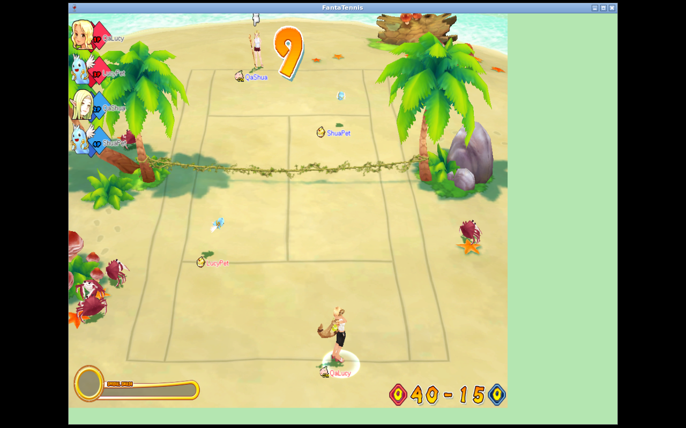
<figcaption><strong>Figure 1 — Dedicated Battlemon Basic.</strong> Two human owners and their pet actors run on the four-actor court. Full transition evidence is retained in report 03.</figcaption>
</figure>

<figure class="evidence-page">
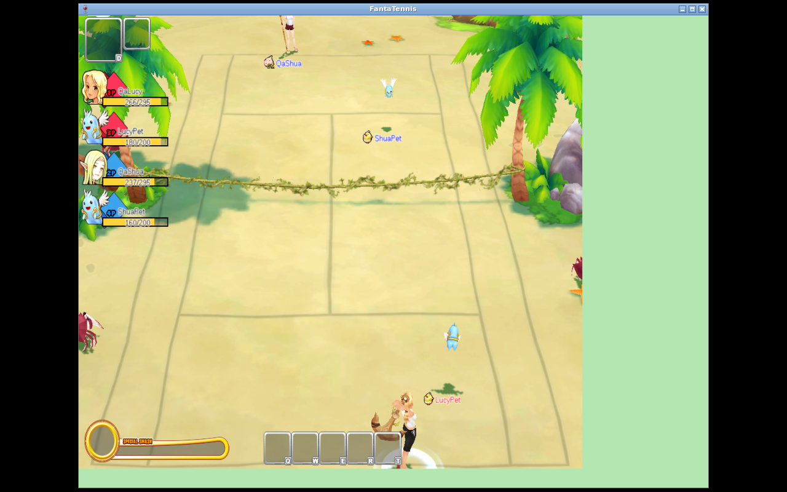
<figcaption><strong>Figure 2 — Dedicated Battlemon Battle.</strong> Four combat actors are active in the native Battle scene.</figcaption>
</figure>

The retained Battle capture SHA-256 is `93fcc0539d106e7060ebc8155d830200e235d57f7c4b6bc2bd090b1657a894b7`.

<div class="page-break"></div>

# Guardian: one-pet negative and two-pet positive

## One attached pet is insufficient

The discriminating run used two humans in an ordinary Guardian room with Allow Battlemon enabled but only one owner pet attached. The guest reached READY; the master did not transition.

<figure class="evidence-page">

<figcaption><strong>Figure 3 — One-pet Guardian negative.</strong> Both humans are present and the guest is READY, but only the master's pet tray is populated. START remains disabled and the room reports that the game cannot start.</figcaption>
</figure>

At `21:46:33.364Z`, the guest emitted `CMSGRoomChangeReady (0x1775)` and both clients received position 1 ready via `0x1776`. Through `21:50:32Z`, the packet tail contains heartbeats but no `CMSGStartGame (0x177B)`, relay setup, or `SMSGStartGame`. This is a native client pre-start negative—not evidence of a server rejection packet, because the disabled UI did not emit a request.

Focused `RoomStartGamePacketHandlerTest` coverage separately sends the server-side state through the start handler and proves that missing either active owner's pet yields only the room-start acknowledgement and does not initialize the match.

<div class="page-break"></div>

## One pet per owner starts and plays

The positive run used the same Guardian tuple and option, with `LucyPet` attached to `QaLucy` and `ShuaPet` attached to `QaShua`.

<figure class="evidence-page">

<figcaption><strong>Figure 4 — Both-pet Guardian pre-start.</strong> LucyPet, QaLucy MASTER, QaShua READY, and ShuaPet are all present; START is enabled.</figcaption>
</figure>

<figure class="evidence-page">
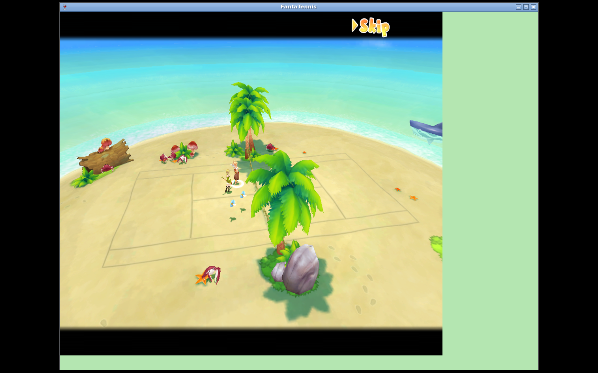
<figcaption><strong>Figure 5 — Guardian start transition.</strong> After the native `0x177B`, both real endpoints connected and received successful start results.</figcaption>
</figure>

<div class="page-break"></div>

The key packet sequence was:

```text
08:04:12.484  guest  CMSGRoomChangeReady 0x1775 true
08:04:14.980  master CMSGStartGame       0x177B
08:04:15.121  server 0x03EA              [4,5,0,0]
08:04:15.124  server 0x03EA              [5,4,0,0]
08:04:15.561/.673 both CMSGConnectedToRelay 0x03F3
08:04:16.281/.282 both SMSGStartGame 0x17DE result=0
```

<figure class="evidence-page">
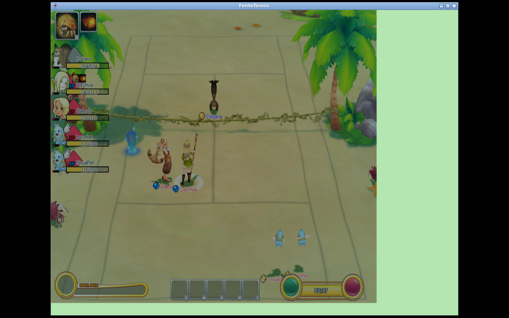
<figcaption><strong>Figure 6 — Both-pet Guardian gameplay.</strong> The status panel independently lists Dokaro, both humans, LucyPet, and ShuaPet. A Wine rendering artifact leaves a green region on the right, but the actor/status evidence is unobscured.</figcaption>
</figure>

The run continued through live gameplay and natural completion. Guardian retained two network endpoints while server authorization mapped the two pet positions to their owners. The capture SHA-256 is `a77ed8571291a5520e4c9aeda5dc0376c2b02cdac413770c7d694ab7c9346171`.

# Pet lifecycle native matrix

## PET_ITEM positive actions

| Native action | Authoritative before | Authoritative after | Item delta | Verdict |
|---|---|---|---|---|
| index 1 | strength 15 | strength 16 | count 3→2 | observed positive |
| index 13 | expiry 2026-11-20 12:28:01 | 2026-11-21 12:28:01 | count 3→2 | observed +1 day |
| index 14 | `lifeMax=120` | `lifeMax=125` | count 3→2 | observed +5 |
| index 23 | energy 30, hunger 40 | energy 80, hunger 90 | count 3→2 | observed +50/+50 |

The sequence is retained in the [lifecycle DB transitions](data/lifecycle-db-transitions.txt). Index 1 was sent as `CMSGUseQuickSlot.quickSlotId=24`, where 24 is the owned pocket row and that row's item index is 1.

<figure class="evidence-page">
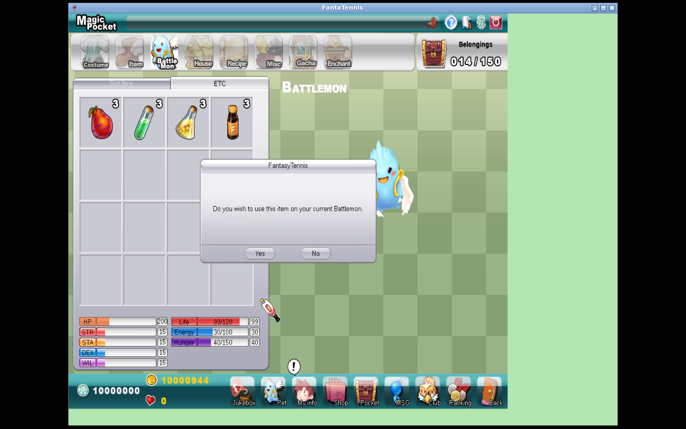
<figcaption><strong>Figure 7 — PET_ITEM use.</strong> The client refreshed the pet/inventory UI. The paired DB checkpoints—not the screenshot alone—establish strength 15→16 and count 3→2.</figcaption>
</figure>

<div class="page-break"></div>

## Signed-byte cap at 127

The authoritative cap fixture set strength 127 with one remaining index-1 item. The native client emitted `0x1BDA` for pocket row 24. The after-image remained strength 127 and count 1; no mutation refresh/decrement followed.

<figure class="evidence-page">
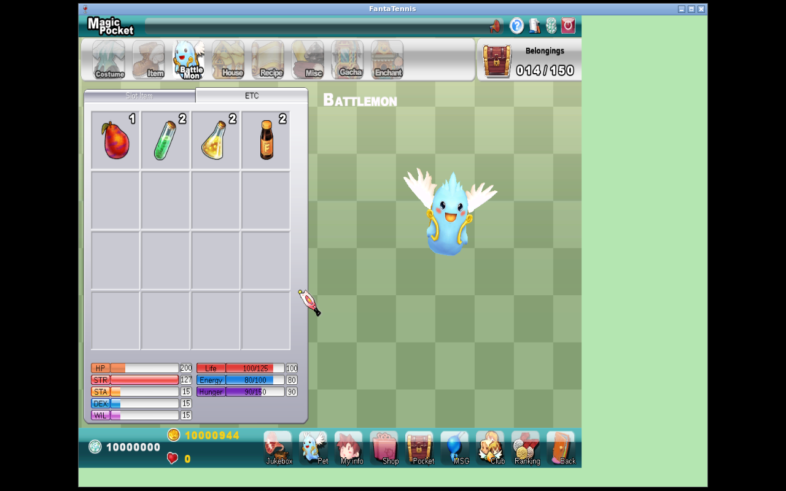
<figcaption><strong>Figure 8 — Stat boundary.</strong> Native UI after the action; paired fixture and after DB snapshots prove no mutation at 127.</figcaption>
</figure>

This validates the implementation's representability guard. It does not prove that every historical retail region chose 127 as a game-design maximum.

## Rename packet, length, and item boundaries

Valid rename sent:

```text
0x1524 itemId=22 petType=1 newPetName="ShuaProof"
0x1525 result=0
0x151B pet refresh
0x1B73 itemId=22 remaining=2
```

The DB changed `ShuaPet→ShuaProof` and SPECIAL index-10 count `3→2`.

<figure class="evidence-page">
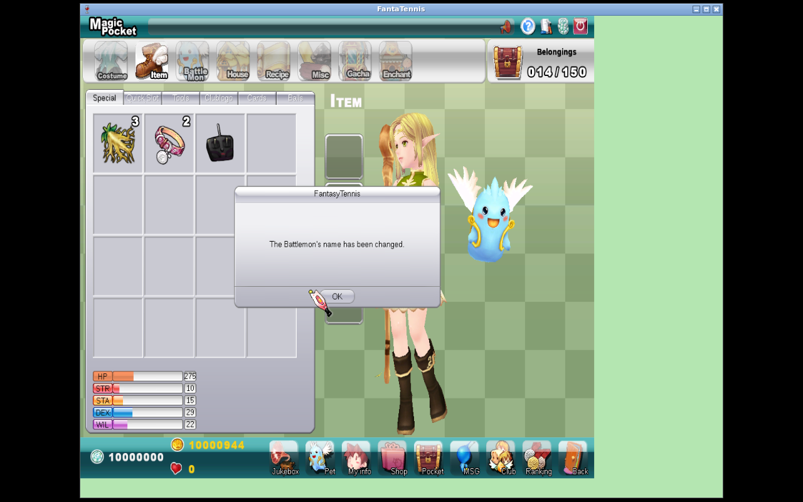
<figcaption><strong>Figure 9 — Rename success.</strong> The native client confirms the change; packet and DB evidence establish the accepted name and item consumption.</figcaption>
</figure>

Two boundary outcomes differ and must not be conflated:

1. Typing 13 characters caused the client to emit only the 12-code-unit name `ShuaProofLon`; that request succeeded. It was truncation, not rejection.
2. A one-character name was blocked client-side with “The length of the nickname must be between 2 to 12 characters.” No one-character `0x1524` appeared and DB state was unchanged.

<figure class="evidence-page">
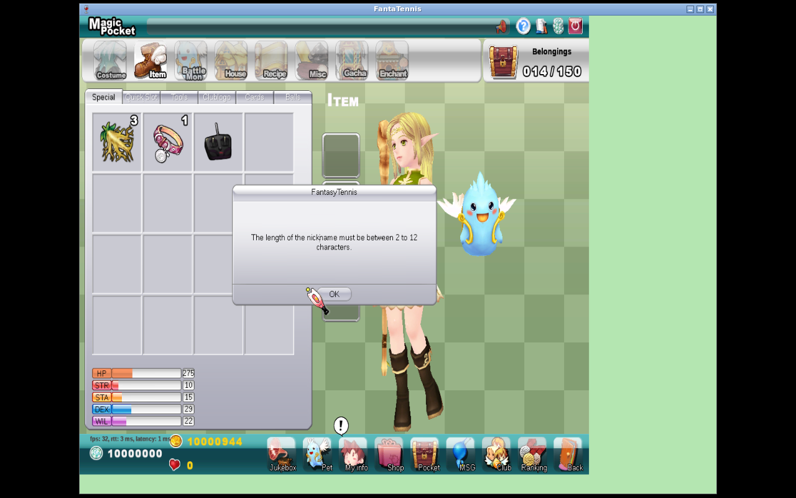
<figcaption><strong>Figure 10 — Client-side minimum length.</strong> The native UI states the 2–12 range. No matching one-character request was emitted.</figcaption>
</figure>

With the rename item fixture at count zero, the client did emit `0x1524` for `NoItem`; the server returned `0x1525 result=1`. Name and count remained unchanged. The native wording is generic and should not be interpreted as a recovered retail reason code.

<figure class="evidence-page">
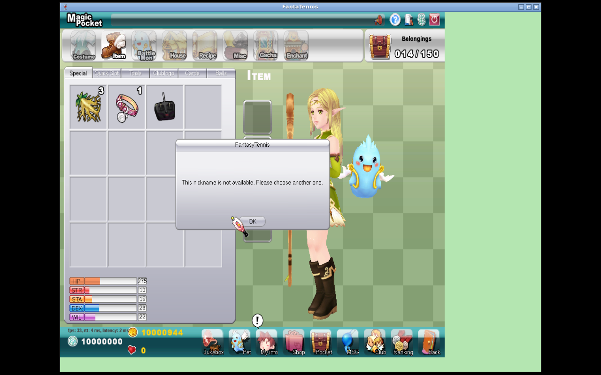
<figcaption><strong>Figure 11 — Exhausted rename item.</strong> The client displays a generic nickname failure. The packet result and DB no-mutation pair establish the authoritative reason in this fixture.</figcaption>
</figure>

<div class="page-break"></div>

## Dead-pet revive

The positive fixture was dead and expired with `lifeMax=125`, energy 7, hunger 8, and three revive items. The native client emitted:

```text
0x1526 itemId=21 petType=1
0x1527 result=0
0x151B pet refresh
0x1B73 itemId=21 remaining=2
```

The DB after-image was alive, energy 100, hunger 150, item count 2, with expiry rebuilt from the server compatibility policy.

<figure class="evidence-page">
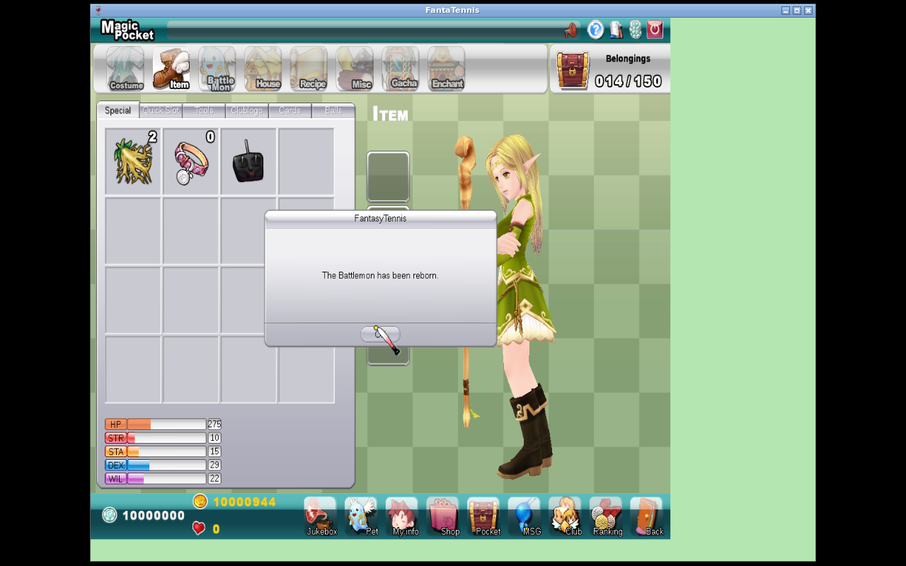
<figcaption><strong>Figure 12 — Dead-pet revive success.</strong> UI, packet response, pet refresh, item update, and DB transition agree.</figcaption>
</figure>

An alive-but-expired fixture reached native confirmation but emitted no `0x1526`; the DB remained unchanged. Missing-item revive is covered by service/handler tests, not claimed as a native walkthrough result.

<div class="page-break"></div>

# Actor control, cleanup, and persistence boundary

## Owner-mapped actor reports

A timestamped input experiment grouped relay reports by source endpoint and actor position. During the right-key interval:

- owner-0 endpoint reported positions 0 and 2;
- owner-1 endpoint reported positions 1 and 3;
- positions 2 and 3 included moving `0x32C9` records; and
- no dedicated pet-controller opcode appeared.

The capture SHA-256 is `c4245614ecdc9763175a0c85829d2819662a7ad7a437bbf086b12b1e1a90aea6`. This proves the native report shape and endpoint/actor mapping. It does **not** prove autonomous pet AI, target selection, or retail decision logic.

## Owner disconnect removes the owner-pet pair

The disconnect experiment began in a two-owner/four-actor Battlemon match. Player 4's game and relay connections became inactive. The remaining client received removal/room refresh, returned to the waiting room, and showed only `QaShua` and `ShuaPet`; `QaLucy` and `LucyPet` disappeared together.

<table>
<tr>
<td>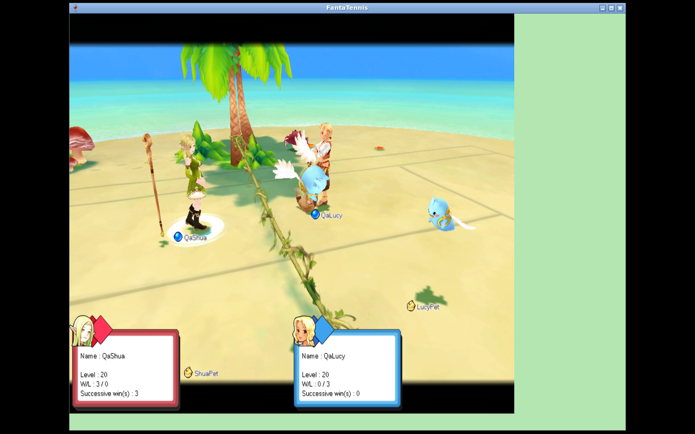<br><strong>Before:</strong> both owner/pet pairs are in the match.</td>
<td><br><strong>After:</strong> only QaShua and ShuaPet remain.</td>
</tr>
</table>

The Wine gameplay frame has known pillar-box/green-region artifacts; the roster transition and decoded disconnect packets are the authoritative evidence.

## Match persistence boundary

Natural Basic, Battle, and Guardian completions updated human rewards/records as applicable. Pet and pet-statistic rows did not change in the before/after comparisons. No evidence justified inventing pet EXP, levels, ranking, hunger/energy depletion, or independent rewards at match completion, so the implementation leaves those rows unchanged.

<div class="page-break"></div>

# Red/green and package verification

## Red baseline

No standalone pre-implementation Maven red receipt was retained for the lifecycle slice, so this report does not manufacture one. Two real behavioral reds drove the work:

1. the earlier native dedicated-Battlemon null-pet admission crashed in the client pet-tail parser; and
2. lifecycle handlers before `9740e57` did not own the transactional pet/item mutation contract described here.

The null-pet crash and its disassembly are documented in report 03. The final lifecycle tests are green, but this report does not relabel green-only output as a preserved executed red run.

## Focused green matrix

| Test class | Tests | Contract |
|---|---:|---|
| `RoomStartGamePacketHandlerTest` | 21 | Battlemon/Guardian pet cardinality, start/abort/retry |
| `BattlemonLifecycleServiceImplTest` | 11 | transaction authorization, item effects/caps, consume/remove, rename/revive |
| `BattlemonLifecycleHandlerTest` | 5 | native handler result/refresh/inventory ordering |
| `BattlemonLifecyclePacketTest` | 3 | request/result byte contracts |
| `BattlemonActorPolicyTest` | 14 | endpoint/actor authorization and native report shapes |
| `BattlemonMatchplayGameTest` | 5 | Basic/Battle four-actor behavior and persistence projection |
| `GameSessionTest` | 16 | actor ownership/session lifecycle |
| `S2CRoomPlayerListInformationPacketTest` | 2 | optional full pet tail |
| `S2CGameNetworkSettingsPacketTest` | 4 | dedicated/Guardian network roster |
| **Total** | **81** | **0 failures, 0 errors, 0 skipped** |

Executed command:

```text
JAVA_HOME=/tmp/jdk-21 PATH=/tmp/jdk-21/bin:$PATH \
mvn -pl game-server -am \
  -Dtest=RoomStartGamePacketHandlerTest,\
BattlemonLifecycleServiceImplTest,\
BattlemonLifecycleHandlerTest,\
BattlemonLifecyclePacketTest,\
BattlemonActorPolicyTest,\
BattlemonMatchplayGameTest,\
GameSessionTest,\
S2CRoomPlayerListInformationPacketTest,\
S2CGameNetworkSettingsPacketTest \
  -Dsurefire.failIfNoSpecifiedTests=false test

Tests run: 81, Failures: 0, Errors: 0, Skipped: 0
BUILD SUCCESS — 2026-08-13T00:06:47Z
```

## Release package gate

```text
JAVA_HOME=/tmp/jdk-21 PATH=/tmp/jdk-21/bin:$PATH \
mvn -pl auth-server,chat-server,game-server,relay-server,ac-server \
  -am -DskipTests package

auth/game/chat/relay/ac: SUCCESS
BUILD SUCCESS — 2026-08-13T00:07:31Z
```

The implementation files committed in `9740e57` were byte-identical to the verified disposable tree. CRLF-aware staged and unstaged `diff --check` gates passed before the implementation commit.

# Compatibility interpretations

1. **Revive expiry reconstruction.** The native client proves request shape, success, refreshed values, and item consumption; it does not expose a retail-server formula. The branch uses `now + min(lifeMax, 300 days)`. A successful historical retail trace with known S0/S1 would replace this interpretation.
2. **Signed stat cap 127.** The cap follows current signed-byte storage/serialization and the successful no-mutation native boundary. A proven unsigned wire/entity migration could justify a different limit but would be a broader protocol change.
3. **Unique pet by type for rename/revive.** The native request identifies `petType`, not pet database ID. The branch rejects ambiguous duplicate owned rows rather than mutating an arbitrary pet. Retail duplicate-type selection remains unknown.
4. **Guardian all-owner cardinality.** Native UI gating shows one pet is insufficient and both pets start. The server mirrors that invariant for direct/crafted requests.
5. **Human-only network and progression.** Pets are actor positions owned by human endpoints and receive no independent persistent match rewards absent contrary evidence.
6. **No dummy or padded pet.** Dedicated Battlemon rejects missing pets instead of synthesizing rows or padding absent tails. This fixes the authoritative state that caused the native null dereference.
7. **Generic lifecycle failure result.** Observed `0x1525` values distinguish success/failure, but not a rich reason taxonomy. The branch returns the compatible generic failure rather than inventing reason codes.

# Failures and corrected procedure

- **Null-pet admission:** ordinary-room optional serialization was valid, but scene 2 dereferenced a missing local pet. Admission now validates/attaches a real pet before success.
- **Guardian assumption:** allowing a single owner's pet did not unlock START. The discriminating two-owner one-pet run corrected the model to one pet per active owner.
- **Rename boundary wording:** 13 typed characters were initially easy to misclassify as rejection. Packet inspection proved truncation to 12 and success.
- **Revive boundary:** alive-but-expired reached a confirmation dialog but emitted no request. It is recorded as client-side gating, not server rejection.
- **Stat-cap evidence:** an earlier 16→17 action was not a cap rejection. The final fixture/after pair at 127 is the only cap proof used here.
- **Lifecycle capture retention:** a later empty capture service replaced the useful lifecycle PCAP. The final 450-byte file is explicitly excluded; decoded logs plus DB pairs support lifecycle claims. No unverifiable earlier hash is presented as retained evidence.
- **Orb resource pressure:** task-owned native clients, displays, capture, and JFTSE services were stopped after collection. Raw evidence was preserved before disposable build cleanup decisions.

# Remaining reverse-engineering boundary

The following are not silently treated as complete:

1. autonomous pet AI, retail target selection, navigation, timing, and interrupt behavior;
2. exact original-server revive expiry and any region/version differences;
3. native positive/boundary runs for every PET_ITEM index, especially all stat increments and each species cap;
4. hunger/energy decay cadence, death conditions, pet EXP/level progression, and reconnect persistence;
5. all pet spell, skill, animation, projectile, damage, and effect packet shapes;
6. duplicate owned pets of the same type and the original selection/disambiguation rule;
7. global/case/Unicode nickname uniqueness and profanity behavior beyond the observed client length gate;
8. richer lifecycle failure reason codes, if any;
9. player counts and actor topologies other than two owners plus one pet each;
10. every Basic/Battle/Guardian map, rule, item interaction, and abort/reconnect permutation;
11. ranked/matchmaking policy and historical balance formulas; and
12. behavior of historical client or retail-server builds not available for capture.

The smallest next experiments would pair each unknown with an exact S0 fixture, native action, packet capture, DB S1, and multi-client UI result. Until then these are falsifiable unknowns, not implementation facts.

<div class="page-break"></div>

# Reproduction guide

## 1. Checkout and hashes

```text
git fetch thewindmom feature/battlemon-retail-fidelity
git checkout feature/battlemon-retail-fidelity
git rev-parse HEAD
sha256sum FantaTennis.7z FantaTennis.exe
```

The executable must match the title-page hash. A different build requires revalidation rather than reuse of offsets or client behavior assumptions.

## 2. Build and tests

Use JDK 21 and the exact commands in [verification receipts](data/verification-receipts.txt). Package after the final tests so the native runtime uses the same integrated source.

## 3. Fixtures and lifecycle matrix

Use disposable accounts with one owned type-1 pet each. Before every scenario, reset account online state, pet alive/expiry/stats, item pocket IDs/counts, and selected active pet. Capture authoritative S0 immediately before the native click and S1 immediately after the response/refresh.

For Guardian cardinality, keep room tuple `roomType=0, mode=2` and Allow Battlemon enabled. First attach exactly one owner pet with both humans present and ready; then repeat from a clean room with both pets. Do not splice states between runs.

## 4. Observable native stack

In an Amp orb, launch auth/game/chat/relay/AC, Xvfb, Openbox, both Wine clients, and capture as supervised `amp orb service` units. Keep one runtime directory, Win32 Wine prefix, display, and account per client. Start packet capture before login/action and stop it before hashing.

Do not publish raw PCAPs without inspecting login/session traffic. The report commits sanitized excerpts instead.

<div class="page-break"></div>

# Artifact hashes and evidence inventory

The [capture hash manifest](data/capture-hashes.txt) records retained raw capture hashes and the lifecycle-capture caveat. Raw PCAPs remain outside Git because they can contain sensitive session traffic.

## Evidence inventory

| Evidence file | Purpose | Claim supported |
|---|---|---|
| [Report 03 source](../03-battlemon-end-to-end-implementation-validation/README.md) | predecessor native report | full Basic/Battle/Guardian positive flows and null-pet diagnosis |
| [Report 03 PDF](../03-battlemon-end-to-end-implementation-validation/battlemon-end-to-end-implementation-validation.pdf) | inspected predecessor PDF | reviewable end-to-end evidence |
| [Basic gameplay](../03-battlemon-end-to-end-implementation-validation/images/03-basic-gameplay.png) | native client | four-actor Basic |
| [Battle gameplay](../03-battlemon-end-to-end-implementation-validation/images/07-battle-gameplay.png) | native client | four-actor Battle |
| [Guardian one-pet negative](images/01-guardian-one-pet-start-disabled.png) | native client | two humans, only one pet, guest ready, START disabled |
| [Guardian both-pet pre-start](images/02-guardian-both-pets-prestart.png) | native client | both owner pets, enabled START |
| [Guardian start](images/03-guardian-both-pets-start.png) | native client | successful transition |
| [Guardian gameplay](images/04-guardian-both-pets-gameplay.png) | native client | boss, two humans, two pets in HUD |
| [PET_ITEM result](images/05-pet-stat-increase.png) | native client | item UI refresh; paired DB proves mutation |
| [Stat cap](images/06-pet-stat-cap.png) | native client | boundary UI; paired DB proves no mutation |
| [Rename success](images/07-pet-rename-success.png) | native client | positive rename UI |
| [Short-name rejection](images/08-pet-rename-short-rejected.png) | native client | native 2–12-character gate |
| [Exhausted rename](images/09-pet-rename-exhausted.png) | native client | generic failure UI; packet/DB determine fixture reason |
| [Revive success](images/10-pet-revive-success.png) | native client | positive reborn UI |
| [Disconnect before](images/11-owner-disconnect-before.png) | native client | initial two-owner/four-actor state |
| [Disconnect after](images/12-owner-disconnect-after.png) | native client | only remaining owner/pet pair |
| [Lifecycle DB transitions](data/lifecycle-db-transitions.txt) | database | positive and no-mutation S0/S1 values |
| [Protocol excerpts](data/protocol-excerpts.txt) | game/relay logs | request/result IDs, Guardian start, actor control, disconnect |
| [Verification receipts](data/verification-receipts.txt) | Maven/JAR output | 81 focused tests and package success |
| [Capture hashes](data/capture-hashes.txt) | SHA-256 manifest | artifact identity and publication caveat |
| [Generated PDF](battlemon-retail-fidelity-reverse-engineering.pdf) | maintainer deliverable | visually reviewed version of this report |

# Final conclusion

Battlemon is complete **for the explicitly controlled JFTSE compatibility slice**: two owners with one pet each, dedicated Basic/Battle end to end, Guardian's validated all-owner Allow Battlemon contract, sampled lifecycle item mutations, rename, dead-pet revive, owner-mapped relay actors, cleanup, and human-only match persistence. The implementation and native evidence agree, focused tests are green, and all affected services package successfully.

It is not accurate to call all historical Battlemon behavior fully reverse-engineered. The remaining boundary above—most notably autonomous behavior, exact retail lifecycle formulas, unsampled items/skills/progression, additional topologies, and unavailable retail builds—remains explicit rather than filled with guesses.
